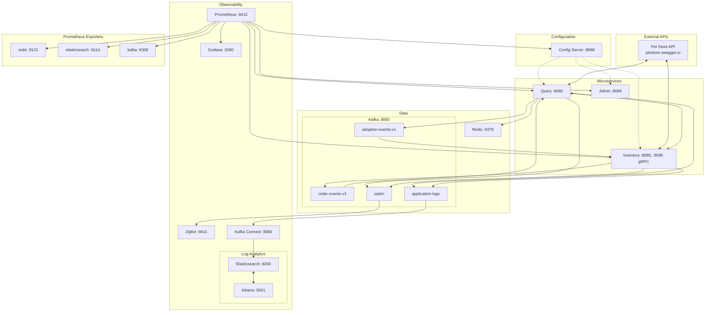

# Microservices OPS Demo

A full-stack observability demo showing Spring Boot microservices with metrics (Prometheus/Grafana), distributed tracing (Zipkin), centralized configuration (Spring Cloud Config), event-driven communication (Kafka), and log analytics (Elasticsearch/Kibana). Two microservices—Query and Inventory—integrate with the Swagger PetStore API, sync orders via Kafka, and communicate via gRPC with circuit breakers and resilience patterns.

## Components

- Two microservices (Spring Boot 4.0.3) that perform requests to the [Swagger's PetStore](https://petstore.swagger.io/) and communicate with each other using **gRPC** (primary) or HTTP and [Spring for Apache Kafka](https://spring.io/projects/spring-kafka).
- A **Spring Cloud Config Server** (port 8888) for centralized configuration. Query, Inventory, and Admin Server fetch config at startup. Config files in `config-server/src/main/resources/config/`; clients use `spring.config.import=optional:configserver:http://localhost:8888`.
- A Zipkin server that receives traces from the microservices via [Micrometer Tracing](https://micrometer.io/docs/tracing) (Brave).
- A Prometheus server that scrapes metrics from [Spring Boot Actuator](https://docs.spring.io/spring-boot/docs/current/reference/html/actuator.html).
- A Kafka cluster (landoop/fast-data-dev) for event-driven communication between the microservices and the tracer, including a Web UI.
- **Elasticsearch** (9200) and **Kibana** (5601) for log analytics. Logs from Query and Inventory are sent to the `application-logs` Kafka topic and ingested via Kafka Connect. Logs include `traceId`, `spanId`, `service`, `host`; use `traceId` in Kibana to correlate with Zipkin traces.

## Prerequisites

- **Java 21** or higher (Java 25 supported when JDK 25 is available; set `java.version` in pom.xml)
- **Docker** and **Docker Compose** (for running the full stack)
- **Maven 3.8+**
- **System resources** (full stack): ~6–7 GB RAM, ~3–5 CPU cores. Minimal stack: ~2 GB RAM.

> **Demo context**: This stack is intended for local development and demonstrations. Grafana (admin/admin), Elasticsearch (security disabled), and Redis/Kafka use default configurations without authentication. Not for production use without hardening.

## Quick Start

### Start the full demo

```bash
./start.sh
```

This script runs in phases: **Building** (Maven package), **Port check**, **Building Docker images** (including elk-init, kafka-connect), and **Starting full stack**. Errors report the failed phase. It packages Config Server, both microservices, and Admin Server, builds Docker images, and starts the entire stack (Config Server, Kafka, Zipkin, Prometheus, Grafana, Elasticsearch, Kibana, Kafka Connect, elk-init, Admin, and both microservices).

### Start infrastructure only (Kafka, Zipkin, Prometheus)

```bash
./start.sh minimal
```

### Skip tests when packaging (full stack only)

```bash
./start.sh --skip-tests
# Or combined: ./start.sh minimal --skip-tests  (--skip-tests ignored for minimal)
```

Or directly: `docker compose -f docker-compose-minimal.yml up`

Then run the microservices locally:

```bash
# Terminal 1 - Config Server (port 8888, optional)
cd config-server && ./mvnw spring-boot:run

# Terminal 2 - Inventory microservice (port 8085)
cd inventory-microservice && ./mvnw spring-boot:run

# Terminal 3 - Query microservice (port 8086)
cd query-microservice && ./mvnw spring-boot:run
```

Config Server is optional: if not running, services use local `application.yml`.

See [docs/CONTAINER_SETUP.md](docs/CONTAINER_SETUP.md) for container setup, environment, and startup flow. See [docs/ARCHITECTURE.md](docs/ARCHITECTURE.md) for detailed flow diagrams (Docker startup, pet adoption, order sync, log flow, trace correlation).

## Architecture & Event Flow


```mermaid
flowchart TB
    subgraph External["External APIs"]
        PetStore["Pet Store API<br/>petstore.swagger.io"]
    end

    subgraph Config["Configuration"]
        ConfigServer["Config Server :8888"]
    end

    subgraph Microservices["Microservices"]
        Query["Query :8086"]
        Inventory["Inventory :8085, :9090 gRPC"]
        Admin["Admin :8089"]
    end

    subgraph Data["Data"]
        Redis["Redis :6379"]
        subgraph Kafka["Kafka :9092"]
            OE["order-events-v1"]
            AE["adoption-events-v1"]
            ZipkinTopic["zipkin"]
            AppLogs["application-logs"]
        end
    end

    subgraph Observability["Observability"]
        Zipkin["Zipkin :9411"]
        Prometheus["Prometheus :9412"]
        Grafana["Grafana :3000"]
        subgraph ELK["Log Analytics"]
            ES["Elasticsearch :9200"]
            Kibana["Kibana :5601"]
        end
        KC["Kafka Connect :8084"]
    end

    subgraph Exporters["Prometheus Exporters"]
        RE["redis :9121"]
        EE["elasticsearch :9114"]
        KE["kafka :9308"]
    end

    ConfigServer -.-> Query
    ConfigServer -.-> Inventory
    ConfigServer -.-> Admin

    PetStore <--> Query
    PetStore <--> Inventory
    Query <--> Inventory
    Query --> Redis

    Inventory --> OE
    OE --> Query
    Query --> AE
    AE --> Inventory

    Query --> ZipkinTopic
    Inventory --> ZipkinTopic
    ZipkinTopic --> Zipkin

    Query --> AppLogs
    Inventory --> AppLogs
    AppLogs --> KC
    KC --> ES
    ES <--> Kibana

    Prometheus --> Query
    Prometheus --> Inventory
    Prometheus --> Admin
    Prometheus --> ConfigServer
    Prometheus --> RE
    Prometheus --> EE
    Prometheus --> KE
    Prometheus --> Grafana
```

> **Note:** Traces go to Zipkin via Kafka (`zipkin` topic). Logs are enriched with traceId/spanId and flow to `application-logs` → Kafka Connect → Elasticsearch → Kibana for trace correlation.

### Kafka Topics

| Topic                               | Producer         | Consumer                      | Description                                      |
| ----------------------------------- | ---------------- | ----------------------------- | ------------------------------------------------ |
| `order-events-v1`                   | Inventory        | Query                         | Order updates from Pet Store API                 |
| `adoption-events-v1`                | Query            | Inventory                     | Pet adoption events                              |
| `adoption-congratulation-events-v1` | Inventory        | (external)                    | Adoption confirmation events                     |
| `zipkin`                            | Query, Inventory | Zipkin                        | Distributed traces                               |
| `application-logs`                  | Query, Inventory | Kafka Connect → Elasticsearch | Enriched JSON logs (traceId, service) for Kibana |

## Running Tests

```bash
# All tests (use ./mvnw in cloud/CI)
cd query-microservice && ./mvnw test
cd inventory-microservice && ./mvnw test

# With coverage (JaCoCo)
./mvnw verify
```

Tests use JUnit 5, Mockito, MockMvc, EmbeddedKafka. **80% instruction coverage** enforced via JaCoCo. Run `./mvnw verify` per module. Integration tests use `@SpringBootTest` with `@EmbeddedKafka`; gRPC tests use mocks (`inventory.grpc.enabled: false` in test profile).

### Documentation Index

| Doc                                                                 | Topic                                            |
| ------------------------------------------------------------------- | ------------------------------------------------ |
| [ARCHITECTURE.md](docs/ARCHITECTURE.md)                             | System overview, flow diagrams, design decisions |
| [CONTAINER_SETUP.md](docs/CONTAINER_SETUP.md)                       | Container setup, environment, startup flow       |
| [PROFILING.md](docs/PROFILING.md)                                   | Load testing with Gatling                        |
| [KIBANA_DASHBOARDS_PROPOSAL.md](docs/KIBANA_DASHBOARDS_PROPOSAL.md) | Proposed Kibana dashboards                       |

## Profiling and Load Testing

Load test the microservices and generate performance reports:

```bash
./start.sh profile
```

This builds and starts the full stack, waits for services to be healthy, runs a Gatling load test (default 60s, 2 req/s), and outputs the HTML report path. Customize with `PROFILE_DURATION` and `PROFILE_RATE`:

```bash
PROFILE_DURATION=120 PROFILE_RATE=5 ./start.sh profile
```

If the stack is already running, run only the load test:

```bash
cd profiling && ./run.sh 60 2
```

See [docs/PROFILING.md](docs/PROFILING.md) for methodology, metrics, JFR, and troubleshooting.

## gRPC (Query ↔ Inventory)

Query syncs with Inventory via **gRPC** (port 9090) when `inventory.grpc.enabled=true`. Operations: `GetInventory`, `GetOrder`, `RefreshInventory`. Proto in `inventory-grpc-api/src/main/proto/inventory.proto`. REST remains available as fallback.

**Build order**: `inventory-grpc-api` must be installed before Query/Inventory. `./start.sh` and CI workflows handle this (`mvn install -DskipTests -f inventory-grpc-api/pom.xml` first).

## Important Configuration

- **Config Server**: Port 8888. Native backend: `config-server/src/main/resources/config/{application}.yml`. Clients use `spring.config.import=optional:configserver:http://localhost:8888`; optional means fallback to local config when Config Server is down.
- **Kafka**: Uses `landoop/fast-data-dev` (Kafka + Zookeeper + Schema Registry + Web UI). Broker at `localhost:9092`, Web UI at [http://localhost:3030](http://localhost:3030). Override broker with `spring.cloud.stream.kafka.binder.brokers` or `SPRING_CLOUD_STREAM_KAFKA_BINDER_BROKERS`.
- **Tracing**: Traces are sent to Zipkin via Kafka by default. Set `management.tracing.export.zipkin.transport: kafka` (default) or `http`. For Kafka: `kafka.bootstrap-servers` (default: `localhost:9092`), `kafka.topic` (default: `zipkin`). For HTTP: set `transport: http` and `endpoint: http://localhost:9411/api/v2/spans`.
- **Circuit breaker (OrderService)**: `ignoreExceptions` includes `HttpClientErrorException.NotFound` (404) so expected PetStore 404s (IDs 6–10) do not trip the circuit. Retry also ignores 404.
- **Port assignments**: 8085 (Inventory), 8086 (Query), 9090 (gRPC), 8084 (Kafka Connect) avoid landoop ports (8081 Schema Registry, 8083 Connect). See `start.sh` for full port list.
- **Spring Cloud 2025.1.0**: Required for Spring Boot 4.0.3 compatibility.
- **Kafka JSON (Spring Kafka 4.x)**: Uses `JacksonJsonDeserializer` and `JacksonJsonSerializer`. Configure via binder-level `consumer-properties` and `producer-properties` (not bindings-level). Use bracket notation for dotted keys, e.g. `"[value.deserializer]"`, `"[spring.json.trusted.packages]"`, `"[spring.json.value.default.type]"`.
- **Log distribution to Kafka**: Enabled by default in Docker (`kafka-logging` profile). Logs enriched with traceId, spanId, service, environment, host, stack traces (errors). Flow: `application-logs` → Kafka Connect → Elasticsearch → Kibana. Enable locally with `SPRING_PROFILES_ACTIVE=development,kafka-logging`. **Troubleshooting**: No logs in Kibana → run `./elk/init-elk.sh`, ensure `kafka-logging` profile. Kafka Connect port 8084 avoids landoop conflict (8083). Use logback-kafka-appender 0.1.0 (0.2.0+ removed LayoutKafkaMessageEncoder).

## Query microservice


This microservice performs queries to the inventory microservice and the pet shop API. It supports the following operations:

- `GET /v1/inventory` Proxies to the inventory microservice (gRPC or REST).
- `GET /v1/pets` Lists pets from PetStore; supports `id`, `status`, `tags` filters.
- `POST /v1/pets/{id}/reserve` Reserves a pet (Ticketmaster-style); returns token.
- `POST /v1/pets/{id}/adopt` Adopts a pet; requires `X-Reservation-Token` when Redis is available.
- `GET /v1/orders` Lists orders from local DB (synced via Kafka).
- `GET /v1/orders/{id}/live` Proxies live order from Inventory.

The Swagger page is accessible at [http://localhost:8086/swagger-ui.html](http://localhost:8086/swagger-ui.html)

## Inventory microservice


This microservice performs queries to the pet shop API. This service is used by the query service to perform some queries. It supports the following operations:

- `GET /v1/inventory` Fetches inventory from PetStore; optional `status`, `lowStockThreshold` filters.
- `GET /v1/order/{id}` Fetches single order from PetStore.
- `POST /v1/inventory/refresh` Triggers order sync and returns refreshed inventory.
- **gRPC (port 9090)**: GetInventory, GetOrder, RefreshInventory for Query sync.

Scheduled order sync queries PetStore orders (random IDs 1–10); found orders emit events consumed by Query.

The Swagger page is accessible at [http://localhost:8085/swagger-ui.html](http://localhost:8085/swagger-ui.html)

## Prometheus server


The Prometheus server is accessible at [http://localhost:9412](http://localhost:9412).

**Scrape targets**: Spring Boot apps (8085, 8086, 8088, 8089), Redis exporter (9121), Elasticsearch exporter (9114), Kafka exporter (9308), Prometheus self (9412).

## Grafana dashboards

Grafana is accessible at [http://localhost:3000](http://localhost:3000) (admin/admin). Provisioned dashboards:

- **Pet Shop Overview** – Ecosystem health (Redis, Kafka, Elasticsearch, Prometheus targets), adoptions, reservations, orders, reservation conflicts, query rates, latencies (pet, adoption, inventory, orders live/refresh/get). Links to Infrastructure dashboard.
- **Infrastructure** – Redis, Elasticsearch (cluster status, nodes, docs, shards, index store), Kafka (brokers, consumer lag, producer rate), Spring Boot (JVM heap, HTTP rate & latency), Prometheus (targets up/down, scrape duration)

### Adding dashboards

Dashboards are provisioned from `grafana/provisioning/dashboards/default/`. Modify the JSON files or add new ones to extend.

### Example of metrics reported

Here are some examples of the metrics registered.

#### Orders updated in total

In the [OrderService.java](https://github.com/hdmsantander/microservices-ops-demo/blob/a2718edffddaceb66ad7045835c7b0705419c365/inventory-microservice/src/main/java/mx/hdmsantander/opsdemo/inventory/service/OrderService.java#L58) there is a section of code that updates a _Counter_ style metric.

```JAVA
if (responseEntity.getStatusCode().is2xxSuccessful()) {
  log.info("Request was successful! Emitting event to update orders!");
  meterRegistry.counter("orders.updated").increment();
  orderEventService.send(responseEntity.getBody());
}
```


#### Time taken to adopt a pet

In the [PetService.java](https://github.com/hdmsantander/microservices-ops-demo/blob/a2718edffddaceb66ad7045835c7b0705419c365/query-microservice/src/main/java/mx/hdmsantander/opsdemo/query/service/PetService.java#L61) there is an annotation that enables a _Timer_ style metric for the [method](https://github.com/hdmsantander/microservices-ops-demo/blob/a2718edffddaceb66ad7045835c7b0705419c365/query-microservice/src/main/java/mx/hdmsantander/opsdemo/query/service/PetService.java#L62) that performs pet adoptions.

```JAVA
@Timed(value = "pet.query.time", description = "Time taken to query and return the pet shop list for all pets")
```


#### Amount of orders in the system

In [PetShopOrderService.java](query-microservice/src/main/java/mx/hdmsantander/opsdemo/query/service/PetShopOrderService.java) a _Gauge_ metric reports the number of orders in the query system's database:

```java
@PostConstruct
void registerGauge() {
    Gauge.builder("orders.size", petShopOrderRepository, r -> (double) r.count())
            .description("Number of orders in the system")
            .register(meterRegistry);
}
```


## ELK Stack (Elasticsearch, Kibana, Kafka Connect)

The ELK stack provides centralized log analytics:

| Component         | Port | Description                                                                                              |
| ----------------- | ---- | -------------------------------------------------------------------------------------------------------- |
| **Elasticsearch** | 9200 | Log storage; receives logs from Kafka Connect                                                            |
| **Kibana**        | 5601 | Log search, dashboards, trace correlation                                                                |
| **Kafka Connect** | 8084 | Elasticsearch Sink; ingests `application-logs` topic (8084 avoids conflict with landoop Connect on 8083) |

**elk-init** runs at startup to create the `application-logs` Kafka topic, register the Kafka Connect Elasticsearch Sink connector, import Kibana dashboards from `elk/kibana-dashboards/` (data view + pre-configured dashboards), and create the data view via API if needed.

**Manual recovery**: If elk-init failed or running without Docker, run `./elk/init-elk.sh` then `./elk/provision-kibana.sh`. Log schema fields: `@timestamp`, `level`, `logger_name`, `message`, `thread_name`, `traceId`, `spanId`, `service`, `environment`, `host`, `stack_trace` (errors).

### Kibana

Kibana is accessible at [http://localhost:5601](http://localhost:5601).

- **Discover**: Search logs from Query and Inventory. Filter by `service`, `level`, `traceId`, etc.
- **Dashboards**: Six dashboards are auto-imported from `elk/kibana-dashboards/` with pre-configured Lens panels (log volume, by service/level, errors/warnings, trace correlation). See [elk/kibana-dashboards/README.md](elk/kibana-dashboards/README.md).
- **Trace correlation**: Copy a `traceId` from Zipkin (http://localhost:9411) and filter in Kibana Discover to see logs across services.

See [docs/KIBANA_DASHBOARDS_PROPOSAL.md](docs/KIBANA_DASHBOARDS_PROPOSAL.md) for the full proposal.

## Zipkin server


The Zipkin server is accessible at [http://localhost:9411](http://localhost:9411)

### Example of traces registered

Here are some examples of the traces registered.

#### Scheduled order retrieval

The inventory microservice performs a scheduled retrieval of the orders in the pet shop API. If it finds an order, it emits an event that the query microservice consumes to update its database.


#### Pet adoption

The query microservice performs a GET of the pet ID to the pet shop API, and if the ID of the pet exists it emits an event which in turn is consumed by the inventory microservice.


## Kafka server


The stack uses `landoop/fast-data-dev`, which includes Kafka, Zookeeper, Schema Registry, and a Web UI. The Kafka Web UI for viewing topics and events is accessible at [http://localhost:3030](http://localhost:3030).

## CI/CD and Code Coverage

### GitHub Actions

- **Run Tests** (`.github/workflows/test.yml`): Runs tests for both microservices on every pull request targeting `main`, `master`, or `develop`. Installs `inventory-grpc-api` first so Query and Inventory can resolve the dependency.
- **Coverage Report** (`.github/workflows/coverage.yml`): Generates JaCoCo HTML coverage reports and publishes them to GitHub Pages. Trigger manually via **Actions → Coverage Report → Run workflow** (optionally select a branch). Also installs `inventory-grpc-api` before verification.

### Enabling GitHub Pages for Coverage Reports

1. Go to **Settings → Pages** in the repository
2. Under **Build and deployment**, set **Source** to **GitHub Actions**
3. Run the "Coverage Report" workflow from the Actions tab
4. Reports will be available at `https://<org>.github.io/<repo>/` (e.g. query-microservice and inventory-microservice links)

### Local Coverage

Run tests with coverage (enforces **80% minimum** instruction coverage via JaCoCo check):

```bash
# Query microservice
./mvnw verify -f query-microservice/pom.xml

# Inventory microservice
./mvnw verify -f inventory-microservice/pom.xml
```

Reports are written to `target/site/jacoco/index.html` in each microservice directory. Build fails if coverage drops below 80%.
