# Microservices OPS demo

This repository holds a Spring Boot OPS demo with the following components:

- Two microservices (Spring Boot 4.0.3) that perform requests to the [Swagger's PetStore](https://petstore.swagger.io/) and communicate with each other using **gRPC** (primary) or HTTP and [Spring for Apache Kafka](https://spring.io/projects/spring-kafka).
- A **Spring Cloud Config Server** (port 8888) for centralized configuration. Query, Inventory, and Admin Server fetch config at startup. See [docs/CONFIG_SERVER.md](docs/CONFIG_SERVER.md).
- A Zipkin server that receives traces from the microservices via [Micrometer Tracing](https://micrometer.io/docs/tracing) (Brave).
- A Prometheus server that scrapes metrics from [Spring Boot Actuator](https://docs.spring.io/spring-boot/docs/current/reference/html/actuator.html).
- A Kafka cluster (landoop/fast-data-dev) for event-driven communication between the microservices and the tracer, including a Web UI.
- **Elasticsearch** (9200) and **Kibana** (5601) for log analytics. Logs from Query and Inventory are sent to the `application-logs` Kafka topic and ingested via Kafka Connect. See [docs/ELK_LOGGING.md](docs/ELK_LOGGING.md).

## Prerequisites

- **Java 21** or higher (Java 25 supported when JDK 25 is available; set `java.version` in pom.xml)
- **Docker** and **Docker Compose** (for running the full stack)
- **Maven 3.8+**

## Quick Start

### Start the full demo

```bash
./start.sh
```

This script packages Config Server, both microservices, and Admin Server, builds Docker images, and starts the entire stack (Config Server, Kafka, Zipkin, Prometheus, Grafana, Elasticsearch, Kibana, Kafka Connect, Admin, and both microservices).

### Start infrastructure only (Kafka, Zipkin, Prometheus)

```bash
./start.sh minimal
```

### Skip tests when packaging (full stack only)

```bash
./start.sh --skip-tests
# Or combined: ./start.sh minimal --skip-tests  (--skip-tests ignored for minimal)
```

Or directly: `docker compose -f docker-compose-minimal.yml up`

Then run the microservices locally:

```bash
# Terminal 1 - Config Server (port 8888, optional)
cd config-server && ./mvnw spring-boot:run

# Terminal 2 - Inventory microservice (port 8085)
cd inventory-microservice && ./mvnw spring-boot:run

# Terminal 3 - Query microservice (port 8086)
cd query-microservice && ./mvnw spring-boot:run
```

Config Server is optional: if not running, services use local `application.yml`.

See [docs/DOCKER.md](docs/DOCKER.md) for container best practices, startup ordering, and health checks.

## Architecture & Event Flow

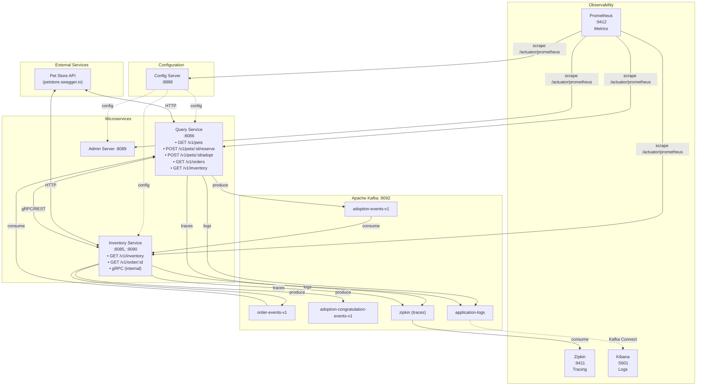
```mermaid
flowchart TB
    subgraph External["External Services"]
        PetStore["Pet Store API<br/>(petstore.swagger.io)"]
    end

    subgraph Config["Configuration"]
        ConfigServer["Config Server<br/>:8888"]
    end

    subgraph Microservices["Microservices"]
        Query["Query Service<br/>:8086<br/>• GET /v1/pets<br/>• POST /v1/pets/:id/reserve<br/>• POST /v1/pets/:id/adopt<br/>• GET /v1/orders<br/>• GET /v1/inventory"]
        Inventory["Inventory Service<br/>:8085, :9090<br/>• GET /v1/inventory<br/>• GET /v1/order/:id<br/>• gRPC (internal)"]
        Admin["Admin Server :8089"]
    end

    ConfigServer -.->|config| Query
    ConfigServer -.->|config| Inventory
    ConfigServer -.->|config| Admin

    subgraph Kafka["Apache Kafka :9092"]
        direction TB
        OE["order-events-v1"]
        AE["adoption-events-v1"]
        ACE["adoption-congratulation-events-v1"]
        ZipkinTopic["zipkin (traces)"]
        AppLogs["application-logs"]
    end

    subgraph Observability["Observability"]
        Zipkin["Zipkin<br/>:9411<br/>Tracing"]
        Prometheus["Prometheus<br/>:9412<br/>Metrics"]
        Kibana["Kibana<br/>:5601<br/>Logs"]
    end

    PetStore <-->|HTTP| Query
    PetStore <-->|HTTP| Inventory
    Query <-->|gRPC/REST| Inventory

    Inventory -->|produce| OE
    OE -->|consume| Query
    Query -->|produce| AE
    AE -->|consume| Inventory
    Inventory -->|produce| ACE

    Query -->|traces| ZipkinTopic
    Inventory -->|traces| ZipkinTopic
    ZipkinTopic -->|consume| Zipkin
    Query -->|logs| AppLogs
    Inventory -->|logs| AppLogs
    AppLogs -.->|Kafka Connect| Kibana

    Prometheus -->|scrape /actuator/prometheus| Query
    Prometheus -->|scrape /actuator/prometheus| Inventory
    Prometheus -->|scrape /actuator/prometheus| ConfigServer
    Prometheus -->|scrape /actuator/prometheus| Admin
```

> **Note:** Microservices send traces to Zipkin via Kafka (`zipkin` topic). Zipkin consumes from Kafka. Configure `management.tracing.export.zipkin.kafka.bootstrap-servers`.

### Kafka Topics

| Topic                               | Producer         | Consumer   | Description                      |
| ----------------------------------- | ---------------- | ---------- | -------------------------------- |
| `order-events-v1`                   | Inventory        | Query      | Order updates from Pet Store API |
| `adoption-events-v1`                | Query            | Inventory  | Pet adoption events              |
| `adoption-congratulation-events-v1` | Inventory        | (external) | Adoption confirmation events     |
| `zipkin`                            | Query, Inventory | Zipkin     | Distributed traces               |
| `application-logs`                 | Query, Inventory | Kafka Connect → Elasticsearch | Structured JSON logs for Kibana |

## Running Tests

```bash
# All tests (use ./mvnw in cloud/CI)
cd query-microservice && ./mvnw test
cd inventory-microservice && ./mvnw test

# With coverage (JaCoCo)
./mvnw verify
```

See [docs/TESTING.md](docs/TESTING.md) for test categories and gRPC testing notes. See [docs/CHANGELOG_PR.md](docs/CHANGELOG_PR.md) for a summary of observability and ELK changes. See [docs/IMPROVEMENT_REPORT.md](docs/IMPROVEMENT_REPORT.md) for future improvements. See [docs/SCHEMA_REGISTRY_EUREKA_CONFIG_PROPOSAL.md](docs/SCHEMA_REGISTRY_EUREKA_CONFIG_PROPOSAL.md) for evaluation of Schema Registry, Eureka, and Spring Config Server.

## Profiling and Load Testing

Load test the microservices and generate performance reports:

```bash
./start.sh profile
```

This builds and starts the full stack, waits for services to be healthy, runs a Gatling load test (default 60s, 2 req/s), and outputs the HTML report path. Customize with `PROFILE_DURATION` and `PROFILE_RATE`:

```bash
PROFILE_DURATION=120 PROFILE_RATE=5 ./start.sh profile
```

If the stack is already running, run only the load test:

```bash
cd profiling && ./run.sh 60 2
```

See [docs/PROFILING.md](docs/PROFILING.md) for methodology, metrics, JFR, and troubleshooting.

## gRPC (Query ↔ Inventory)

Query syncs with Inventory via **gRPC** (port 9090) when `inventory.grpc.enabled=true`. Operations: `GetInventory`, `GetOrder`, `RefreshInventory`. REST remains available as fallback. See [docs/GRPC_IMPLEMENTATION.md](docs/GRPC_IMPLEMENTATION.md).

**Build order**: `inventory-grpc-api` must be installed before Query/Inventory. `./start.sh` handles this.

## Important Configuration

- **Config Server**: Runs on port 8888. Clients use `spring.config.import=optional:configserver:http://localhost:8888`. Config is served from `config-server/src/main/resources/config/`. If Config Server is down, services fall back to local `application.yml`. See [docs/CONFIG_SERVER.md](docs/CONFIG_SERVER.md).
- **Kafka**: Uses `landoop/fast-data-dev` (Kafka + Zookeeper + Schema Registry + Web UI). Broker at `localhost:9092`, Web UI at [http://localhost:3030](http://localhost:3030). Override broker with `spring.cloud.stream.kafka.binder.brokers` or `SPRING_CLOUD_STREAM_KAFKA_BINDER_BROKERS`.
- **Tracing**: Traces are sent to Zipkin via Kafka by default. Set `management.tracing.export.zipkin.transport: kafka` (default) or `http`. For Kafka: `kafka.bootstrap-servers` (default: `localhost:9092`), `kafka.topic` (default: `zipkin`). For HTTP: set `transport: http` and `endpoint: http://localhost:9411/api/v2/spans`.
- **Spring Cloud 2025.1.0**: Required for Spring Boot 4.0.3 compatibility.
- **Kafka JSON (Spring Kafka 4.x)**: Uses `JacksonJsonDeserializer` and `JacksonJsonSerializer`. Configure via binder-level `consumer-properties` and `producer-properties` (not bindings-level). Use bracket notation for dotted keys, e.g. `"[value.deserializer]"`, `"[spring.json.trusted.packages]"`, `"[spring.json.value.default.type]"`.
- **Log distribution to Kafka**: Enabled by default in Docker (`kafka-logging` profile). Structured JSON logs (traceId/spanId) flow to `application-logs` → Kafka Connect → Elasticsearch → Kibana. See [docs/LOGGING_KAFKA.md](docs/LOGGING_KAFKA.md) and [docs/ELK_LOGGING.md](docs/ELK_LOGGING.md).

## Query microservice

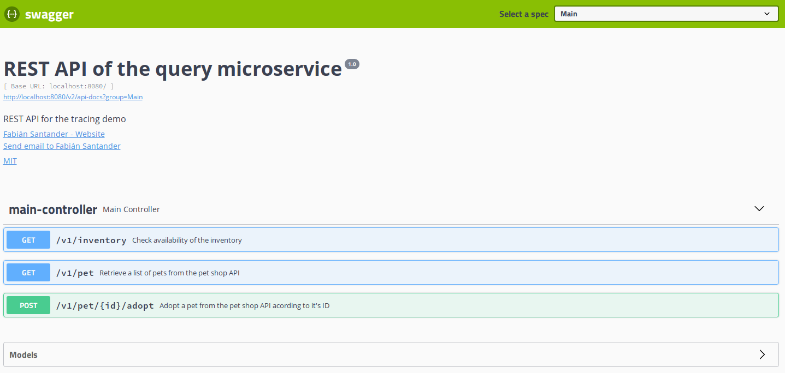

This microservice performs queries to the inventory microservice and the pet shop API. It supports the following operations:

- `GET /v1/inventory` Proxies to the inventory microservice (gRPC or REST).
- `GET /v1/pets` Lists pets from PetStore; supports `id`, `status`, `tags` filters.
- `POST /v1/pets/{id}/reserve` Reserves a pet (Ticketmaster-style); returns token.
- `POST /v1/pets/{id}/adopt` Adopts a pet; requires `X-Reservation-Token` when Redis is available.
- `GET /v1/orders` Lists orders from local DB (synced via Kafka).
- `GET /v1/orders/{id}/live` Proxies live order from Inventory.

The Swagger page is accessible at [http://localhost:8086/swagger-ui.html](http://localhost:8086/swagger-ui.html)

## Inventory microservice

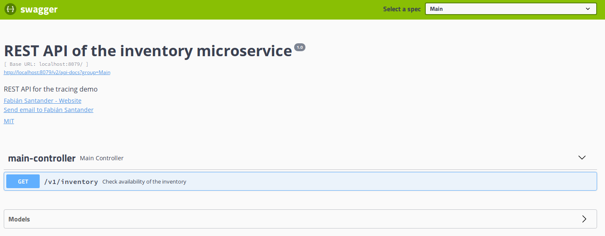

This microservice performs queries to the pet shop API. This service is used by the query service to perform some queries. It supports the following operations:

- `GET /v1/inventory` Fetches inventory from PetStore; optional `status`, `lowStockThreshold` filters.
- `GET /v1/order/{id}` Fetches single order from PetStore.
- `POST /v1/inventory/refresh` Triggers order sync and returns refreshed inventory.
- **gRPC (port 9090)**: GetInventory, GetOrder, RefreshInventory for Query sync.

Scheduled order sync queries PetStore orders (random IDs 1–10); found orders emit events consumed by Query.

The Swagger page is accessible at [http://localhost:8085/swagger-ui.html](http://localhost:8085/swagger-ui.html)

## Prometheus server

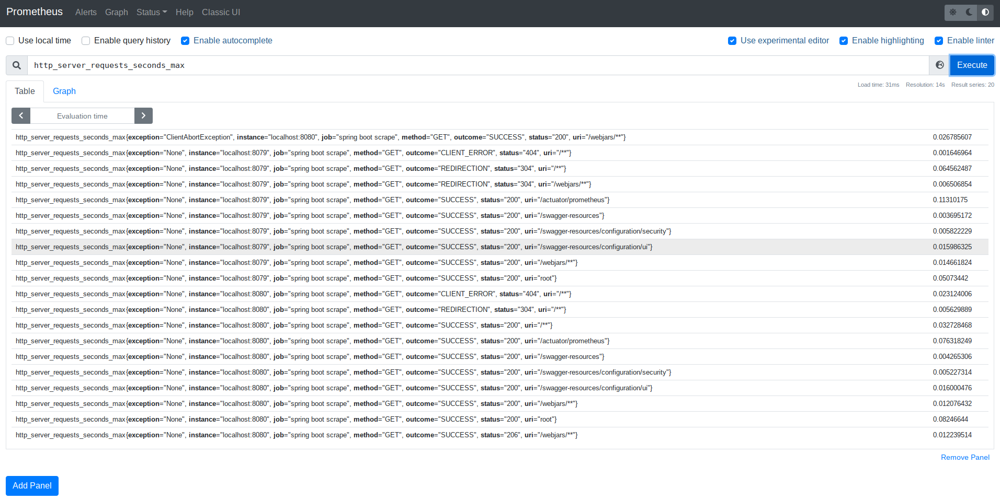

The Prometheus server is accessible at [http://localhost:9412](http://localhost:9412).

**Scrape targets**: Spring Boot apps (8085, 8086, 8088, 8089), Redis exporter (9121), Elasticsearch exporter (9114), Kafka exporter (9308), Prometheus self (9412).

## Grafana dashboards

Grafana is accessible at [http://localhost:3000](http://localhost:3000) (admin/admin). Provisioned dashboards:

- **Pet Shop Overview** – Ecosystem health (Redis, Kafka, Elasticsearch, Prometheus targets), adoptions, reservations, orders, reservation conflicts, query rates, latencies (pet, adoption, inventory, orders live/refresh/get). Links to Infrastructure dashboard.
- **Infrastructure** – Redis, Elasticsearch (cluster status, nodes, docs, shards, index store), Kafka (brokers, consumer lag, producer rate), Spring Boot (JVM heap, HTTP rate & latency), Prometheus (targets up/down, scrape duration)

### Example of metrics reported

Here are some examples of the metrics registered.

#### Orders updated in total

In the [OrderService.java](https://github.com/hdmsantander/microservices-ops-demo/blob/a2718edffddaceb66ad7045835c7b0705419c365/inventory-microservice/src/main/java/mx/hdmsantander/opsdemo/inventory/service/OrderService.java#L58) there is a section of code that updates a _Counter_ style metric.

```JAVA
if (responseEntity.getStatusCode().is2xxSuccessful()) {
  log.info("Request was successful! Emitting event to update orders!");
  meterRegistry.counter("orders.updated").increment();
  orderEventService.send(responseEntity.getBody());
}
```

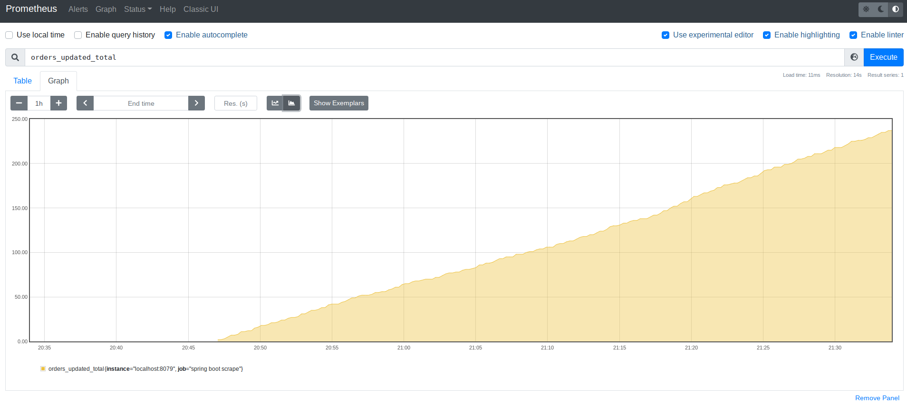

#### Time taken to adopt a pet

In the [PetService.java](https://github.com/hdmsantander/microservices-ops-demo/blob/a2718edffddaceb66ad7045835c7b0705419c365/query-microservice/src/main/java/mx/hdmsantander/opsdemo/query/service/PetService.java#L61) there is an annotation that enables a _Timer_ style metric for the [method](https://github.com/hdmsantander/microservices-ops-demo/blob/a2718edffddaceb66ad7045835c7b0705419c365/query-microservice/src/main/java/mx/hdmsantander/opsdemo/query/service/PetService.java#L62) that performs pet adoptions.

```JAVA
@Timed(value = "pet.query.time", description = "Time taken to query and return the pet shop list for all pets")
```

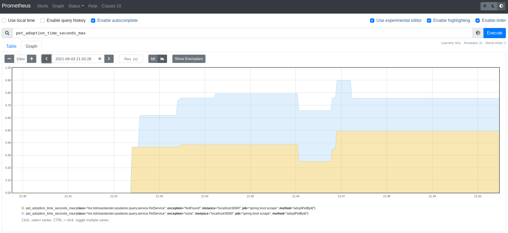

#### Amount of orders in the system

In [PetShopOrderService.java](query-microservice/src/main/java/mx/hdmsantander/opsdemo/query/service/PetShopOrderService.java) a _Gauge_ metric reports the number of orders in the query system's database:

```java
@PostConstruct
void registerGauge() {
    Gauge.builder("orders.size", petShopOrderRepository, r -> (double) r.count())
            .description("Number of orders in the system")
            .register(meterRegistry);
}
```

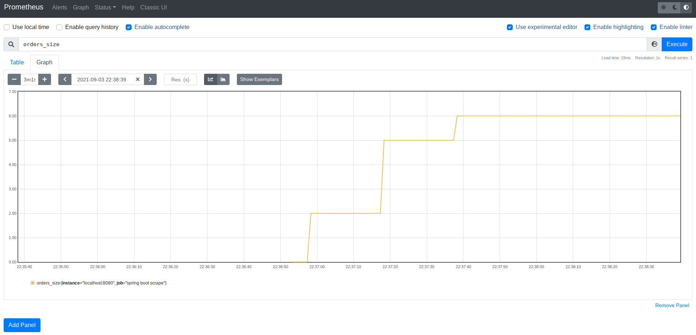

## Kibana (Elasticsearch logs)

Kibana is accessible at [http://localhost:5601](http://localhost:5601). Use **Discover** to search logs from Query and Inventory. Logs are ingested from the `application-logs` Kafka topic via Kafka Connect. See [docs/KIBANA_DASHBOARDS_PROPOSAL.md](docs/KIBANA_DASHBOARDS_PROPOSAL.md) for proposed dashboards (Log Overview, Error Monitoring, Trace Correlation, Log Processing). Export dashboards from Kibana and place `.ndjson` in `elk/init/dashboards/` for auto-import on startup. See [docs/ELK_LOGGING.md](docs/ELK_LOGGING.md) for setup.

## Zipkin server

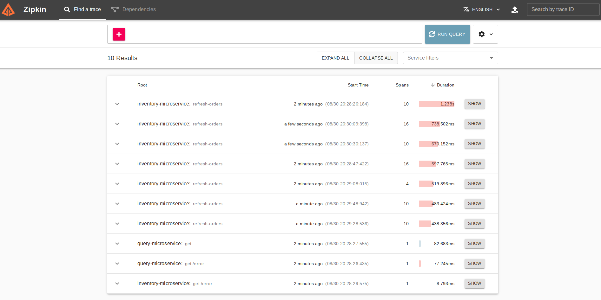

The Zipkin server is accessible at [http://localhost:9411](http://localhost:9411)

### Example of traces registered

Here are some examples of the traces registered.

#### Scheduled order retrieval

The inventory microservice performs a scheduled retrieval of the orders in the pet shop API. If it finds an order, it emits an event that the query microservice consumes to update its database.

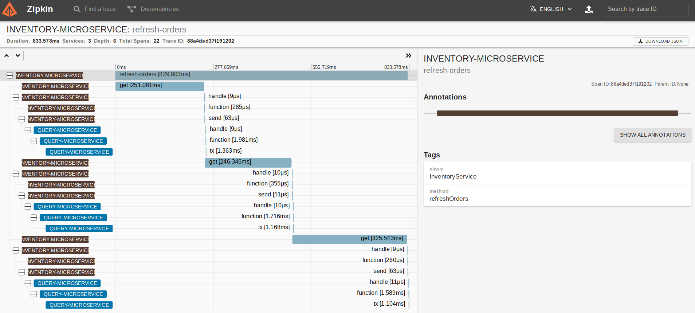

#### Pet adoption

The query microservice performs a GET of the pet ID to the pet shop API, and if the ID of the pet exists it emits an event which in turn is consumed by the inventory microservice.

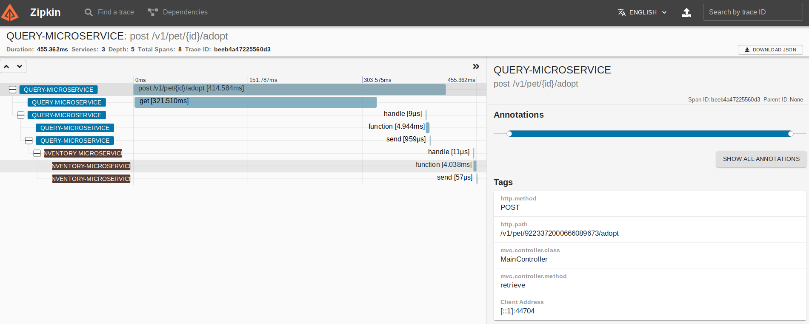

## Kafka server

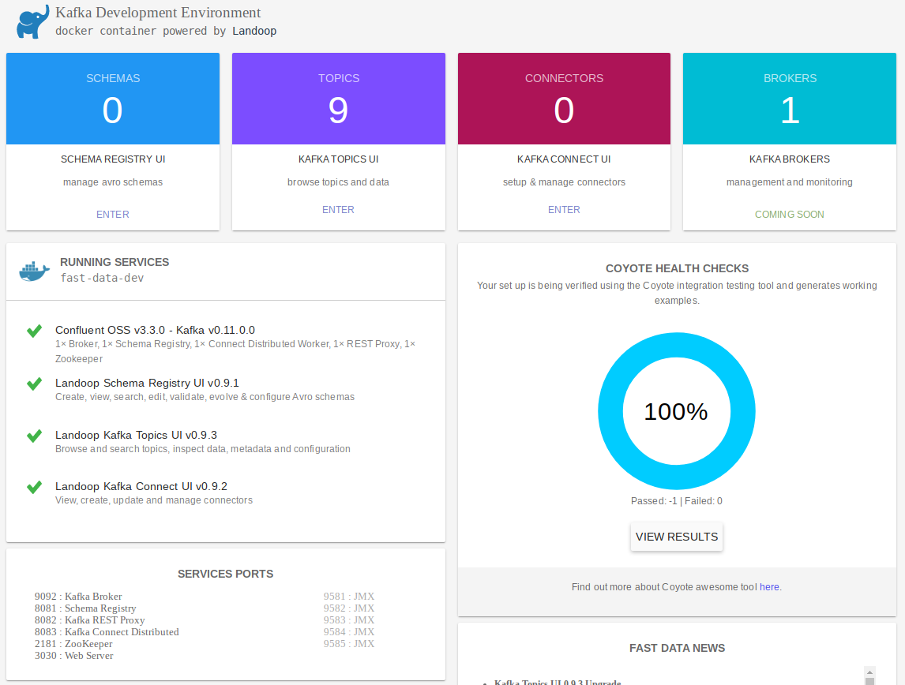

The stack uses `landoop/fast-data-dev`, which includes Kafka, Zookeeper, Schema Registry, and a Web UI. The Kafka Web UI for viewing topics and events is accessible at [http://localhost:3030](http://localhost:3030).

## CI/CD and Code Coverage

### GitHub Actions

- **Run Tests** (`.github/workflows/test.yml`): Runs tests for both microservices on every pull request targeting `main`, `master`, or `develop`.
- **Coverage Report** (`.github/workflows/coverage.yml`): Generates JaCoCo HTML coverage reports and publishes them to GitHub Pages. Trigger manually via **Actions → Coverage Report → Run workflow** (optionally select a branch).

### Enabling GitHub Pages for Coverage Reports

1. Go to **Settings → Pages** in the repository
2. Under **Build and deployment**, set **Source** to **GitHub Actions**
3. Run the "Coverage Report" workflow from the Actions tab
4. Reports will be available at `https://<org>.github.io/<repo>/` (e.g. query-microservice and inventory-microservice links)

### Local Coverage

Run tests with coverage (enforces **80% minimum** instruction coverage via JaCoCo check):

```bash
# Query microservice
./mvnw verify -f query-microservice/pom.xml

# Inventory microservice
./mvnw verify -f inventory-microservice/pom.xml
```

Reports are written to `target/site/jacoco/index.html` in each microservice directory. Build fails if coverage drops below 80%.
