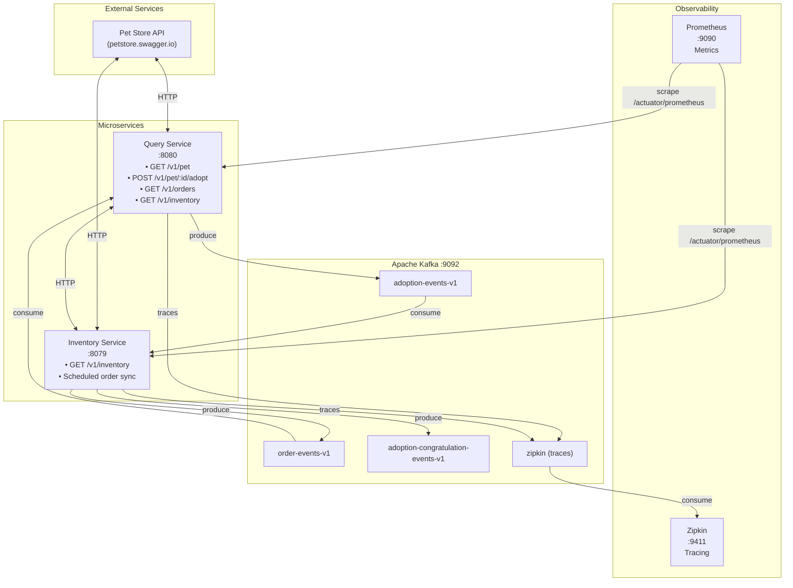

# Microservices OPS demo

This repository holds a Spring Boot OPS demo with the following components:

- Two microservices (Spring Boot 4.0.3) that perform requests to the [Swagger's PetStore](https://petstore.swagger.io/) and communicate with each other using HTTP and [Spring for Apache Kafka](https://spring.io/projects/spring-kafka).
- A Zipkin server that receives traces from the microservices via [Micrometer Tracing](https://micrometer.io/docs/tracing) (Brave).
- A Prometheus server that scrapes metrics from [Spring Boot Actuator](https://docs.spring.io/spring-boot/docs/current/reference/html/actuator.html).
- A Kafka cluster (landoop/fast-data-dev) for event-driven communication between the microservices and the tracer, including a Web UI.

## Prerequisites

- **Java 17** or higher
- **Docker** and **Docker Compose** (for running the full stack)
- **Maven 3.8+** (or use the included Maven wrapper `./mvnw`)

## Quick Start

### Start the full demo

```bash
./start.sh
```

This script packages both microservices, builds Docker images, and starts the entire stack (Kafka, Zipkin, Prometheus, and both microservices).

### Start infrastructure only (Kafka, Zipkin, Prometheus)

```bash
./start.sh minimal
```

Or directly: `docker compose -f docker-compose-minimal.yml up`

Then run the microservices locally:

```bash
# Terminal 1 - Inventory microservice (port 8079)
cd inventory-microservice && ./mvnw spring-boot:run

# Terminal 2 - Query microservice (port 8080)
cd query-microservice && ./mvnw spring-boot:run
```

## Architecture & Event Flow


```mermaid
flowchart TB
    subgraph External["External Services"]
        PetStore["Pet Store API<br/>(petstore.swagger.io)"]
    end

    subgraph Microservices["Microservices"]
        Query["Query Service<br/>:8080<br/>• GET /v1/pet<br/>• POST /v1/pet/:id/adopt<br/>• GET /v1/orders<br/>• GET /v1/inventory"]
        Inventory["Inventory Service<br/>:8079<br/>• GET /v1/inventory<br/>• Scheduled order sync"]
    end

    subgraph Kafka["Apache Kafka :9092"]
        direction TB
        OE["order-events-v1"]
        AE["adoption-events-v1"]
        ACE["adoption-congratulation-events-v1"]
        ZipkinTopic["zipkin (traces)"]
    end

    subgraph Observability["Observability"]
        Zipkin["Zipkin<br/>:9411<br/>Tracing"]
        Prometheus["Prometheus<br/>:9090<br/>Metrics"]
    end

    PetStore <-->|HTTP| Query
    PetStore <-->|HTTP| Inventory
    Query <-->|HTTP| Inventory

    Inventory -->|produce| OE
    OE -->|consume| Query
    Query -->|produce| AE
    AE -->|consume| Inventory
    Inventory -->|produce| ACE

    Query -->|traces| ZipkinTopic
    Inventory -->|traces| ZipkinTopic
    ZipkinTopic -->|consume| Zipkin

    Prometheus -->|scrape /actuator/prometheus| Query
    Prometheus -->|scrape /actuator/prometheus| Inventory
```

> **Note:** Zipkin is configured with `KAFKA_BOOTSTRAP_SERVERS` in docker-compose and can consume traces from the `zipkin` Kafka topic. Microservices send traces via Kafka.

### Kafka Topics

| Topic                               | Producer         | Consumer   | Description                      |
| ----------------------------------- | ---------------- | ---------- | -------------------------------- |
| `order-events-v1`                   | Inventory        | Query      | Order updates from Pet Store API |
| `adoption-events-v1`                | Query            | Inventory  | Pet adoption events              |
| `adoption-congratulation-events-v1` | Inventory        | (external) | Adoption confirmation events     |
| `zipkin`                            | Query, Inventory | Zipkin     | Distributed traces               |

## Running Tests

```bash
# Query microservice
cd query-microservice && ./mvnw test

# Inventory microservice
cd inventory-microservice && ./mvnw test
```

## Important Configuration

- **Kafka**: Uses `landoop/fast-data-dev` (Kafka + Zookeeper + Schema Registry + Web UI). Broker at `localhost:9092`, Web UI at [http://localhost:3030](http://localhost:3030). Override broker with `spring.cloud.stream.kafka.binder.brokers` or `SPRING_CLOUD_STREAM_KAFKA_BINDER_BROKERS`.
- **Spring Cloud 2025.1.0**: Required for Spring Boot 4.0.3 compatibility.
- **Kafka JSON (Spring Kafka 4.x)**: Uses `JacksonJsonDeserializer` and `JacksonJsonSerializer`. Configure via binder-level `consumer-properties` and `producer-properties` (not bindings-level). Use bracket notation for dotted keys, e.g. `"[value.deserializer]"`, `"[spring.json.trusted.packages]"`, `"[spring.json.value.default.type]"`.

## Query microservice


This microservice performs queries to the inventory microservice and the pet shop API. It supports the following operations:

- `GET /v1/inventory` This operation queries the inventory endpoint of the inventory microservice and returns the result.
- `GET /v1/pet` This operation queries the list of pets from the pet shop API and returns the results.
- `POST /v1/pet/{id}/adopt` This operation performs the "adoption" of a pet from the shop. It requires a valid ID from the pet shop and it triggers an adoption event, which is consumed by the inventory microservice, which then in turn emits an event.
- `GET /v1/orders` This operation queries the service's database to get a list of all the orders currently registered in the system. The orders are created from events wich the inventory microservice emits.

The Swagger page is accessible at [http://localhost:8080/swagger-ui.html](http://localhost:8080/swagger-ui.html)

## Inventory microservice


This microservice performs queries to the pet shop API. This service is used by the query service to perform some queries. It supports the following operations:

- `GET /v1/inventory` This operation queries the inventory endpoint of the pet shop API and returns the result. It is intended to be used by the query microservice.

It also performs a scheduled query of the inventory of the pet shop API to "update" the inventory of the shop in the microservice ecosystem. The service performs a query of orders (generated randomly as integers in the range of 1-10) to the [orders endpoint](https://petstore.swagger.io/v2/store/order) of the pet shop API, triggering an event if the order exists, this event is consumed by the query microservice which in turn updates the entity in question in its database.

The Swagger page is accessible at [http://localhost:8079/swagger-ui.html](http://localhost:8079/swagger-ui.html)

## Prometheus server


The Prometheus server is accessible at [http://localhost:9090](http://localhost:9090)

### Example of metrics reported

Here are some examples of the metrics registered.

#### Orders updated in total

In the [OrderService.java](https://github.com/hdmsantander/microservices-ops-demo/blob/a2718edffddaceb66ad7045835c7b0705419c365/inventory-microservice/src/main/java/mx/hdmsantander/opsdemo/inventory/service/OrderService.java#L58) there is a section of code that updates a _Counter_ style metric.

```JAVA
if (responseEntity.getStatusCode().is2xxSuccessful()) {
  log.info("Request was successful! Emitting event to update orders!");
  meterRegistry.counter("orders.updated").increment();
  orderEventService.send(responseEntity.getBody());
}
```


#### Time taken to adopt a pet

In the [PetService.java](https://github.com/hdmsantander/microservices-ops-demo/blob/a2718edffddaceb66ad7045835c7b0705419c365/query-microservice/src/main/java/mx/hdmsantander/opsdemo/query/service/PetService.java#L61) there is an annotation that enables a _Timer_ style metric for the [method](https://github.com/hdmsantander/microservices-ops-demo/blob/a2718edffddaceb66ad7045835c7b0705419c365/query-microservice/src/main/java/mx/hdmsantander/opsdemo/query/service/PetService.java#L62) that performs pet adoptions.

```JAVA
@Timed(value = "pet.query.time", description = "Time taken to query and return the pet shop list for all pets")
```


#### Amount of orders in the system

In [PetShopOrderService.java](query-microservice/src/main/java/mx/hdmsantander/opsdemo/query/service/PetShopOrderService.java) a _Gauge_ metric reports the number of orders in the query system's database:

```java
@PostConstruct
void registerGauge() {
    Gauge.builder("orders.size", petShopOrderRepository, r -> (double) r.count())
            .description("Number of orders in the system")
            .register(meterRegistry);
}
```


## Zipkin server


The Zipkin server is accessible at [http://localhost:9411](http://localhost:9411)

### Example of traces registered

Here are some examples of the traces registered.

#### Scheduled order retrieval

The inventory microservice performs a scheduled retrieval of the orders in the pet shop API. If it finds an order, it emits an event that the query microservice consumes to update its database.


#### Pet adoption

The query microservice performs a GET of the pet ID to the pet shop API, and if the ID of the pet exists it emits an event which in turn is consumed by the inventory microservice.


## Kafka server


The stack uses `landoop/fast-data-dev`, which includes Kafka, Zookeeper, Schema Registry, and a Web UI. The Kafka Web UI for viewing topics and events is accessible at [http://localhost:3030](http://localhost:3030).
