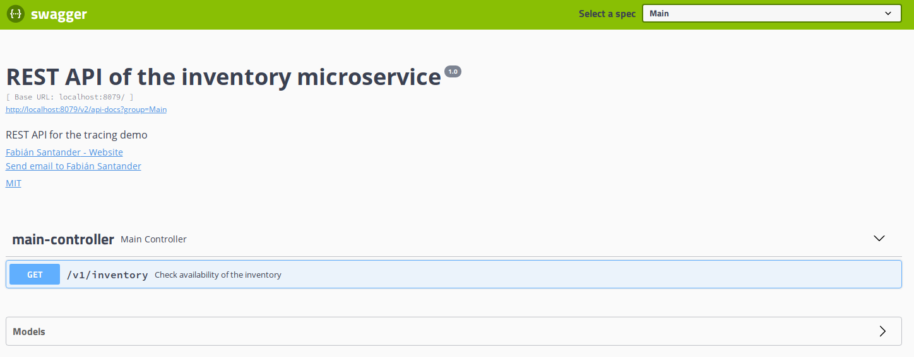

# Microservices OPS demo

This repository holds a Spring Boot OPS demo with the following components:

- Two microservices that perform requests to the [Swagger's PetStore](https://petstore.swagger.io/) and comunicate with each other using HTTP requests and events using [Spring Cloud Stream](https://spring.io/projects/spring-cloud-stream).
- A ZipKin server that register traces and dependencies from the microservices operations, provided by [Spring Cloud Sleuth](https://spring.io/projects/spring-cloud-sleuth).
- A Prometheus server that polls the microservices to register metrics gathered from [Spring Boot's actuator](https://docs.spring.io/spring-boot/docs/current/reference/html/actuator.html).
- A Kafka cluster to comunicate the microservices and the tracer.

The demo can be started by executing the following command:

```BASH
./start.sh
```

The Zipkin server, Prometheus server and Kafka cluster can be started standalone by running:

```BASH
docker-compose -f docker-compose-minimal.yml up
```

## Query microservice


This microservice performs queries to the inventory microservice and the pet shop API. It supports the following operations:

- `GET /v1/inventory` This operation queries the inventory endpoint of the inventory microservice and returns the result.
- `GET /v1/pet` This operation queries the list of pets from the pet shop API and returns the results.
- `POST /v1/pet/{id}/adopt` This operation performs the "adoption" of a pet from the shop. It requires a valid ID from the pet shop and it triggers an adoption event, which is consumed by the inventory microservice, which then in turn emits an event.
- `GET /v1/orders` This operation queries the service's database to get a list of all the orders currently registered in the system. The orders are created from events wich the inventory microservice emits.

The Swagger page is accesible at [http://localhost:8080/swagger-ui.html](http://localhost:8080/swagger-ui.html)

## Inventory microservice



This microservice performs queries to the pet shop API. This service is used by the query service to perform some queries. It supports the following operations:

- `GET /v1/inventory` This operation queries the inventory endpoint of the pet shop API and returns the result. It is intended to be used by the query microservice.

It also performs a scheduled query of the inventory of the pet shop API to "update" the inventory of the shop in the microservice ecosystem. The service performs a query of orders (generated randomly as integers in the range of 1-10) to the [orders endpoint](https://petstore.swagger.io/v2/store/order) of the pet shop API, triggering an event if the order exists, this event is consumed by the query microservice which in turn updates the entity in question in its database.

The Swagger page is accesible at [http://localhost:8079/swagger-ui.html](http://localhost:8079/swagger-ui.html)

## Prometheus server


The prometheus server is accesible at [http://localhost:9090](http://localhost:9090)

## Zipkin server


The Zipkin server is accesible at [http://localhost:9411](http://localhost:9411)

## Kafka server

An interface to see the topcs and events found in the kafka server is accesible at [http://localhost:3030](http://localhost:3030)


