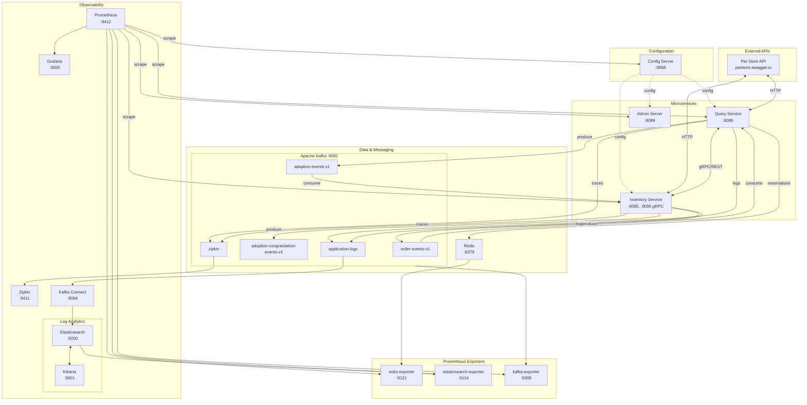
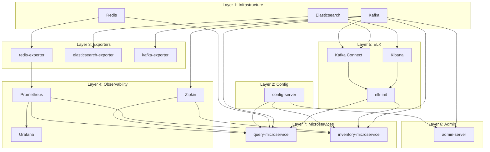
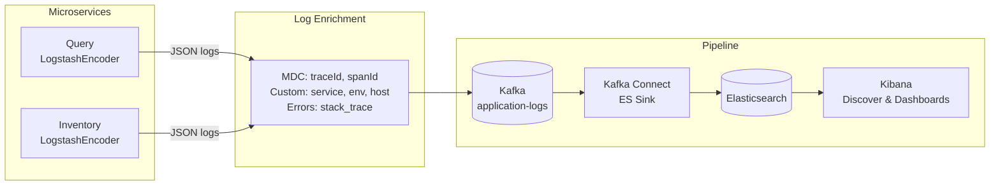
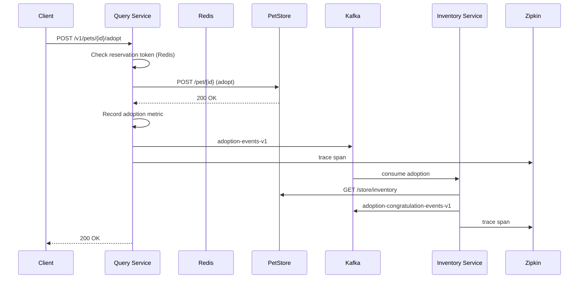
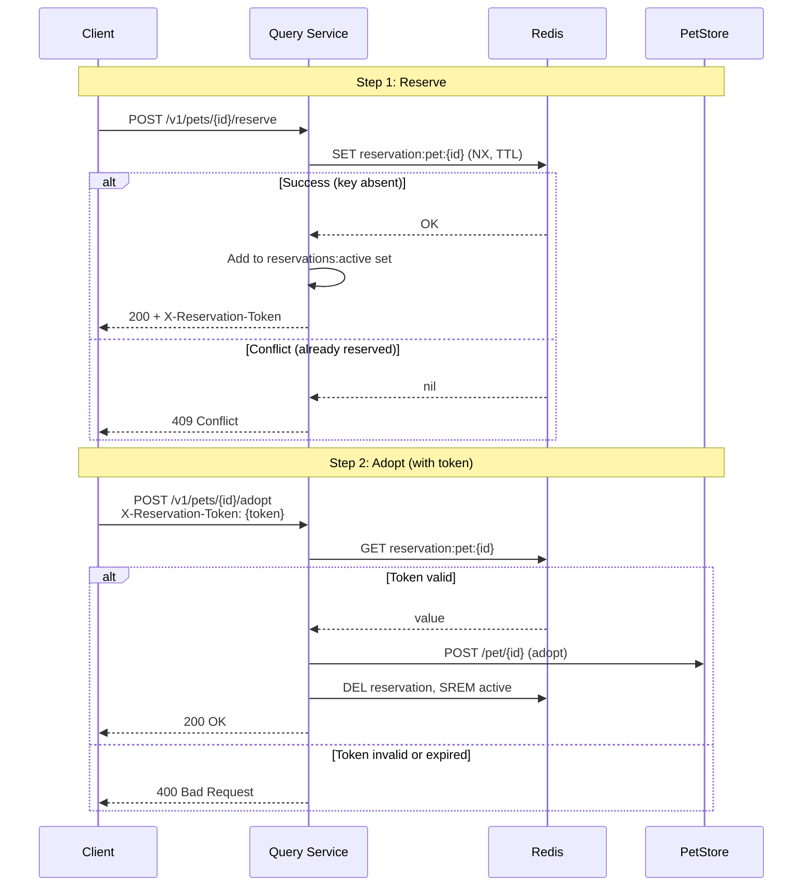
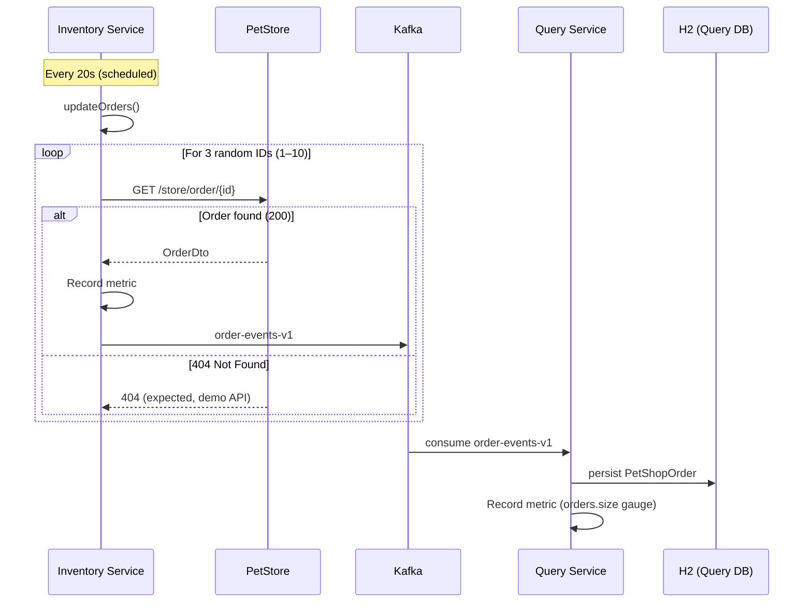
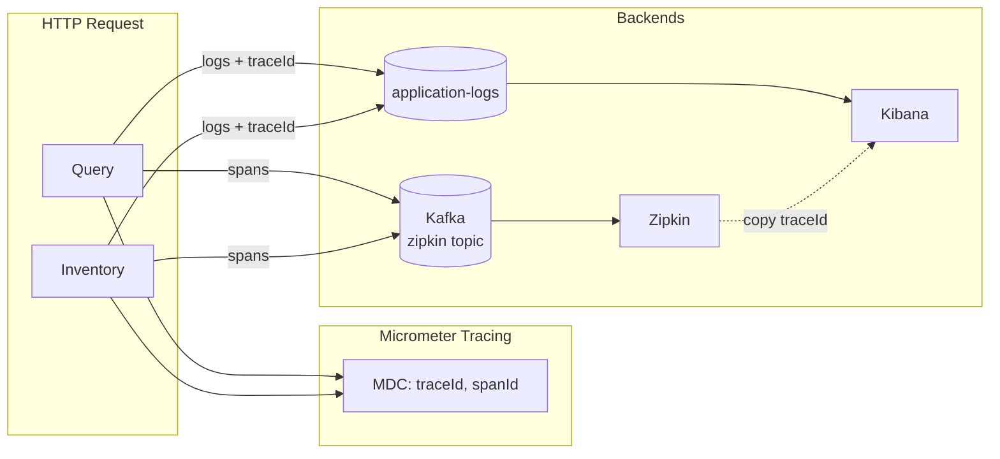
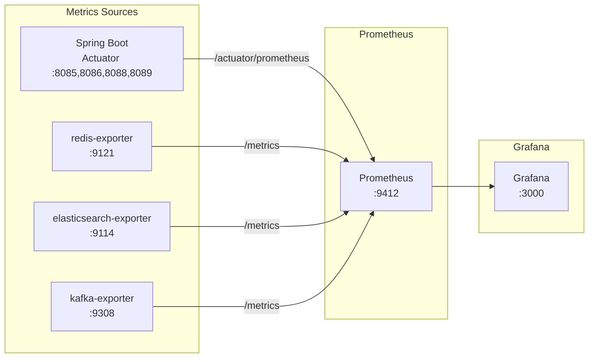

# Architecture and Flows

This document describes the system architecture, component relationships, and key operational flows for the microservices-ops-demo.

## System Overview

---

## Docker Startup Flow

The full stack starts in seven layers. Each layer waits for its dependencies to be healthy before starting.

See [DOCKER.md](DOCKER.md) for health checks and graceful shutdown.

---

## Log Flow (ELK)

Application logs are enriched with trace correlation (traceId, spanId), service, environment, and host, then sent to Kafka for ingestion into Elasticsearch.

**Trace correlation**: Copy a `traceId` from Zipkin (http://localhost:9411) and filter in Kibana by `traceId: "..."` to see all logs for that request across Query and Inventory.

See [LOGGING_KAFKA.md](LOGGING_KAFKA.md) and [ELK_LOGGING.md](ELK_LOGGING.md).

---

## Pet Adoption Flow

End-to-end flow when a client adopts a pet via the Query service.

**Notes**:
- Reservation token (from Redis) required when Redis is available.
- Circuit breaker on PetStore/Inventory calls; fallback returns empty on failure.
- Traces and logs include `traceId` for correlation in Zipkin and Kibana.

---

## Pet Reservation Flow

Ticketmaster-style reserve-then-adopt flow. Reservations are stored in Redis with TTL; adoption requires the reservation token when Redis is available.

**Notes**: When Redis is unavailable, reserve returns 503; adopt skips token validation (graceful degradation).

---

## Order Sync Flow

Scheduled and event-driven order synchronization between PetStore, Inventory, and Query.

**Notes**:
- PetStore demo API returns random results; 404 is expected and ignored by circuit breaker.
- Query maintains local order DB; Kafka events keep it in sync.

---

## Trace Correlation Flow

Distributed tracing and log correlation across the observability stack.

**Workflow**:
1. Request enters Query → Micrometer creates trace, propagates traceId/spanId to MDC.
2. Logs (console + Kafka) include traceId, spanId, service, host.
3. gRPC/HTTP calls to Inventory propagate trace context (B3 headers).
4. Zipkin shows the full trace; Kibana shows logs filtered by the same traceId.

---

## Metrics Flow (Prometheus)

**Dashboards**:
- **Pet Shop Overview**: Business metrics (adoptions, reservations, orders, latencies).
- **Infrastructure**: Redis, Elasticsearch, Kafka, JVM, HTTP, Prometheus targets.

---

## Kafka Topics Summary

| Topic | Producer | Consumer | Purpose |
|-------|----------|----------|---------|
| `order-events-v1` | Inventory | Query | Order updates from PetStore |
| `adoption-events-v1` | Query | Inventory | Pet adoption events |
| `adoption-congratulation-events-v1` | Inventory | (external) | Adoption confirmation |
| `zipkin` | Query, Inventory | Zipkin | Distributed traces |
| `application-logs` | Query, Inventory | Kafka Connect → ES | Enriched JSON logs |

---

## Related Documentation

| Doc | Topic |
|-----|-------|
| [DOCKER.md](DOCKER.md) | Container best practices, startup order |
| [ELK_LOGGING.md](ELK_LOGGING.md) | Elasticsearch, Kibana, log schema |
| [LOGGING_KAFKA.md](LOGGING_KAFKA.md) | Log distribution, trace enrichment |
| [GRPC_IMPLEMENTATION.md](GRPC_IMPLEMENTATION.md) | gRPC for Query ↔ Inventory |
| [CONFIG_SERVER.md](CONFIG_SERVER.md) | Centralized configuration |
| [PROFILING.md](PROFILING.md) | Load testing with Gatling |
