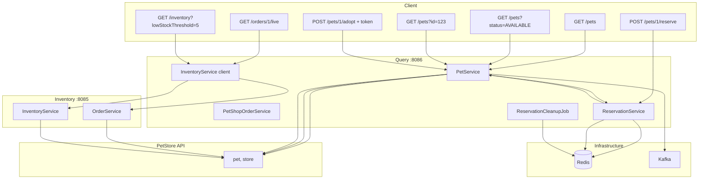
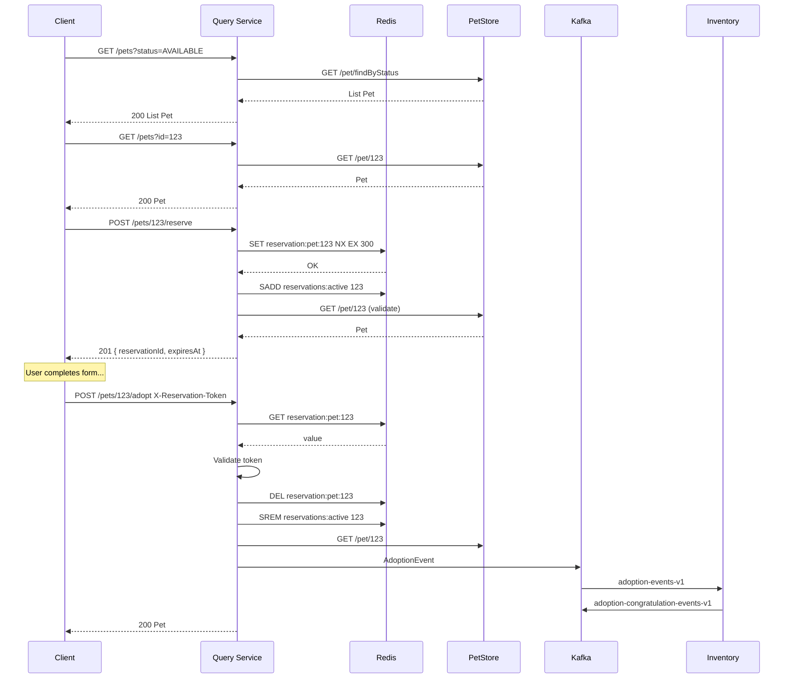

# Observability-First Endpoints Proposal (v5)

## Document History

| Version | Date | Changes |
|---------|------|---------|
| v4 | — | Original proposal |
| v5 | 2025-03-04 | Port alignment (8085/8086), inventory refresh clarification, suggested technologies, validation fixes |
| v5.1 | 2025-03-04 | List-all-pets option for GET /v1/pets; Testing Scope section (adoption process) |
| v5.2 | 2025-03-04 | gRPC for Query ↔ Inventory sync (GetInventory, GetOrder, Refresh); see [GRPC_IMPLEMENTATION.md](GRPC_IMPLEMENTATION.md) |

**Related docs:** [TESTING.md](TESTING.md), [IMPROVEMENT_REPORT.md](IMPROVEMENT_REPORT.md)

---

## Project Context

**Purpose**: Showcase tracing (Zipkin), logging, and Spring/microservices features in a demo environment.

**Current observability**:
- Micrometer: `pet.adoptions` counter, `orders.updated` counter, `orders.size` gauge, `@Timed` on key methods
- Tracing: B3 propagation, custom span on `refreshOrders`, `X-Zipkin-Trace-Id` response header
- Kafka: `order-events-v1`, `adoption-events-v1`, `adoption-congratulation-events-v1`, traces to Zipkin
- Retry: `@Retryable` on PetStore/external calls

**Current ports** (aligned with codebase):
- Query: **8086**
- Inventory: **8085**

---

## Design Principles

1. **Trace chain length** — Flows spanning Query → Inventory → PetStore and Kafka hops.
2. **Metric density** — Counters, gauges, timers for Prometheus dashboards.
3. **Event-driven** — Kafka events with trace propagation.
4. **Reservation flow** — Ticketmaster-style hold-to-prevent-double-booking for adoptions.
5. **Plural resource naming** — `/pets`, `/orders` for collections.
6. **Filter-based design** — Avoid path-variable conflicts; use query params for filters where possible.

---

## Path Ordering Mitigation: Pet-by-ID as Filter

### Proposed Change

**Replace** `GET /v1/pets/{id}` with a filter on `GET /v1/pets` to eliminate path-ordering pitfalls.

| Before | After |
|--------|-------|
| `GET /v1/pets` + `GET /v1/pets/{id}` (two paths, ordering risk) | Single `GET /v1/pets` with optional `id` filter |

**Implementation:**

- Single endpoint: `GET /v1/pets`
- When `id` is present: return single pet (or 404). PetStore call: `GET /pet/{id}`.
- When `id` is absent: **list branch** — either `status` filter (optional) or list all.
  - With `status`: PetStore call `GET /pet/findByStatus` (+ optional in-memory tags filter).
  - Without `status`: List **all pets in the system** — call `findByStatus` for each of `AVAILABLE`, `PENDING`, `SOLD` and merge (deduplicate by id).

**REST Summary:**

| Request | Behavior |
|---------|----------|
| `GET /v1/pets?id=123` | Fetch pet by ID; returns 200 Pet or 404 |
| `GET /v1/pets` | **List all pets** in the system; returns 200 List&lt;Pet&gt; (merged from PetStore findByStatus for each status) |
| `GET /v1/pets?status=AVAILABLE` | List pets by status; returns 200 List&lt;Pet&gt; |
| `GET /v1/pets?status=AVAILABLE&tags=tag1,tag2` | List pets by status, filtered by tags; returns 200 List&lt;Pet&gt; |

**Controller logic:** If `id` param present → single-pet branch; else → list branch. For list: if `status` present → single findByStatus; else → list all (3 PetStore calls, merge).

---

## Filter Semantics (Pitfalls 6 & 7 — Resolved)

### Pets Filters (Pitfall 6)

**Defined behavior for `GET /v1/pets`:**

| Params | PetStore call | Post-processing |
|--------|---------------|-----------------|
| `id` only | `GET /pet/{id}` | None; return single pet |
| None (list all) | `GET /pet/findByStatus?status=available` + `pending` + `sold` | Merge and deduplicate by id; return combined list |
| `status` only | `GET /pet/findByStatus?status={status}` | None |
| `status` + `tags` | `GET /pet/findByStatus?status={status}` | Filter result list: keep only pets whose `tags` contain ALL requested tag names (case-sensitive match on `Tag.name`) |
| `id` + `status` | `id` takes precedence | Ignore `status`; treat as single-pet fetch |
| `id` + `tags` | `id` takes precedence | Ignore `tags`; treat as single-pet fetch |

**List-all-pets implementation:** PetStore v2 has no "list all" endpoint. To list all pets, call `findByStatus` for `available`, `pending`, and `sold`; merge results and deduplicate by pet id.

**Rationale:** PetStore `findByTags` is deprecated. Use `findByStatus` as primary; apply tags filter in-memory to avoid deprecated API and keep semantics clear.

---

### Inventory Filters (Pitfall 7)

**Defined behavior for `GET /v1/inventory`:**

PetStore inventory returns `{ "available": 5, "pending": 2, "sold": 10, ... }` (status key → integer quantity). Keys are lowercase.

| Params | Processing order | Result |
|--------|------------------|--------|
| None | Raw fetch | Full JsonNode |
| `status=available` | (1) Fetch raw; (2) Extract key `available` only | `{ "available": 5 }` or `{}` if key missing |
| `lowStockThreshold=5` | (1) Fetch raw; (2) Keep only entries where `value < threshold` | `{ "pending": 2 }` (example) |
| `status=available` + `lowStockThreshold=5` | (1) Fetch raw; (2) Apply status (single key); (3) If value exists and `value < threshold`, include; else `{}` | Combined filter |

**Order of application:** Status first (narrows to one key), then lowStockThreshold on that key's value.

**Pseudocode:**

```
inv = fetchFromPetStore()
if (status):
    inv = { status: inv[status] }  // single key, or {} if missing
if (lowStockThreshold != null):
    inv = { k: v for k,v in inv.items() if v < lowStockThreshold }
return inv
```

---

## Adoption Reservation Flow (Ticketmaster-Style)

### Problem

Two users can attempt to adopt the same pet simultaneously, causing double-booking.

### Solution

**Reserve-then-Adopt** flow (similar to seat reservations):

1. **Reserve** — Client calls `POST /v1/pets/{id}/reserve`. System atomically claims the pet for a short TTL (e.g. 5 minutes). Returns a reservation token.
2. **Adopt** — Client calls `POST /v1/pets/{id}/adopt` with the reservation token. System validates token, completes adoption, releases hold.
3. **Expiry** — If adoption is not completed within TTL, reservation expires and pet becomes available again.
4. **Release** — Client may cancel via `DELETE /v1/pets/{id}/reserve` (with token) to free the pet early.

### Graceful Degradation (Optional for Demo)

When Redis is unavailable: allow direct adopt (without reservation) with a warning metric `reservations.redis_unavailable` and log. Demonstrates resilience patterns.

### Flow Diagram

```mermaid
flowchart TB
    subgraph Client["Client"]
        C1[POST /pets/1/reserve]
        C2[POST /pets/1/adopt with token]
        C3[DELETE /pets/1/reserve optional]
    end

    subgraph Query["Query Service :8086"]
        R1[ReservationService]
        P1[PetService]
    end

    subgraph Redis["Redis"]
        KV[reservation:pet:{id}]
        RSET[reservations:active]
    end

    subgraph PetStore["PetStore API"]
        PS[pet]
    end

    C1 --> R1
    R1 -->|SET NX EX + SADD| Redis
    R1 --> P1
    P1 -->|validate exists| PS
    
    C2 --> P1
    P1 --> R1
    R1 -->|GET + DEL + SREM| Redis
    R1 -->|valid?| P1
    P1 -->|adopt| PS
    
    C3 --> R1
    R1 -->|DEL + SREM| Redis
```

### New Technology: Redis

| Technology | Purpose | Integration |
|------------|---------|-------------|
| **Redis** | Distributed reservation store; atomic claim; TTL for auto-expiry | Spring Data Redis, Lettuce client |
| **Redis key schema** | `reservation:pet:{petId}` → `{reservationId, createdAt}` with TTL | SET NX EX for atomic claim |
| **Reservations set** | `reservations:active` → SET of `petId` strings | SADD on create, SREM on release/adopt |

**Maven dependency:**

```xml
<dependency>
    <groupId>org.springframework.boot</groupId>
    <artifactId>spring-boot-starter-data-redis</artifactId>
</dependency>
```

**Docker Compose**: Add Redis service (port 6379).

**Configuration**: `spring.data.redis.host`, `spring.data.redis.port`, optional `spring.data.redis.password`.

**Pet ID in Redis:** Use `String.valueOf(petId)` for keys and set members (PetStore uses `long`; model uses `String`).

---

## Design Flaw 5 Mitigation: `reservations.active` Gauge

### Problem

Using `KEYS reservation:pet:*` or `DBSIZE` to count reservations is expensive and can block Redis.

### Mitigation: Dedicated Set

Maintain a Redis SET `reservations:active` whose members are `petId` (as string):

| Operation | Redis commands |
|-----------|----------------|
| Create reservation | `SET reservation:pet:{petId} {json} NX EX ttl`; on success: `SADD reservations:active {petId}` |
| Release (explicit or adopt) | `DEL reservation:pet:{petId}`; `SREM reservations:active {petId}` |
| Gauge read | `SCARD reservations:active` — O(1), non-blocking |

### TTL Expiry Cleanup

When a key expires via TTL, it is removed from Redis but not from `reservations:active`. Mitigation:

**Scheduled cleanup job** (e.g. every 60 seconds):

1. `SMEMBERS reservations:active`
2. For each `petId`: `EXISTS reservation:pet:{petId}`
3. If not exists: `SREM reservations:active {petId}`

Configure interval via `reservation.cleanup-interval-seconds` (default 60). For low reservation counts, cost is acceptable.

**Alternative:** Redis keyspace notifications (`expired` events) to SREM on expiry. Requires `CONFIG SET notify-keyspace-events Ex` and a listener. More complex; scheduled cleanup is sufficient for demo.

---

## Proposed Endpoints

### Query Microservice (port 8086)

| Endpoint | Method | Description | REST Summary |
|----------|--------|-------------|--------------|
| **GET /v1/pets** | GET | List or get pets. Filters: `id` (optional, single pet), `status` (optional when listing), `tags` (optional, comma-separated). No params lists all pets. | `GET /v1/pets` → 200 List&lt;Pet&gt; (all) <br/> `GET /v1/pets?id=123` → 200 Pet or 404 <br/> `GET /v1/pets?status=AVAILABLE` → 200 List&lt;Pet&gt; <br/> `GET /v1/pets?status=AVAILABLE&tags=tag1,tag2` → 200 List&lt;Pet&gt; |
| **POST /v1/pets/{id}/reserve** | POST | Reserve pet for adoption. Returns reservation token and TTL. | `POST /v1/pets/{id}/reserve` → 201 `{ reservationId, petId, expiresAt }`, 409 if already reserved |
| **POST /v1/pets/{id}/adopt** | POST | Adopt pet. **Requires** valid reservation token (header `X-Reservation-Token`). | `POST /v1/pets/{id}/adopt` + `X-Reservation-Token` → 200 Pet, 400 if no/invalid token, 409 if expired |
| **DELETE /v1/pets/{id}/reserve** | DELETE | Release reservation early. Requires `X-Reservation-Token`. | `DELETE /v1/pets/{id}/reserve` + `X-Reservation-Token` → 204, 404 if invalid |
| **GET /v1/reservations/{reservationId}** | GET | Check reservation status. | `GET /v1/reservations/{id}` → 200 `{ reservationId, petId, expiresAt, valid }`, 404 |
| **GET /v1/orders** | GET | List orders from local DB (event-synced) | `GET /v1/orders` → 200 List&lt;PetShopOrder&gt; |
| **GET /v1/orders/{orderId}** | GET | Get order from local DB | `GET /v1/orders/{orderId}` → 200 PetShopOrder, 404 |
| **GET /v1/orders/{orderId}/live** | GET | Proxy to Inventory for live order from PetStore | `GET /v1/orders/{orderId}/live` → 200 OrderDto, 404 |
| **GET /v1/inventory** | GET | Proxy to Inventory service (filter params passed through) | `GET /v1/inventory` → 200 <br/> `GET /v1/inventory?status=available&lowStockThreshold=5` → 200 (proxied) |
| **GET /v1/adoptions/stats** | GET | Adoption count from MeterRegistry | `GET /v1/adoptions/stats` → 200 `{ totalAdoptions }` |
| **POST /v1/inventory/refresh** | POST | Trigger on-demand order sync via Inventory service | `POST /v1/inventory/refresh` → 200 (proxied) |

### Additional Endpoints (Suggested)

| Endpoint | Method | Description | Rationale |
|----------|--------|-------------|-----------|
| **GET /actuator/health/redis** | GET | Redis health indicator (custom) | Shows Redis connectivity for reservation flow |
| **GET /v1/reservations** | GET | List active reservations (admin/debug) | Optional; useful for demo debugging |
| **GET /v1/pets?id={id}&checkReservation=true** | GET | Optional param to include `reserved: boolean` in response | Client can show "Reserved" badge |

### Inventory Microservice (port 8085)

| Endpoint | Method | Description | REST Summary |
|----------|--------|-------------|--------------|
| **GET /v1/inventory** | GET | Inventory from PetStore. Filters: `status` (optional), `lowStockThreshold` (optional). See [Inventory Filters](#inventory-filters-pitfall-7) for application order. | `GET /v1/inventory` → 200 raw <br/> `GET /v1/inventory?status=available` → 200 filtered <br/> `GET /v1/inventory?lowStockThreshold=5` → 200 low-stock only <br/> `GET /v1/inventory?status=available&lowStockThreshold=5` → 200 both applied |
| **GET /v1/order/{orderId}** | GET | Get order from PetStore | `GET /v1/order/{orderId}` → 200 OrderDto, 404 |
| **POST /v1/inventory/refresh** | POST | On-demand order sync; triggers scheduled order refresh logic | `POST /v1/inventory/refresh` → 200 JsonNode (inventory snapshot and/or refreshed orders) |

**Note on inventory/refresh:** The current Inventory service has `refreshOrders()` for order sync. This endpoint triggers that flow. Optionally, also return a fresh inventory snapshot for trace demo purposes.

---

## Metrics Plan

### Counters

| Name | Service | Tags | When |
|------|---------|------|------|
| `pet.adoptions` | Query | (existing) | On successful adoption |
| `pets.queried` | Query | `operation=list\|single\|all`, `filter=tags` when tags used | On pet query |
| `reservations.created` | Query | — | On POST reserve success |
| `reservations.expired` | Query | — | On adopt/release when token was expired |
| `reservations.released` | Query | — | On DELETE reserve or successful adopt |
| `reservations.conflict` | Query | — | On POST reserve when pet already reserved (409) |
| `reservations.cleanup.removed` | Query | — | Count of expired entries removed by cleanup job |
| `inventory.queries` | Query | `view=proxy` | On GET inventory (proxy) |
| `inventory.queries` | Inventory | `filter=raw\|status\|lowStock\|both` | On GET inventory |
| `orders.queries` | Inventory | — | On GET order |
| `orders.updated` | Inventory | (existing) | Scheduled order sync |

### Gauges

| Name | Service | Source | Description |
|------|---------|--------|-------------|
| `orders.size` | Query | (existing) | Orders in DB |
| `adoptions.total` | Query | `pet.adoptions` counter | For /adoptions/stats |
| `reservations.active` | Query | `SCARD reservations:active` | Active reservations (O(1) via set) |

### Timers

| Name | Service | Scope |
|------|---------|-------|
| `pet.query.time` | Query | GET /pets (list and single) |
| `pet.adoption.time` | Query | adoptPetById |
| `reservation.create.time` | Query | createReservation |
| `reservation.release.time` | Query | releaseReservation |
| `reservation.cleanup.time` | Query | Scheduled cleanup job |
| `orders.live.query.time` | Query | GET /orders/{id}/live |
| `inventory.query.time` | Query | GET inventory proxy |
| `inventory.query.time` | Inventory | getInventory (with filters) |
| `orders.get.time` | Inventory | getOrderById |

### DistributionSummary

| Name | Service | Use |
|------|---------|-----|
| `inventory.low_stock.count` | Inventory | Number of items returned when lowStockThreshold filter applied |

---

## Suggested Technologies for Demo Stack

In addition to Redis (required for reservations), the following technologies fit the observability/resilience demo:

| Technology | Purpose | Priority |
|------------|---------|----------|
| **Grafana** | Dashboards for Prometheus metrics (JVM, Spring Boot, Kafka) | High |
| **Testcontainers** | Integration tests with Redis, Kafka | Medium |
| **Spring Boot Admin** | Centralized health, metrics, env for all services | Medium |
| **Docker Compose healthchecks** | Ordered startup and readiness | Low |

### Grafana

- Add Grafana service to docker-compose; Prometheus datasource at `http://localhost:9090` (host network).
- Use pre-built dashboards: Spring Boot 2.1 Statistics, JVM (Micrometer), Kafka.

### Testcontainers

- Use `@Testcontainers` for Query reservation tests and Kafka consumer tests.
- Dependencies: `org.testcontainers:testcontainers`, `org.testcontainers:junit-jupiter`, `org.testcontainers:kafka`.

---

## New Components & Service Modifications

### Query Microservice

| Component | Purpose |
|-----------|---------|
| `ReservationService` | Redis: SET NX EX, SADD/SREM on `reservations:active`; validate token; atomic adopt |
| `ReservationCleanupJob` | `@Scheduled` every N seconds: SMEMBERS, EXISTS, SREM for expired keys |
| `PetService.getPets(id?, status?, tags?)` | If id present → GET /pet/{id}; else if status present → GET findByStatus (+ tags filter); else → list all (3× findByStatus, merge) |
| Configuration | Redis; `reservation.ttl-seconds`; `reservation.cleanup-interval-seconds` |

**Reservation key design:**

- Key: `reservation:pet:{petId}`
- Value: `{ "reservationId": "uuid", "createdAt": "iso8601" }`
- TTL: configurable (default 300)
- Set: `reservations:active` — SADD on create, SREM on release/adopt; cleanup job SREMs expired

### Inventory Microservice

| Component | Purpose |
|-----------|---------|
| `InventoryService.getInventory(status?, lowStockThreshold?)` | Fetch from PetStore; apply status filter (single key); then lowStockThreshold (value < N) per [Inventory Filters](#inventory-filters-pitfall-7) |
| `OrderService` (existing) | Expose `GET /v1/order/{orderId}` via controller |
| Refresh endpoint | `POST /v1/inventory/refresh` calls `orderService.updateOrders()` and optionally returns inventory |

### New Dependencies & Infrastructure

| Item | Change |
|------|--------|
| Query `pom.xml` | Add `spring-boot-starter-data-redis` |
| `docker-compose.yml` | Add Redis container (redis:7-alpine, port 6379); optionally Grafana |
| Query `application.yml` | `spring.data.redis.*`; `reservation.ttl-seconds`; `reservation.cleanup-interval-seconds` |

---

## Flow Upgrades Summary

### Before (Original)

- `GET /pet?status=X` — list pets
- `POST /pet/{id}/adopt` — adopt directly (no reservation)
- Risk: concurrent adoptions of same pet

### After (Reservation Flow + Filter-Based Pets)

1. `GET /v1/pets` (all pets) or `GET /v1/pets?status=X` or `GET /v1/pets?id=123` or `GET /v1/pets?status=X&tags=tag1,tag2` — list or single pet via filters
2. `POST /v1/pets/{id}/reserve` — reserve (hold) pet
3. `POST /v1/pets/{id}/adopt` + `X-Reservation-Token` — adopt (requires valid reservation)
4. Optional: `DELETE /v1/pets/{id}/reserve` — release early
5. Optional: `GET /v1/reservations/{id}` — check status

---

## Pitfalls Analysis (Updated)

### Technical Pitfalls

1. **Redis availability** — Mitigation: health checks, optional graceful degradation (direct adopt with warning when Redis down).
2. **Clock skew** — TTL relies on Redis server time. Ensure NTP in containers.
3. **Pet ID type mismatch** — PetStore uses `long`; Redis keys are strings. Use `String.valueOf(petId)` consistently.
4. **Race on adopt** — Use Lua script for atomic get-and-delete when token matches.
5. **Path ordering** — **Resolved:** Single `GET /v1/pets` with `id` filter; no `/pets/{id}` path.
6. **Filter semantics** — **Resolved:** [Pets Filters](#pets-filters-pitfall-6) and [Inventory Filters](#inventory-filters-pitfall-7) fully specified.
7. **Inventory filter combos** — **Resolved:** Status first, then lowStockThreshold.

### Design Flaws

1. **Reservation token transport** — Header `X-Reservation-Token`; document single-use.
2. **No user/session identity** — Acceptable for demo.
3. **PetStore eventual consistency** — Document limitation.
4. **Redis single point of failure** — Acceptable for demo.
5. **Gauge `reservations.active`** — **Resolved:** Dedicated SET `reservations:active` with SADD/SREM; SCARD for gauge; scheduled cleanup for TTL expiry.

---

## Design Flaws Analysis (Updated)

| Flaw | Severity | Mitigation |
|------|----------|------------|
| Token in header — no encryption | Low | Demo; production: HTTPS, signed tokens |
| No idempotency key for adopt | Medium | Document single-use tokens |
| Tags filter | Medium | **Resolved:** findByStatus + in-memory tags filter |
| Query proxy for inventory refresh | Low | HTTP hop for trace demo |
| reservations.active gauge | Medium | **Resolved:** SET + SCARD + cleanup job |

---

## Architecture Diagram (Full Flow)



---

## End-to-End Reservation + Adoption Flow



---

## Testing Scope

This section documents the testing scope for the adoption process and related flows, based on existing and proposed integration tests.

### Adoption Process — Testing Scope

| Test Type | Location | Scope | What is tested |
|-----------|----------|-------|----------------|
| **Controller (unit)** | `MainControllerTest.adoptPet_returnsOk` | Query controller | `POST /v1/pet/{id}/adopt` returns 200 when PetService returns a pet; verifies HTTP contract |
| **Service (integration)** | `Resilience4jIntegrationTest.adoptPetById_returns_fallback_after_retries_exhausted` | Query PetService | Adoption fails gracefully when PetStore API returns 5xx; circuit breaker/retry fallback returns null |
| **Event mapping (unit)** | `AdoptionEventTest.createFromPet_mapsPetToAdoptionEvent` | Query event | Pet → AdoptionEvent mapping (petId, name, dateOfAdoption) |
| **Event flow (unit)** | `AdoptionEventProcessorConfigurationTest.adoptionEventProcessor_sendsCongratulationEvent` | Inventory event | AdoptionEvent → AdoptionCongratulationEvent; StreamBridge sends to `adoptionCongratulationOut` |
| **Event model (unit)** | `AdoptionCongratulationEventTest` | Inventory event | AdoptionCongratulationEvent construction from AdoptionEvent |
| **Tracing (integration)** | `TracingPropagationTest.trace_context_is_propagated_in_http_response` | Query HTTP | X-Zipkin-Trace-Id header present in responses; trace propagation |

### Proposed Additions for Reservation Flow

When the reservation flow is implemented, the following tests should be added:

| Test | Scope |
|------|-------|
| Reserve → adopt with valid token | Full flow: POST reserve → POST adopt with X-Reservation-Token → 200 |
| Adopt without token | POST adopt without header → 400 |
| Adopt with invalid/expired token | POST adopt with bad token → 409 |
| Reserve already-reserved pet | POST reserve on same pet twice → 409 on second |
| Release reservation | POST reserve → DELETE reserve with token → 204 |
| Resilience with Redis down | Graceful degradation: adopt without reservation (if implemented) |

### Test Infrastructure

- **Embedded Kafka**: `@EmbeddedKafka` for adoption event flow; no external Kafka required in tests.
- **Mocked external calls**: RestTemplate mocked for PetStore and Inventory; AdoptionEventSender mocked in controller tests.
- **Resilience4j**: Integration tests verify retry, circuit breaker, and rate limiter behavior with real bean wiring.
- **Test profile**: `application-test.yml` disables scheduled tasks, uses HTTP for Zipkin (no Kafka transport).

---

## Validation Reference

See [PROPOSAL_VALIDATION_ANALYSIS.md](./PROPOSAL_VALIDATION_ANALYSIS.md) for detailed validation against the current codebase, implementation checklist, and gap analysis.
