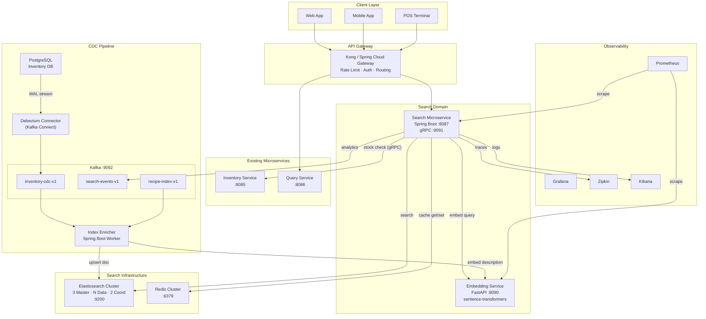
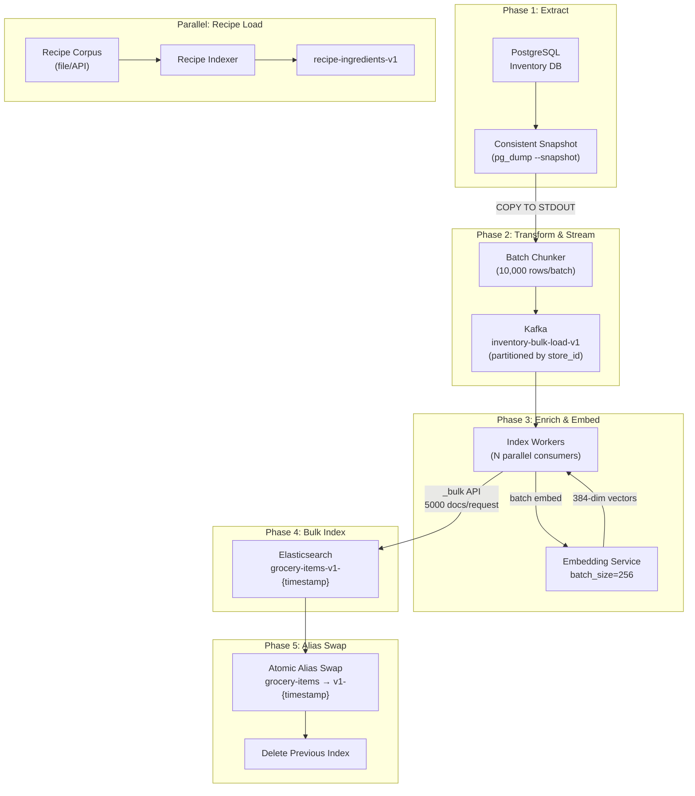
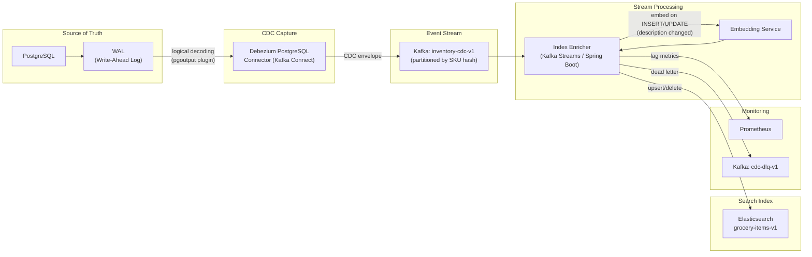
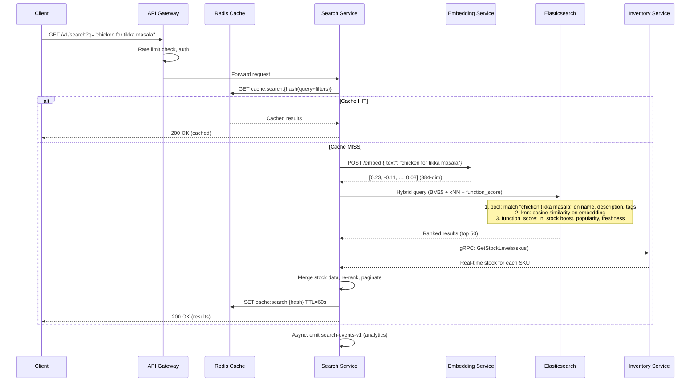
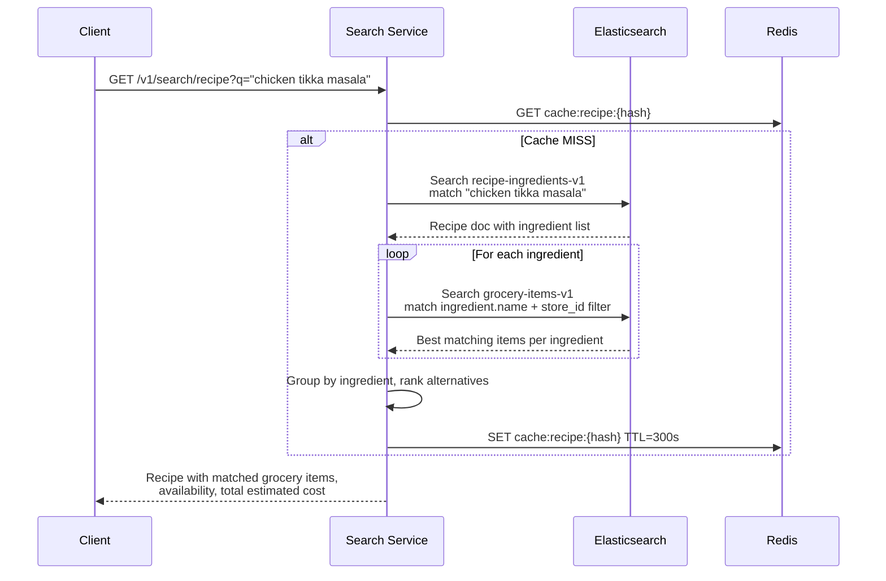
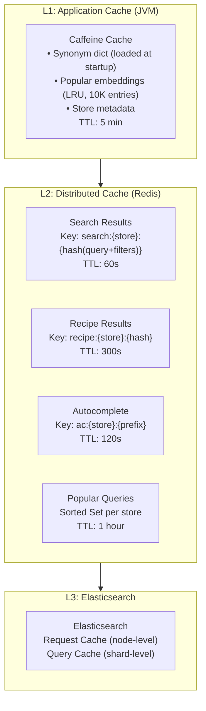
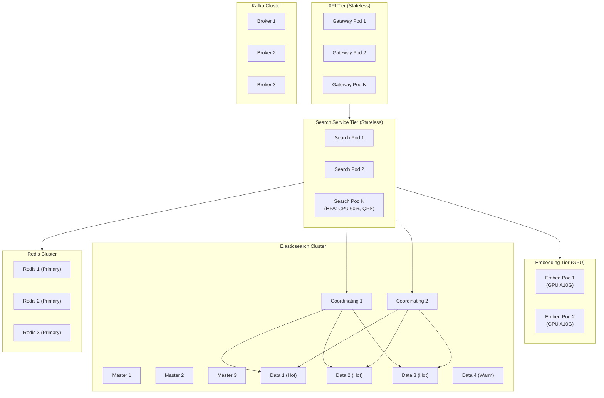
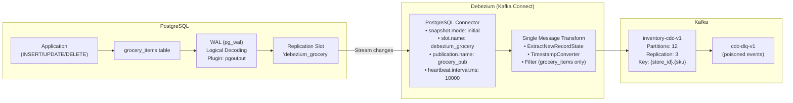
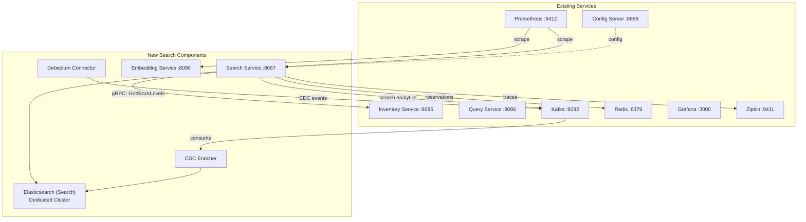

# Grocery Search System — Architecture & Design Proposal

> **Perspective**: Lead Software Architect + Lead Software Engineer
>
> **Scope**: Natural language search engine for grocery items in a retail inventory, with recipe-based discovery, tokenization-driven relevance, CDC-powered real-time indexing, and horizontal scalability for millions of concurrent users.

---

## Table of Contents

1. [Problem Statement](#problem-statement)
2. [Technology Stack](#technology-stack)
3. [High-Level Architecture](#high-level-architecture)
4. [Dataset & Expected Inputs/Models](#dataset--expected-inputsmodels)
5. [Tokenization & NLP Strategy](#tokenization--nlp-strategy)
6. [Index Schema Design](#index-schema-design)
7. [Data Flow — Initialization (Full Load)](#data-flow--initialization-full-load)
8. [Data Flow — CDC (Real-Time Sync)](#data-flow--cdc-real-time-sync)
9. [Data Flow — Query Path](#data-flow--query-path)
10. [Recipe-Based Search](#recipe-based-search)
11. [Sharding Design Choices](#sharding-design-choices)
12. [Caching Design Choices](#caching-design-choices)
13. [Scaling for Millions of Users](#scaling-for-millions-of-users)
14. [CDC Model — Deep Dive](#cdc-model--deep-dive)
15. [Latency Budget & SLA Targets](#latency-budget--sla-targets)
16. [Pitfalls, Challenges & Mitigations](#pitfalls-challenges--mitigations)
17. [Observability Integration](#observability-integration)
18. [Deployment Topology](#deployment-topology)
19. [Migration & Rollout Plan](#migration--rollout-plan)
20. [Implementation Estimate](#implementation-estimate)
21. [Minimal Tech Stack to Run](#minimal-tech-stack-to-run)

---

## Problem Statement

Retail grocery stores maintain inventory databases with millions of SKUs. Each item has structured fields (UPC, category, price, stock quantity) and unstructured fields (description, brand narrative, nutritional notes). Customers need to:

- **Search by natural language**: _"something for a quick pasta dinner"_, _"gluten free snacks for kids"_
- **Search by recipe**: _"chicken tikka masala"_ returns all required ingredients available in-store
- **Get recommendations**: _"I bought tomatoes"_ suggests basil, mozzarella, olive oil (complementary items)
- **Autocomplete**: Partial input yields ranked suggestions with sub-100ms latency

The system must index items from an inventory database, stay synchronized in near real-time via CDC, and serve search results at scale (millions of users, sub-200ms p99 latency).

---

## Technology Stack

| Layer | Technology | Rationale |
|-------|-----------|-----------|
| **Source of Truth** | PostgreSQL 16 | ACID inventory DB; logical replication support for CDC |
| **CDC Connector** | Debezium 2.x (PostgreSQL) | WAL-based, low-overhead CDC; mature Kafka Connect integration |
| **Event Backbone** | Apache Kafka 3.x | Already in the stack; durable log for CDC events, replay capability |
| **Search Engine** | Elasticsearch 8.x (or OpenSearch 2.x) | Inverted index, BM25, custom analyzers, dense vectors for semantic search |
| **Vector Embeddings** | sentence-transformers (`all-MiniLM-L6-v2`) | Lightweight model (80MB), 384-dim vectors, good grocery-domain accuracy |
| **Embedding Service** | Python sidecar (FastAPI) or Java ONNX Runtime | Generates embeddings at index time and query time |
| **Cache** | Redis 7.x Cluster | Already in the stack; search result caching, rate limiting, popular queries |
| **Search API** | Spring Boot 4.0.3 (search-microservice) | Consistent with existing stack; gRPC + REST |
| **API Gateway** | Kong / Spring Cloud Gateway | Rate limiting, auth, request routing, canary deployments |
| **Orchestration** | Kubernetes (EKS/GKE) | Horizontal pod autoscaling, node pools per workload type |
| **Observability** | Prometheus + Grafana + Zipkin + ELK | Already in the stack; extend with search-specific dashboards |

### Why Elasticsearch over alternatives

| Alternative | Rejection Rationale |
|------------|---------------------|
| **Solr** | Heavier operational overhead; Elasticsearch ecosystem (Kibana, APM) already present |
| **Typesense** | Limited custom analyzer support; weaker at complex multi-field queries |
| **Meilisearch** | No native dense vector support; single-node default architecture |
| **Algolia (SaaS)** | Vendor lock-in; per-query pricing prohibitive at millions-of-users scale |
| **pgvector + pg_trgm** | PostgreSQL full-text search lacks custom tokenizer pipelines; vector search performance degrades beyond ~5M rows without significant tuning |

---

## High-Level Architecture



---

## Dataset & Expected Inputs/Models

### Source Data: Grocery Inventory

The source of truth is a PostgreSQL inventory database. A typical large retail chain maintains 50K–500K unique SKUs, multiplied across stores for location-specific stock and pricing.

#### PostgreSQL Source Schema

```sql
CREATE TABLE grocery_items (
    sku             VARCHAR(20)   PRIMARY KEY,
    upc             VARCHAR(14)   NOT NULL,
    name            VARCHAR(255)  NOT NULL,
    description     TEXT,
    brand           VARCHAR(100),
    category        VARCHAR(100)  NOT NULL,
    subcategory     VARCHAR(100),
    department      VARCHAR(50),
    tags            TEXT[],
    dietary_flags   TEXT[],
    weight_oz       NUMERIC(8,2),
    unit_measure    VARCHAR(20),
    image_url       VARCHAR(500),
    created_at      TIMESTAMPTZ   NOT NULL DEFAULT now(),
    updated_at      TIMESTAMPTZ   NOT NULL DEFAULT now()
);

CREATE TABLE grocery_stock (
    store_id        VARCHAR(20)   NOT NULL,
    sku             VARCHAR(20)   NOT NULL REFERENCES grocery_items(sku),
    price           NUMERIC(10,2) NOT NULL,
    unit_price      NUMERIC(10,2),
    stock_qty       INTEGER       NOT NULL DEFAULT 0,
    aisle           VARCHAR(10),
    last_restocked  TIMESTAMPTZ,
    updated_at      TIMESTAMPTZ   NOT NULL DEFAULT now(),
    PRIMARY KEY (store_id, sku)
);

CREATE INDEX idx_grocery_items_category ON grocery_items(category);
CREATE INDEX idx_grocery_items_updated  ON grocery_items(updated_at);
CREATE INDEX idx_grocery_stock_store    ON grocery_stock(store_id);
CREATE INDEX idx_grocery_stock_updated  ON grocery_stock(updated_at);

-- Trigger to auto-update updated_at
CREATE OR REPLACE FUNCTION update_timestamp()
RETURNS TRIGGER AS $$
BEGIN
    NEW.updated_at = now();
    RETURN NEW;
END;
$$ LANGUAGE plpgsql;

CREATE TRIGGER trg_grocery_items_updated
    BEFORE UPDATE ON grocery_items
    FOR EACH ROW EXECUTE FUNCTION update_timestamp();

CREATE TRIGGER trg_grocery_stock_updated
    BEFORE UPDATE ON grocery_stock
    FOR EACH ROW EXECUTE FUNCTION update_timestamp();
```

#### Sample Records

```sql
-- Sample grocery items
INSERT INTO grocery_items (sku, upc, name, description, brand, category, subcategory, department, tags, dietary_flags, weight_oz, unit_measure) VALUES
('GRC-001-42', '00123456789012', 'Organic Free-Range Chicken Breast',
 'Premium organic chicken breast, hormone-free, antibiotic-free. Individually vacuum sealed. USDA Certified Organic. Perfect for grilling, baking, or stir-fry.',
 'Happy Farms', 'Meat & Poultry', 'Chicken', 'Fresh',
 ARRAY['chicken', 'breast', 'organic', 'grilling', 'protein', 'dinner'],
 ARRAY['organic', 'antibiotic-free', 'hormone-free'],
 32.0, 'oz'),

('PAS-012-01', '00234567890123', 'Barilla Penne Rigate No. 73',
 'Classic Italian penne pasta made with 100% durum wheat semolina. Al dente in 11 minutes. Non-GMO verified.',
 'Barilla', 'Pasta & Grains', 'Dried Pasta', 'Center Store',
 ARRAY['pasta', 'penne', 'italian', 'dinner', 'quick meal'],
 ARRAY['non-gmo', 'vegan'],
 16.0, 'oz'),

('SAU-045-01', '00345678901234', 'Pataks Tikka Masala Simmer Sauce',
 'Authentic Indian tikka masala cooking sauce. Medium heat. Made with tomatoes, cream, and aromatic spices. Just add chicken or paneer.',
 'Pataks', 'International Foods', 'Indian', 'Center Store',
 ARRAY['indian', 'tikka masala', 'sauce', 'cooking sauce', 'curry', 'dinner'],
 ARRAY['gluten-free'],
 15.0, 'oz'),

('PRD-088-07', '00456789012345', 'Organic Baby Spinach',
 'Triple-washed, ready to eat organic baby spinach. Perfect for salads, smoothies, or sautéing. USDA Organic.',
 'Earthbound Farm', 'Produce', 'Leafy Greens', 'Fresh',
 ARRAY['spinach', 'salad', 'organic', 'smoothie', 'greens', 'healthy'],
 ARRAY['organic', 'vegan', 'gluten-free'],
 5.0, 'oz');

-- Sample stock per store
INSERT INTO grocery_stock (store_id, sku, price, unit_price, stock_qty, aisle, last_restocked) VALUES
('STORE-0042', 'GRC-001-42', 12.99, 6.50, 47, 'A3', '2026-03-25T06:00:00Z'),
('STORE-0042', 'PAS-012-01', 1.89,  1.89, 120, 'B5', '2026-03-24T06:00:00Z'),
('STORE-0042', 'SAU-045-01', 4.49,  4.79, 35, 'B7', '2026-03-23T06:00:00Z'),
('STORE-0042', 'PRD-088-07', 4.99,  15.97, 62, 'C1', '2026-03-26T04:00:00Z'),
('STORE-0108', 'GRC-001-42', 13.49, 6.75, 23, 'A2', '2026-03-25T05:30:00Z'),
('STORE-0108', 'PAS-012-01', 1.79,  1.79, 200, 'C3', '2026-03-24T06:00:00Z');
```

### Dataset Scale Assumptions

| Dimension | Minimal (dev/test) | Medium (regional chain) | Large (national retailer) |
|-----------|--------------------|-----------------------|--------------------------|
| Unique SKUs | 5,000 | 80,000 | 500,000 |
| Stores | 1 | 50 | 2,000 |
| Stock records (SKU × Store) | 5,000 | 4,000,000 | 200,000,000+ |
| ES documents (catalog index) | 5,000 | 80,000 | 500,000 |
| ES documents (stock index) | 5,000 | 4,000,000 | 10,000,000 (top 5 stores per shard) |
| Recipe corpus | 500 | 5,000 | 50,000 |
| Avg description length | ~150 chars | ~150 chars | ~150 chars |
| Avg tags per item | 6 | 6 | 6 |

### Expected Inputs (Search Requests)

| Input Type | Example | Expected Volume |
|------------|---------|----------------|
| **Free-text search** | `"gluten free pasta"`, `"quick dinner ideas"`, `"organic baby food"` | 60% of queries |
| **UPC/SKU scan** | `"00123456789012"`, `"GRC-001-42"` | 10% of queries |
| **Category browse + text** | `"cheese" + category=Dairy` | 15% of queries |
| **Recipe search** | `"chicken tikka masala"`, `"banana bread"` | 10% of queries |
| **Autocomplete prefix** | `"chi"` → chicken, chips, chia seeds | 4× per search (keystrokes) |
| **Similar item** | `GET /v1/search/similar/GRC-001-42` | 5% of queries |

### Embedding Model Specification

| Property | Value |
|----------|-------|
| Model | `sentence-transformers/all-MiniLM-L6-v2` |
| Parameters | 22.7M |
| Dimensions | 384 |
| Max sequence length | 256 tokens |
| Model size | ~80MB |
| Inference latency (GPU, single) | ~5ms |
| Inference latency (GPU, batch=64) | ~15ms total (~0.23ms/item) |
| Inference latency (CPU, single) | ~25ms |
| Inference latency (CPU, batch=64) | ~200ms total (~3.1ms/item) |
| Training data | 1B+ sentence pairs (general domain) |
| Similarity metric | Cosine similarity |

**Input construction for embedding**: The text fed to the model is a concatenation of searchable fields:

```
{name} | {category} | {description} | {tags joined by space}
```

Example:

```
Organic Free-Range Chicken Breast | Meat & Poultry | Premium organic chicken breast, hormone-free, antibiotic-free. Individually vacuum sealed. | chicken breast organic grilling protein dinner
```

This produces a 384-float vector like `[0.0234, -0.1102, 0.0891, ..., -0.0445]` that captures the semantic meaning of the item in a form that allows cosine distance comparison with query vectors.

### Recipe Corpus Model

Recipes are sourced from a curated dataset (e.g., Open Recipe corpus, internal content team). Each recipe maps to normalized ingredient names that match grocery item names after synonym expansion.

```json
{
  "recipe_id": "RCP-00421",
  "recipe_name": "Chicken Tikka Masala",
  "cuisine": "Indian",
  "tags": ["dinner", "curry", "indian", "chicken", "weeknight", "comfort food"],
  "servings": 4,
  "prep_time_min": 15,
  "cook_time_min": 30,
  "ingredients": [
    { "name": "chicken breast",        "quantity": "2 lbs",    "category": "Meat & Poultry", "optional": false },
    { "name": "tikka masala sauce",    "quantity": "1 jar",    "category": "International Foods", "optional": false },
    { "name": "basmati rice",          "quantity": "2 cups",   "category": "Pasta & Grains", "optional": false },
    { "name": "plain yogurt",          "quantity": "1 cup",    "category": "Dairy", "optional": false },
    { "name": "fresh cilantro",        "quantity": "1 bunch",  "category": "Produce", "optional": true },
    { "name": "naan bread",            "quantity": "1 package", "category": "Bakery", "optional": true },
    { "name": "garlic",                "quantity": "4 cloves", "category": "Produce", "optional": false },
    { "name": "ginger root",           "quantity": "1 inch",   "category": "Produce", "optional": false }
  ]
}
```

---

## Tokenization & NLP Strategy

This is the core of the search relevance engine. The approach mirrors how major search engines (Google, Ticketmaster) tokenize and index content for natural language retrieval.

### Analysis Chain (Elasticsearch Custom Analyzer)

```mermaid
flowchart LR
    Raw["Raw Text<br/>'Organic Free-Range<br/>Chicken Breast, 2lb'"]
    --> CharFilter["Char Filters<br/>• HTML strip<br/>• Normalize hyphens<br/>• Remove special chars"]
    --> Tokenizer["Standard Tokenizer<br/>→ [organic, free, range,<br/>chicken, breast, 2lb]"]
    --> LowerCase["Lowercase Filter<br/>→ [organic, free, range,<br/>chicken, breast, 2lb]"]
    --> StopWords["Stop Words<br/>(custom grocery set)<br/>→ removes 'the', 'a', etc."]
    --> Synonyms["Synonym Filter<br/>• chicken breast → poultry<br/>• 2lb → 2 pound<br/>• organic → bio"]
    --> Stemmer["Stemmer (English)<br/>• breasts → breast<br/>• roasting → roast"]
    --> EdgeNgram["Edge N-Gram (autocomplete)<br/>• chick → chi, chic, chick<br/>• brea → bre, brea, breas"]
    --> Index["Inverted Index"]
```



### Analyzer Definitions

Four custom analyzers handle different use cases:

| Analyzer | Purpose | Pipeline |
|----------|---------|----------|
| `grocery_full` | Primary search (description, name) | char_filter → standard tokenizer → lowercase → grocery_synonyms → english_stemmer → asciifolding |
| `grocery_autocomplete` | Prefix matching for search-as-you-type | char_filter → standard tokenizer → lowercase → edge_ngram (min=2, max=15) |
| `grocery_exact` | Exact matches (UPC, brand) | keyword tokenizer → lowercase → trim |
| `grocery_recipe` | Recipe ingredient matching | char_filter → standard tokenizer → lowercase → recipe_synonyms → english_stemmer |

### Synonym Graph — Grocery Domain

Grocery search requires a rich synonym dictionary. This is a non-trivial, ongoing maintenance item.

```
# Measurement normalization
lb, lbs, pound, pounds => pound
oz, ounce, ounces => ounce
kg, kilogram, kilograms => kilogram
gal, gallon, gallons => gallon
pt, pint, pints => pint

# Grocery equivalences
chicken breast, poultry breast, boneless chicken => chicken_breast
ground beef, minced beef, hamburger meat => ground_beef
heavy cream, whipping cream, double cream => heavy_cream
all purpose flour, plain flour, ap flour => all_purpose_flour
bell pepper, capsicum, sweet pepper => bell_pepper
cilantro, coriander leaves, fresh coriander => cilantro
eggplant, aubergine => eggplant
zucchini, courgette => zucchini
arugula, rocket, rucola => arugula
scallion, green onion, spring onion => scallion

# Diet/attribute synonyms
organic, bio, certified organic => organic
gluten free, gf, coeliac safe => gluten_free
sugar free, no sugar, zero sugar => sugar_free
low fat, lite, light => low_fat
non gmo, gmo free => non_gmo
plant based, vegan => plant_based
```

### Multi-Field Strategy (BM25 + Vectors)

Each grocery item is indexed with multiple fields, each analyzed differently and weighted in the query:

```json
{
  "name":        { "analyzer": "grocery_full",         "boost": 3.0 },
  "name.autocomplete": { "analyzer": "grocery_autocomplete", "boost": 1.5 },
  "description": { "analyzer": "grocery_full",         "boost": 2.0 },
  "category":    { "analyzer": "grocery_full",         "boost": 1.5 },
  "brand":       { "analyzer": "grocery_exact",        "boost": 1.0 },
  "tags":        { "analyzer": "grocery_full",         "boost": 2.5 },
  "upc":         { "analyzer": "grocery_exact",        "boost": 5.0 },
  "embedding":   { "type": "dense_vector", "dims": 384, "similarity": "cosine" }
}
```

### Hybrid Scoring: BM25 + kNN + Business Signals

The final score for each search result is a weighted combination:

```
final_score = (0.5 × BM25_score) + (0.3 × kNN_cosine_similarity) + (0.2 × business_boost)
```

Where `business_boost` factors in:
- **In-stock status**: 1.0 if in stock, 0.1 if out of stock (still returned, demoted)
- **Freshness**: Higher for recently restocked perishables
- **Popularity**: Click-through rate from search analytics
- **Margin**: Configurable business-driven promotion weight
- **Proximity**: Aisle/location distance from user's current position (for in-store mobile)

This is implemented using Elasticsearch's `function_score` query wrapping a `bool` query with `knn` rescoring.

---

## Index Schema Design

### Primary Index: `grocery-items-v1`

```json
{
  "settings": {
    "number_of_shards": 5,
    "number_of_replicas": 2,
    "refresh_interval": "1s",
    "analysis": {
      "char_filter": {
        "grocery_char_filter": {
          "type": "pattern_replace",
          "pattern": "[^a-zA-Z0-9\\s]",
          "replacement": " "
        }
      },
      "filter": {
        "grocery_synonyms": {
          "type": "synonym_graph",
          "synonyms_path": "synonyms/grocery_synonyms.txt",
          "updateable": true
        },
        "grocery_stemmer": {
          "type": "stemmer",
          "language": "english"
        },
        "autocomplete_filter": {
          "type": "edge_ngram",
          "min_gram": 2,
          "max_gram": 15
        }
      },
      "analyzer": {
        "grocery_full": {
          "type": "custom",
          "char_filter": ["grocery_char_filter"],
          "tokenizer": "standard",
          "filter": ["lowercase", "grocery_synonyms", "grocery_stemmer", "asciifolding"]
        },
        "grocery_autocomplete": {
          "type": "custom",
          "char_filter": ["grocery_char_filter"],
          "tokenizer": "standard",
          "filter": ["lowercase", "autocomplete_filter"]
        }
      }
    }
  },
  "mappings": {
    "properties": {
      "sku":           { "type": "keyword" },
      "upc":           { "type": "keyword" },
      "name":          { "type": "text", "analyzer": "grocery_full",
                         "fields": { "autocomplete": { "type": "text", "analyzer": "grocery_autocomplete" },
                                     "keyword": { "type": "keyword" } } },
      "description":   { "type": "text", "analyzer": "grocery_full" },
      "brand":         { "type": "keyword" },
      "category":      { "type": "keyword",
                         "fields": { "text": { "type": "text", "analyzer": "grocery_full" } } },
      "subcategory":   { "type": "keyword" },
      "department":    { "type": "keyword" },
      "tags":          { "type": "text", "analyzer": "grocery_full" },
      "dietary_flags": { "type": "keyword" },
      "price":         { "type": "scaled_float", "scaling_factor": 100 },
      "unit_price":    { "type": "scaled_float", "scaling_factor": 100 },
      "unit_measure":  { "type": "keyword" },
      "weight_oz":     { "type": "float" },
      "in_stock":      { "type": "boolean" },
      "stock_qty":     { "type": "integer" },
      "aisle":         { "type": "keyword" },
      "store_id":      { "type": "keyword" },
      "embedding":     { "type": "dense_vector", "dims": 384,
                         "index": true, "similarity": "cosine" },
      "popularity":    { "type": "float" },
      "last_restocked":{ "type": "date" },
      "updated_at":    { "type": "date" },
      "indexed_at":    { "type": "date" }
    }
  }
}
```

### Secondary Index: `recipe-ingredients-v1`

Maps recipe names to normalized ingredient lists for recipe-based search:

```json
{
  "mappings": {
    "properties": {
      "recipe_id":    { "type": "keyword" },
      "recipe_name":  { "type": "text", "analyzer": "grocery_full",
                        "fields": { "autocomplete": { "type": "text", "analyzer": "grocery_autocomplete" } } },
      "cuisine":      { "type": "keyword" },
      "ingredients":  {
        "type": "nested",
        "properties": {
          "name":     { "type": "text", "analyzer": "grocery_full" },
          "quantity":  { "type": "keyword" },
          "category": { "type": "keyword" },
          "optional": { "type": "boolean" }
        }
      },
      "tags":         { "type": "text", "analyzer": "grocery_full" },
      "servings":     { "type": "integer" },
      "prep_time_min":{ "type": "integer" },
      "embedding":    { "type": "dense_vector", "dims": 384, "index": true, "similarity": "cosine" }
    }
  }
}
```

---

## Data Flow — Initialization (Full Load)

Full index build from scratch or complete reindex. This is needed on first deployment, after schema changes, or for disaster recovery.



### Initialization — Spring Boot Bulk Indexer

```java
@Component
@RequiredArgsConstructor
public class BulkIndexService {

    private final ElasticsearchClient esClient;
    private final EmbeddingClient embeddingClient;
    private static final int BULK_SIZE = 5_000;

    public void reindex(String newIndexName, Stream<GroceryItemRow> rows) {
        updateIndexSettings(newIndexName, "-1", 0);

        List<BulkOperation> buffer = new ArrayList<>(BULK_SIZE);
        AtomicLong count = new AtomicLong();

        rows.map(this::toDocument)
            .forEach(doc -> {
                buffer.add(BulkOperation.of(op ->
                    op.index(idx -> idx.index(newIndexName).id(doc.sku()).document(doc))
                ));
                if (buffer.size() >= BULK_SIZE) {
                    flush(buffer);
                    count.addAndGet(buffer.size());
                    buffer.clear();
                }
            });

        if (!buffer.isEmpty()) {
            flush(buffer);
            count.addAndGet(buffer.size());
        }

        updateIndexSettings(newIndexName, "1s", 2);
        log.info("Bulk indexed {} documents into {}", count.get(), newIndexName);
    }

    private GroceryDocument toDocument(GroceryItemRow row) {
        String textForEmbedding = String.join(" | ",
            row.name(), row.category(), row.description(),
            String.join(" ", row.tags())
        );
        float[] embedding = embeddingClient.embed(textForEmbedding);

        return new GroceryDocument(
            row.sku(), row.upc(), row.name(), row.description(),
            row.brand(), row.category(), row.subcategory(), row.department(),
            row.tags(), row.dietaryFlags(), row.price(), row.unitPrice(),
            row.unitMeasure(), row.weightOz(), row.stockQty() > 0,
            row.stockQty(), row.aisle(), row.storeId(), embedding,
            0.0f, row.lastRestocked(), row.updatedAt(), Instant.now()
        );
    }

    private void flush(List<BulkOperation> operations) {
        BulkResponse response = esClient.bulk(b -> b.operations(operations));
        if (response.errors()) {
            response.items().stream()
                .filter(i -> i.error() != null)
                .forEach(i -> log.error("Bulk error for {}: {}", i.id(), i.error().reason()));
        }
    }

    private void updateIndexSettings(String index, String refreshInterval, int replicas) {
        esClient.indices().putSettings(s -> s
            .index(index)
            .settings(is -> is
                .refreshInterval(t -> t.time(refreshInterval))
                .numberOfReplicas(String.valueOf(replicas))
            )
        );
    }
}
```

### Alias Swap (Zero-Downtime)

```java
@Component
@RequiredArgsConstructor
public class IndexAliasService {

    private final ElasticsearchClient esClient;
    private static final String ALIAS = "grocery-items";

    public void swapAlias(String newIndex) {
        List<String> oldIndices = resolveCurrentIndices();

        List<Action> actions = new ArrayList<>();
        for (String old : oldIndices) {
            actions.add(Action.of(a -> a.remove(r -> r.index(old).alias(ALIAS))));
        }
        actions.add(Action.of(a -> a.add(ad -> ad.index(newIndex).alias(ALIAS))));

        esClient.indices().updateAliases(u -> u.actions(actions));
        log.info("Alias '{}' swapped from {} to {}", ALIAS, oldIndices, newIndex);

        for (String old : oldIndices) {
            esClient.indices().delete(d -> d.index(old));
            log.info("Deleted old index: {}", old);
        }
    }

    private List<String> resolveCurrentIndices() {
        try {
            return new ArrayList<>(
                esClient.indices().getAlias(a -> a.name(ALIAS)).result().keySet()
            );
        } catch (ElasticsearchException e) {
            return List.of();
        }
    }
}
```

### Initialization Performance Estimates

| Metric | Value | Notes |
|--------|-------|-------|
| Total SKUs | 500K–2M (typical large retailer) | Multi-store: items × stores for stock-level documents |
| Snapshot time | 30–60s | Consistent `pg_export_snapshot` read; no table locks |
| Batch size (Kafka) | 10,000 rows | Balances memory and throughput |
| Embedding throughput | ~5,000 items/sec | GPU: `all-MiniLM-L6-v2` on A10G; CPU: ~500/sec |
| Bulk index throughput | ~15,000 docs/sec | 5 shards, 3 index workers, `refresh_interval: -1` during bulk |
| **Total init time (1M items, GPU)** | **~8–12 minutes** | Includes snapshot + embed + bulk + alias swap |
| **Total init time (1M items, CPU)** | **~40–50 minutes** | CPU embedding is the bottleneck |

### Optimization: Disable refresh during bulk load

During initialization, set `refresh_interval: -1` and `number_of_replicas: 0` on the new index. After bulk load completes, restore settings and let Elasticsearch build replicas. This reduces init time by ~40%.

---

## Data Flow — CDC (Real-Time Sync)

Change Data Capture keeps Elasticsearch synchronized with the inventory database in near real-time.



### CDC Event Envelope (Debezium)

```json
{
  "schema": { "...": "..." },
  "payload": {
    "before": null,
    "after": {
      "sku": "GRC-001-42",
      "name": "Organic Free-Range Chicken Breast",
      "description": "Premium organic chicken breast, hormone-free, 2lb package",
      "category": "Meat & Poultry",
      "price": 12.99,
      "stock_qty": 47,
      "store_id": "STORE-0042",
      "updated_at": "2026-03-26T10:15:32.441Z"
    },
    "source": {
      "version": "2.5.0",
      "connector": "postgresql",
      "db": "inventory",
      "schema": "public",
      "table": "grocery_items",
      "lsn": 234881024,
      "txId": 559
    },
    "op": "u",
    "ts_ms": 1711444532441,
    "ts_us": 1711444532441000,
    "ts_ns": 1711444532441000000
  }
}
```

### CDC Enricher — Spring Boot Implementation

```java
@Component
@RequiredArgsConstructor
@Slf4j
public class CdcEnricherConsumer {

    private final ElasticsearchClient esClient;
    private final EmbeddingClient embeddingClient;
    private final MeterRegistry meterRegistry;
    private final CacheInvalidationService cacheInvalidation;
    private static final String INDEX = "grocery-items";

    private static final Set<String> TEXT_FIELDS = Set.of("name", "description", "tags");

    @KafkaListener(
        topics = "inventory-cdc-v1",
        groupId = "cdc-enricher-group",
        containerFactory = "cdcKafkaListenerContainerFactory"
    )
    public void onCdcEvent(
            @Payload String payload,
            @Header(KafkaHeaders.RECEIVED_KEY) String key,
            Acknowledgment ack) {

        Timer.Sample timer = Timer.start(meterRegistry);
        try {
            CdcEvent event = objectMapper.readValue(payload, CdcEvent.class);
            processEvent(event);
            ack.acknowledge();
            meterRegistry.counter("cdc.events.processed",
                "table", event.source().table(), "operation", event.op()).increment();
        } catch (Exception e) {
            log.error("CDC enrichment failed for key={}: {}", key, e.getMessage(), e);
            meterRegistry.counter("cdc.events.failed", "reason", e.getClass().getSimpleName()).increment();
            throw e;
        } finally {
            timer.stop(meterRegistry.timer("cdc.enrichment.duration"));
        }
    }

    private void processEvent(CdcEvent event) {
        switch (event.op()) {
            case "c", "r" -> handleCreateOrSnapshot(event);
            case "u" -> handleUpdate(event);
            case "d" -> handleDelete(event);
            default -> log.warn("Unknown CDC operation: {}", event.op());
        }
    }

    private void handleCreateOrSnapshot(CdcEvent event) {
        Map<String, Object> after = event.after();
        GroceryDocument doc = buildDocument(after);
        doc.setEmbedding(generateEmbedding(after));
        doc.setIndexedAt(Instant.now());

        esClient.index(i -> i.index(INDEX).id(doc.getSku()).document(doc));
    }

    private void handleUpdate(CdcEvent event) {
        Map<String, Object> before = event.before();
        Map<String, Object> after = event.after();
        String sku = (String) after.get("sku");

        boolean textChanged = TEXT_FIELDS.stream()
            .anyMatch(field -> !Objects.equals(
                before != null ? before.get(field) : null,
                after.get(field)
            ));

        Map<String, Object> updates = new HashMap<>(after);
        updates.put("indexed_at", Instant.now().toString());

        if (textChanged) {
            updates.put("embedding", generateEmbedding(after));
            meterRegistry.counter("cdc.reembedding.triggered").increment();
        }

        esClient.update(u -> u
            .index(INDEX).id(sku)
            .doc(updates)
            .docAsUpsert(true)
        );

        cacheInvalidation.invalidateForSku(sku, (String) after.get("store_id"));
    }

    private void handleDelete(CdcEvent event) {
        String sku = (String) event.before().get("sku");
        esClient.delete(d -> d.index(INDEX).id(sku));
        cacheInvalidation.invalidateForSku(sku, null);
    }

    private float[] generateEmbedding(Map<String, Object> fields) {
        String text = String.join(" | ",
            (String) fields.getOrDefault("name", ""),
            (String) fields.getOrDefault("category", ""),
            (String) fields.getOrDefault("description", ""),
            fields.containsKey("tags") ? String.join(" ", (List<String>) fields.get("tags")) : ""
        );
        return embeddingClient.embed(text);
    }

    private GroceryDocument buildDocument(Map<String, Object> fields) {
        // Maps CDC after-image to ES document
        return GroceryDocument.builder()
            .sku((String) fields.get("sku"))
            .upc((String) fields.get("upc"))
            .name((String) fields.get("name"))
            .description((String) fields.get("description"))
            .brand((String) fields.get("brand"))
            .category((String) fields.get("category"))
            .subcategory((String) fields.get("subcategory"))
            .department((String) fields.get("department"))
            .tags((List<String>) fields.get("tags"))
            .dietaryFlags((List<String>) fields.get("dietary_flags"))
            .price(toBigDecimal(fields.get("price")))
            .stockQty(toInt(fields.get("stock_qty")))
            .inStock(toInt(fields.get("stock_qty")) > 0)
            .storeId((String) fields.get("store_id"))
            .aisle((String) fields.get("aisle"))
            .updatedAt(Instant.parse((String) fields.get("updated_at")))
            .build();
    }
}
```

The conditional re-embedding is critical: stock quantity changes (frequent) should not trigger re-embedding (expensive). Only text field changes trigger it.

---

## Data Flow — Query Path



### Search Controller — Spring Boot Implementation

```java
@RestController
@RequestMapping("/v1/search")
@RequiredArgsConstructor
@Slf4j
public class SearchController {

    private final SearchService searchService;
    private final MeterRegistry meterRegistry;

    @GetMapping
    @Timed(value = "search.query.duration", extraTags = {"query_type", "text"})
    public ResponseEntity<SearchResponse> search(
            @RequestParam("q") String query,
            @RequestParam("store") String storeId,
            @RequestParam(defaultValue = "0") int page,
            @RequestParam(defaultValue = "20") int size,
            @RequestParam(required = false) String category,
            @RequestParam(required = false) List<String> dietary) {

        SearchRequest request = SearchRequest.builder()
            .query(query)
            .storeId(storeId)
            .page(page)
            .size(Math.min(size, 100))
            .category(category)
            .dietaryFlags(dietary)
            .build();

        SearchResponse response = searchService.search(request);

        meterRegistry.counter("search.query.total",
            "store_id", storeId,
            "query_type", "text",
            "cache_hit", String.valueOf(response.cacheHit())
        ).increment();

        if (response.totalHits() == 0) {
            meterRegistry.counter("search.zero_results.total", "store_id", storeId).increment();
        }

        return ResponseEntity.ok(response);
    }

    @GetMapping("/autocomplete")
    @Timed(value = "search.query.duration", extraTags = {"query_type", "autocomplete"})
    public ResponseEntity<AutocompleteResponse> autocomplete(
            @RequestParam("q") String prefix,
            @RequestParam("store") String storeId,
            @RequestParam(defaultValue = "8") int limit) {

        return ResponseEntity.ok(
            searchService.autocomplete(prefix, storeId, Math.min(limit, 20))
        );
    }

    @GetMapping("/recipe")
    @Timed(value = "search.query.duration", extraTags = {"query_type", "recipe"})
    public ResponseEntity<RecipeSearchResponse> recipeSearch(
            @RequestParam("q") String recipeQuery,
            @RequestParam("store") String storeId,
            @RequestParam(defaultValue = "4") int servings) {

        return ResponseEntity.ok(
            searchService.recipeSearch(recipeQuery, storeId, servings)
        );
    }

    @GetMapping("/similar/{sku}")
    @Timed(value = "search.query.duration", extraTags = {"query_type", "similar"})
    public ResponseEntity<SearchResponse> similar(
            @PathVariable String sku,
            @RequestParam("store") String storeId,
            @RequestParam(defaultValue = "10") int limit) {

        return ResponseEntity.ok(
            searchService.findSimilar(sku, storeId, limit)
        );
    }

    @PostMapping("/feedback")
    public ResponseEntity<Void> feedback(@RequestBody SearchFeedback feedback) {
        searchService.recordFeedback(feedback);
        return ResponseEntity.accepted().build();
    }
}
```

### Search Service — Elasticsearch Query Builder

```java
@Service
@RequiredArgsConstructor
@Slf4j
public class SearchService {

    private final ElasticsearchClient esClient;
    private final EmbeddingClient embeddingClient;
    private final SearchCacheService cache;
    private final InventoryGrpcClient inventoryClient;
    private final SearchEventPublisher eventPublisher;

    private static final String INDEX = "grocery-items";

    public SearchResponse search(SearchRequest request) {
        String cacheKey = cache.buildKey(request);
        SearchResponse cached = cache.get(cacheKey);
        if (cached != null) {
            return cached.withCacheHit(true);
        }

        float[] queryVector = embeddingClient.embed(request.query());

        co.elastic.clients.elasticsearch.core.SearchResponse<GroceryDocument> esResponse =
            esClient.search(s -> s
                .index(INDEX)
                .size(request.size())
                .from(request.page() * request.size())
                .query(buildHybridQuery(request))
                .knn(k -> k
                    .field("embedding")
                    .queryVector(toList(queryVector))
                    .k(50)
                    .numCandidates(200)
                    .boost(0.3f)
                    .filter(f -> f.term(t -> t.field("store_id").value(request.storeId())))
                )
                .highlight(h -> h
                    .fields("name", hf -> hf)
                    .fields("description", hf -> hf.fragmentSize(150).numberOfFragments(2))
                ),
            GroceryDocument.class
        );

        List<String> skus = esResponse.hits().hits().stream()
            .map(hit -> hit.source().getSku())
            .toList();

        Map<String, StockLevel> liveStock = inventoryClient.getStockLevels(skus, request.storeId());

        List<SearchHit> hits = esResponse.hits().hits().stream()
            .map(hit -> toSearchHit(hit, liveStock))
            .toList();

        SearchResponse response = SearchResponse.builder()
            .hits(hits)
            .totalHits(esResponse.hits().total().value())
            .tookMs(esResponse.took())
            .cacheHit(false)
            .build();

        cache.put(cacheKey, response, skus);

        eventPublisher.publishAsync(request, response);

        return response;
    }

    private Query buildHybridQuery(SearchRequest request) {
        List<Query> should = List.of(
            Query.of(q -> q.multiMatch(m -> m
                .query(request.query())
                .fields("name^3", "description^2", "tags^2.5", "category.text^1.5")
                .type(TextQueryType.BestFields)
                .fuzziness("AUTO")
            )),
            Query.of(q -> q.multiMatch(m -> m
                .query(request.query())
                .fields("name.autocomplete^1.5")
                .type(TextQueryType.PhrasePrefix)
            ))
        );

        List<Query> filters = new ArrayList<>();
        filters.add(Query.of(q -> q.term(t -> t.field("store_id").value(request.storeId()))));
        if (request.category() != null) {
            filters.add(Query.of(q -> q.term(t -> t.field("category").value(request.category()))));
        }
        if (request.dietaryFlags() != null) {
            for (String flag : request.dietaryFlags()) {
                filters.add(Query.of(q -> q.term(t -> t.field("dietary_flags").value(flag))));
            }
        }

        return Query.of(q -> q.functionScore(fs -> fs
            .query(bq -> bq.bool(b -> b.should(should).filter(filters)))
            .functions(
                FunctionScore.of(fn -> fn
                    .filter(f -> f.term(t -> t.field("in_stock").value(true)))
                    .weight(5.0)
                ),
                FunctionScore.of(fn -> fn
                    .fieldValueFactor(fvf -> fvf
                        .field("popularity")
                        .modifier(FieldValueFactorModifier.Log1p)
                        .missing(1.0)
                    )
                ),
                FunctionScore.of(fn -> fn
                    .gauss(g -> g.field("last_restocked").placement(
                        p -> p.origin(JsonData.of("now")).scale(JsonData.of("7d")).decay(0.5)
                    ))
                )
            )
            .scoreMode(FunctionScoreMode.Sum)
            .boostMode(FunctionBoostMode.Multiply)
        ));
    }
}
```

### Embedding Client — Calling the Python sidecar

```java
@Component
@RequiredArgsConstructor
@Slf4j
public class EmbeddingClient {

    private final RestClient restClient;
    private final MeterRegistry meterRegistry;
    private final Cache<String, float[]> embeddingCache;

    @Value("${embedding.service.url:http://localhost:8090}")
    private String embeddingServiceUrl;

    public float[] embed(String text) {
        float[] cached = embeddingCache.getIfPresent(text);
        if (cached != null) return cached;

        Timer.Sample timer = Timer.start(meterRegistry);
        try {
            EmbeddingResponse response = restClient.post()
                .uri(embeddingServiceUrl + "/embed")
                .contentType(MediaType.APPLICATION_JSON)
                .body(new EmbeddingRequest(text))
                .retrieve()
                .body(EmbeddingResponse.class);

            float[] vector = response.embedding();
            embeddingCache.put(text, vector);
            return vector;
        } finally {
            timer.stop(meterRegistry.timer("embedding.duration", "model", "all-MiniLM-L6-v2"));
        }
    }

    public List<float[]> embedBatch(List<String> texts) {
        EmbeddingBatchResponse response = restClient.post()
            .uri(embeddingServiceUrl + "/embed/batch")
            .contentType(MediaType.APPLICATION_JSON)
            .body(new EmbeddingBatchRequest(texts))
            .retrieve()
            .body(EmbeddingBatchResponse.class);

        return response.embeddings();
    }

    record EmbeddingRequest(String text) {}
    record EmbeddingBatchRequest(List<String> texts) {}
    record EmbeddingResponse(float[] embedding) {}
    record EmbeddingBatchResponse(List<float[]> embeddings) {}
}
```

### Embedding Service — Python FastAPI

```python
from fastapi import FastAPI, HTTPException
from pydantic import BaseModel
from sentence_transformers import SentenceTransformer
import numpy as np
import time
from prometheus_client import Histogram, Counter, generate_latest, CONTENT_TYPE_LATEST
from starlette.responses import Response

app = FastAPI(title="Grocery Embedding Service")

model = SentenceTransformer("all-MiniLM-L6-v2", device="cuda")  # "cpu" for minimal stack

EMBED_DURATION = Histogram("embedding_duration_seconds", "Embedding generation time",
                           ["batch_size"])
EMBED_COUNT = Counter("embedding_requests_total", "Total embedding requests", ["type"])

class EmbedRequest(BaseModel):
    text: str

class EmbedBatchRequest(BaseModel):
    texts: list[str]

class EmbedResponse(BaseModel):
    embedding: list[float]

class EmbedBatchResponse(BaseModel):
    embeddings: list[list[float]]


@app.post("/embed", response_model=EmbedResponse)
def embed_single(req: EmbedRequest):
    EMBED_COUNT.labels(type="single").inc()
    with EMBED_DURATION.labels(batch_size="1").time():
        vec = model.encode(req.text, normalize_embeddings=True)
    return EmbedResponse(embedding=vec.tolist())


@app.post("/embed/batch", response_model=EmbedBatchResponse)
def embed_batch(req: EmbedBatchRequest):
    if len(req.texts) > 512:
        raise HTTPException(400, "Batch size exceeds maximum of 512")
    EMBED_COUNT.labels(type="batch").inc()
    with EMBED_DURATION.labels(batch_size=str(len(req.texts))).time():
        vecs = model.encode(req.texts, normalize_embeddings=True, batch_size=64)
    return EmbedBatchResponse(embeddings=[v.tolist() for v in vecs])


@app.get("/health")
def health():
    test_vec = model.encode("health check", normalize_embeddings=True)
    if len(test_vec) != 384:
        raise HTTPException(500, "Model output dimension mismatch")
    return {"status": "healthy", "model": "all-MiniLM-L6-v2", "dims": 384}


@app.get("/metrics")
def metrics():
    return Response(generate_latest(), media_type=CONTENT_TYPE_LATEST)
```

### Query DSL Example

```json
{
  "size": 20,
  "query": {
    "function_score": {
      "query": {
        "bool": {
          "should": [
            { "multi_match": {
                "query": "chicken for tikka masala",
                "fields": ["name^3", "description^2", "tags^2.5", "category.text^1.5"],
                "type": "best_fields",
                "fuzziness": "AUTO"
            }},
            { "multi_match": {
                "query": "chicken for tikka masala",
                "fields": ["name.autocomplete^1.5"],
                "type": "phrase_prefix"
            }}
          ],
          "filter": [
            { "term": { "store_id": "STORE-0042" } }
          ]
        }
      },
      "functions": [
        { "filter": { "term": { "in_stock": true } },  "weight": 5 },
        { "field_value_factor": { "field": "popularity", "modifier": "log1p", "missing": 1 } },
        { "gauss": { "last_restocked": { "origin": "now", "scale": "7d", "decay": 0.5 } } }
      ],
      "score_mode": "sum",
      "boost_mode": "multiply"
    }
  },
  "knn": {
    "field": "embedding",
    "query_vector": [0.23, -0.11, "...", 0.08],
    "k": 50,
    "num_candidates": 200,
    "boost": 0.3
  },
  "highlight": {
    "fields": {
      "name": {},
      "description": { "fragment_size": 150, "number_of_fragments": 2 }
    }
  }
}
```

---

## Recipe-Based Search

Recipe search is a two-phase process: resolve recipe → find matching grocery items.



### Recipe Resolution — Java Implementation

```java
public RecipeSearchResponse recipeSearch(String recipeQuery, String storeId, int servings) {
    String cacheKey = "recipe:" + storeId + ":" + DigestUtils.sha256Hex(recipeQuery + servings);
    RecipeSearchResponse cached = cache.getRecipe(cacheKey);
    if (cached != null) return cached;

    co.elastic.clients.elasticsearch.core.SearchResponse<RecipeDocument> recipeHits =
        esClient.search(s -> s
            .index("recipe-ingredients")
            .size(1)
            .query(q -> q.multiMatch(m -> m
                .query(recipeQuery)
                .fields("recipe_name^3", "tags^2", "ingredients.name")
                .type(TextQueryType.BestFields)
            )),
        RecipeDocument.class
    );

    if (recipeHits.hits().hits().isEmpty()) {
        return RecipeSearchResponse.empty(recipeQuery);
    }

    RecipeDocument recipe = recipeHits.hits().hits().getFirst().source();
    double servingMultiplier = (double) servings / recipe.getServings();

    List<IngredientMatch> ingredientMatches = recipe.getIngredients().parallelStream()
        .map(ingredient -> resolveIngredient(ingredient, storeId))
        .toList();

    double estimatedTotal = ingredientMatches.stream()
        .filter(im -> !im.matches().isEmpty())
        .mapToDouble(im -> im.matches().getFirst().price())
        .sum() * servingMultiplier;

    boolean allAvailable = ingredientMatches.stream()
        .filter(im -> !im.ingredient().optional())
        .allMatch(im -> im.matches().stream().anyMatch(GroceryHit::inStock));

    RecipeSearchResponse response = RecipeSearchResponse.builder()
        .recipe(RecipeSummary.from(recipe, servings))
        .ingredients(ingredientMatches)
        .estimatedTotal(estimatedTotal)
        .allAvailable(allAvailable)
        .build();

    cache.putRecipe(cacheKey, response);
    return response;
}

private IngredientMatch resolveIngredient(RecipeIngredient ingredient, String storeId) {
    var hits = esClient.search(s -> s
        .index("grocery-items")
        .size(5)
        .query(q -> q.bool(b -> b
            .must(m -> m.multiMatch(mm -> mm
                .query(ingredient.getName())
                .fields("name^3", "tags^2", "description")
                .fuzziness("AUTO")
            ))
            .filter(f -> f.term(t -> t.field("store_id").value(storeId)))
            .should(sh -> sh.term(t -> t.field("category").value(ingredient.getCategory()).boost(2.0f)))
        )),
        GroceryDocument.class
    );

    List<GroceryHit> matches = hits.hits().hits().stream()
        .map(h -> GroceryHit.from(h.source()))
        .toList();

    return new IngredientMatch(ingredient, matches);
}
```

### Recipe Response Shape

```json
{
  "recipe": {
    "name": "Chicken Tikka Masala",
    "servings": 4,
    "prep_time_min": 45
  },
  "ingredients": [
    {
      "name": "chicken breast",
      "required_qty": "2 lbs",
      "matches": [
        { "sku": "GRC-001-42", "name": "Organic Chicken Breast 2lb", "price": 12.99, "in_stock": true, "aisle": "A3" },
        { "sku": "GRC-001-43", "name": "Value Pack Chicken Breast 3lb", "price": 9.99, "in_stock": true, "aisle": "A3" }
      ]
    },
    {
      "name": "tikka masala sauce",
      "required_qty": "1 jar",
      "matches": [
        { "sku": "SAU-045-01", "name": "Patak's Tikka Masala Sauce 15oz", "price": 4.49, "in_stock": true, "aisle": "B7" }
      ]
    }
  ],
  "estimated_total": 28.47,
  "all_available": true
}
```

---

## Sharding Design Choices

Sharding decisions are the most impactful infrastructure choice for both search latency and operational overhead. This section covers the rationale, calculations, and trade-offs for each sharded component.

### Elasticsearch Shard Strategy

#### Catalog Index: `grocery-items-v1`

| Parameter | Value | Justification |
|-----------|-------|---------------|
| **Primary shards** | 5 | At 500K docs, avg ~1KB/doc + 384-dim vector (~1.5KB HNSW overhead) = ~1.25GB per shard. ES optimal range: 10–40GB/shard. 5 shards allows growth to ~2M docs before re-sharding. |
| **Replicas** | 2 | Search-heavy workload: replicas serve reads in parallel. 2 replicas → 3 copies → tolerates loss of 2 data nodes. At 50K QPS, each shard copy serves ~3.3K QPS. |
| **Routing** | `store_id` | All items for a store land on the same shard → single-shard queries when filtered by store. Eliminates scatter-gather overhead. |
| **Total shard count** | 15 (5 × 3) | Across 6 data nodes = 2.5 shards per node. Well within recommended <20 shards/GB-heap. |

**Why not more shards?** Each shard is a Lucene index with its own segment files, HNSW graph, and thread overhead. At 500K docs, 5 shards is already generous. Over-sharding (e.g., 20 shards for 500K docs) wastes heap for segment metadata and slows merges.

**Why not fewer?** A single shard cannot handle 50K QPS alone. With 5 shards × 3 copies = 15 searchable shards, each handles ~3.3K QPS — well within a single shard's throughput capacity (~5K simple queries/sec on modern hardware).

#### Routing by `store_id`

```json
PUT /grocery-items-v1/_doc/GRC-001-42?routing=STORE-0042
{
  "sku": "GRC-001-42",
  "store_id": "STORE-0042",
  "..."
}
```

```java
esClient.index(i -> i
    .index("grocery-items")
    .id(doc.getSku() + ":" + doc.getStoreId())
    .routing(doc.getStoreId())
    .document(doc)
);
```

Queries that include `store_id` hit only one shard instead of all five:

```json
{
  "query": {
    "bool": {
      "filter": [{ "term": { "store_id": "STORE-0042" } }],
      "must":   [{ "match": { "name": "chicken breast" } }]
    }
  }
}
```

#### Shard Size Estimation

```
Per document (approx):
  JSON fields:    ~500 bytes (text, keywords, numerics)
  Inverted index: ~300 bytes (tokens, positions, frequencies)
  Dense vector:   384 × 4 bytes = 1,536 bytes (raw) + ~1,500 bytes (HNSW graph)
  Doc values:     ~200 bytes (keywords, numerics for sorting/aggregation)
  Total:          ~4 KB per document

500K docs × 4 KB = ~2 GB raw → ~3 GB on disk (with Lucene overhead)
Per shard (5 shards): ~600 MB
Per shard with replicas: same size, 3 copies = 9 GB total storage
```

#### Vector-Specific HNSW Tuning

```json
{
  "mappings": {
    "properties": {
      "embedding": {
        "type": "dense_vector",
        "dims": 384,
        "index": true,
        "similarity": "cosine",
        "index_options": {
          "type": "hnsw",
          "m": 16,
          "ef_construction": 100
        }
      }
    }
  }
}
```

| Parameter | Value | Effect |
|-----------|-------|--------|
| `m` | 16 | Connections per node in the HNSW graph. Higher = better recall, more memory. 16 is the sweet spot for <1M docs. |
| `ef_construction` | 100 | Build-time search width. Higher = better graph quality, slower indexing. 100 is the default; increase to 200 only if recall < 95%. |
| `ef` (query-time) | 100 | Set via `num_candidates` in kNN query. 200 candidates for k=50 results = 4× oversampling. |

#### Hot-Warm Architecture (for stock index at scale)

For the stock index at national retailer scale (200M+ stock records), use time-based ILM with hot/warm tiers:

```json
PUT _ilm/policy/grocery-stock-policy
{
  "policy": {
    "phases": {
      "hot": {
        "actions": {
          "rollover": { "max_primary_shard_size": "30gb" },
          "set_priority": { "priority": 100 }
        }
      },
      "warm": {
        "min_age": "7d",
        "actions": {
          "allocate": { "require": { "data": "warm" } },
          "shrink": { "number_of_shards": 1 },
          "set_priority": { "priority": 50 }
        }
      }
    }
  }
}
```

### Kafka Partition Strategy

| Topic | Partitions | Key | Rationale |
|-------|-----------|-----|-----------|
| `inventory-cdc-v1` | 12 | `{store_id}.{sku}` | Per-SKU ordering guaranteed. 12 partitions allows up to 12 parallel enricher consumers. At 5K events/sec, each partition handles ~417 events/sec — well within capacity. |
| `inventory-bulk-load-v1` | 12 | `{store_id}.{sku}` | Matches CDC topic for consistent routing during init. |
| `search-events-v1` | 6 | `{session_id}` | Analytics are less latency-sensitive. 6 partitions sufficient for downstream batch consumers. |
| `cdc-dlq-v1` | 3 | (original key) | Low volume; 3 partitions for availability. |

**Why 12 partitions for CDC?** A partition is the unit of parallelism in Kafka. We size for the target consumer count (3–12 enricher pods) plus headroom. 12 allows scaling from 3 consumers (4 partitions each) to 12 consumers (1 partition each) without topic recreation.

### Redis Cluster Sharding

Redis Cluster distributes keys across 16,384 hash slots spread over primary nodes.

| Node Count | Hash Slots per Node | Keys per Node (est.) | Memory per Node |
|-----------|--------------------|--------------------|----------------|
| 3 primary + 3 replica | ~5,461 slots | ~500K keys | ~8GB |

Key distribution strategy:

```
search:{STORE-0042}:{sha256}   →  Hash tag {STORE-0042} routes all queries for a store to same slot
recipe:{STORE-0042}:{sha256}   →  Same slot as search for the same store
ac:{STORE-0042}:{prefix}       →  Same slot
```

Using Redis hash tags `{STORE-0042}` ensures all cache entries for a given store are co-located. This enables efficient pipeline-based invalidation (scan + delete within one node).

```java
public void invalidateForSku(String sku, String storeId) {
    if (storeId != null) {
        String pattern = "*:{" + storeId + "}:*";
        redis.scan(ScanOptions.scanOptions().match(pattern).count(100).build())
            .filter(key -> skuBelongsToKey(key, sku))
            .forEach(redis::delete);
    }
}
```

---

## Caching Design Choices

### Three-Tier Cache Architecture



### L1: Caffeine (JVM-Local) — Configuration

```java
@Configuration
public class CacheConfig {

    @Bean
    public Cache<String, float[]> embeddingCache() {
        return Caffeine.newBuilder()
            .maximumSize(10_000)
            .expireAfterWrite(Duration.ofMinutes(5))
            .recordStats()
            .build();
    }

    @Bean
    public Cache<String, List<String>> synonymCache() {
        return Caffeine.newBuilder()
            .maximumSize(1)
            .expireAfterWrite(Duration.ofMinutes(30))
            .build();
    }

    @Bean
    public Cache<String, StoreMetadata> storeMetadataCache() {
        return Caffeine.newBuilder()
            .maximumSize(5_000)
            .expireAfterWrite(Duration.ofMinutes(5))
            .build();
    }
}
```

**Why L1?** Embedding the same popular queries repeatedly is wasteful. The top 10K query embeddings (~15MB at 384 dims × 4 bytes × 10K) fit easily in JVM heap. Cache hit rate for top queries: ~30–40% — eliminates ~30% of calls to the embedding service.

### L2: Redis — Search Cache Service

```java
@Service
@RequiredArgsConstructor
@Slf4j
public class SearchCacheService {

    private final StringRedisTemplate redis;
    private final ObjectMapper objectMapper;

    private static final Duration SEARCH_TTL = Duration.ofSeconds(60);
    private static final Duration RECIPE_TTL = Duration.ofSeconds(300);
    private static final Duration AUTOCOMPLETE_TTL = Duration.ofSeconds(120);
    private static final Duration LOCK_TTL = Duration.ofMillis(500);

    public String buildKey(SearchRequest request) {
        String raw = request.storeId() + "|" + request.query() + "|" +
                     request.category() + "|" + request.dietaryFlags() +
                     "|" + request.page() + "|" + request.size();
        String hash = DigestUtils.sha256Hex(raw);
        return "search:{" + request.storeId() + "}:" + hash;
    }

    public SearchResponse get(String key) {
        String json = redis.opsForValue().get(key);
        if (json == null) return null;
        return deserialize(json, SearchResponse.class);
    }

    public void put(String key, SearchResponse response, List<String> containedSkus) {
        String json = serialize(response);
        redis.opsForValue().set(key, json, SEARCH_TTL);

        for (String sku : containedSkus) {
            redis.opsForSet().add("sku-keys:{" + sku + "}", key);
            redis.expire("sku-keys:{" + sku + "}", SEARCH_TTL.plusSeconds(10));
        }
    }

    /**
     * Invalidate all cached search results that contain a specific SKU.
     * Called by the CDC enricher when stock/price/description changes.
     */
    public void invalidateForSku(String sku, String storeId) {
        String reverseKey = "sku-keys:{" + sku + "}";
        Set<String> affectedKeys = redis.opsForSet().members(reverseKey);
        if (affectedKeys != null && !affectedKeys.isEmpty()) {
            redis.delete(affectedKeys);
            redis.delete(reverseKey);
            log.debug("Invalidated {} cache keys for SKU {}", affectedKeys.size(), sku);
        }
    }

    /**
     * Stampede prevention: acquire a short-lived lock before rebuilding a cache entry.
     * Other requests seeing the lock return stale data or wait briefly.
     */
    public boolean tryLockForRebuild(String key) {
        String lockKey = "lock:" + key;
        Boolean acquired = redis.opsForValue()
            .setIfAbsent(lockKey, "1", LOCK_TTL);
        return Boolean.TRUE.equals(acquired);
    }

    public void releaseLock(String key) {
        redis.delete("lock:" + key);
    }
}
```

### Cache Invalidation Flow

CDC events trigger targeted cache invalidation:

1. **Stock change** (frequent): Invalidate search results containing that SKU. The reverse index (`sku-keys:{sku}` → set of cache keys) allows O(N) invalidation where N is the number of cached results containing that SKU (typically 5–20 keys).
2. **Price change**: Same as stock change — invalidate affected cached results.
3. **Description/name change**: Invalidate + re-embed + re-index. Broadest invalidation.
4. **Recipe cache**: Invalidated only when ingredient availability changes materially (all-out-of-stock for a key ingredient).

### Cache Stampede Prevention

```java
public SearchResponse searchWithStampedeProtection(SearchRequest request) {
    String cacheKey = cache.buildKey(request);
    SearchResponse cached = cache.get(cacheKey);
    if (cached != null) return cached.withCacheHit(true);

    if (!cache.tryLockForRebuild(cacheKey)) {
        Thread.sleep(50);
        cached = cache.get(cacheKey);
        if (cached != null) return cached.withCacheHit(true);
    }

    try {
        SearchResponse response = executeSearch(request);
        return response;
    } finally {
        cache.releaseLock(cacheKey);
    }
}
```

### L3: Elasticsearch Built-In Caches

Elasticsearch manages two internal caches — no application code needed, but tuning matters:

| Cache | Scope | Behavior | Sizing |
|-------|-------|----------|--------|
| **Node Request Cache** | Per-node | Caches entire shard-level search results for identical queries. Invalidated on refresh. | Default 1% of heap. Increase to 2% for search-heavy workloads: `indices.requests.cache.size: 2%` |
| **Node Query Cache** | Per-shard | Caches frequently used filters (e.g., `store_id` term filter). LRU eviction. | Default 10% of heap. Adequate for our use case. |

Both are automatically invalidated when a segment is refreshed (every 1s), so they complement the Redis L2 cache rather than replacing it.

### Expected Cache Performance

| Layer | Hit Rate | Avg Latency (hit) | Capacity |
|-------|---------|-------------------|----------|
| L1 (Caffeine) | ~35% for embeddings | <0.01ms | 10K entries (~15MB) |
| L2 (Redis) | ~60% for search results | ~1ms | ~500K keys (~4GB) |
| L3 (ES request cache) | ~20% for repeated identical queries | ~2ms (node-local) | ~640MB per node (1% of 64GB) |
| **Effective overall** | **~72% of searches avoid full ES query** | | |

---

## Scaling for Millions of Users

### Traffic Model

| Metric | Value | Notes |
|--------|-------|-------|
| Peak concurrent users | 2M | Assumes 20M DAU, 10% concurrent at peak |
| Search QPS (peak) | 50,000 | 2M users × ~1.5 searches/min / 60 |
| Autocomplete QPS (peak) | 200,000 | ~4 keystroke events per search attempt |
| Writes (CDC events/sec) | 5,000 | Stock updates across all stores |

### Horizontal Scaling Plan



### Component Sizing (50K search QPS target)

| Component | Count | Spec | Rationale |
|-----------|-------|------|-----------|
| API Gateway | 6 pods | 2 vCPU, 4GB | ~8K req/s per pod |
| Search Service | 12 pods | 4 vCPU, 8GB | ~4K search/s per pod (includes enrichment) |
| Embedding Service | 3 pods | 4 vCPU, 16GB, 1× A10G GPU | ~2K embed/s per GPU; query embeddings only at search time |
| ES Coordinating | 4 nodes | 8 vCPU, 32GB | Fan-out to data nodes, aggregation |
| ES Data (Hot) | 6 nodes | 16 vCPU, 64GB, 1TB NVMe | 2M docs × 5 shards × 2 replicas; vector index in memory |
| ES Master | 3 nodes | 4 vCPU, 8GB | Cluster state management |
| Redis Cluster | 6 nodes (3 primary + 3 replica) | 4 vCPU, 32GB | ~500K ops/s total; search cache + rate limiting |
| Kafka | 3 brokers | 8 vCPU, 32GB, 500GB SSD | CDC throughput, 7-day retention |
| CDC Workers | 3 pods | 4 vCPU, 8GB | Partitioned by store_id; parallel enrichment |

### Autoscaling — Kubernetes HPA

```yaml
apiVersion: autoscaling/v2
kind: HorizontalPodAutoscaler
metadata:
  name: search-api-hpa
  namespace: grocery-search
spec:
  scaleTargetRef:
    apiVersion: apps/v1
    kind: Deployment
    name: search-api
  minReplicas: 4
  maxReplicas: 24
  metrics:
  - type: Resource
    resource:
      name: cpu
      target:
        type: Utilization
        averageUtilization: 60
  - type: Pods
    pods:
      metric:
        name: http_server_requests_per_second
      target:
        type: AverageValue
        averageValue: "3500"
  behavior:
    scaleUp:
      stabilizationWindowSeconds: 30
      policies:
      - type: Pods
        value: 2
        periodSeconds: 30
    scaleDown:
      stabilizationWindowSeconds: 300
      policies:
      - type: Pods
        value: 1
        periodSeconds: 60
```

### Autoscaling Triggers

| Component | Metric | Scale-up | Scale-down |
|-----------|--------|----------|------------|
| Search Service | CPU > 60% or QPS > 3500/pod | +2 pods (30s cooldown) | -1 pod (5m cooldown) |
| Embedding Service | Queue depth > 100 | +1 pod (GPU provisioning ~2min) | -1 pod (15m cooldown) |
| ES Data Nodes | Disk > 75% or search latency p99 > 150ms | Add node (manual review) | Shrink via ILM |

---

## CDC Model — Deep Dive

### Architecture: WAL-Based Capture via Debezium



### CDC Latency Breakdown

| Stage | Typical Latency | Worst Case | Notes |
|-------|----------------|------------|-------|
| **WAL write** | 0.1–1ms | 5ms | Synchronous; part of the transaction commit |
| **Logical decoding** | 1–5ms | 20ms | pgoutput plugin decodes WAL records |
| **Debezium read + transform** | 5–15ms | 50ms | Network read from PG replication slot + SMT |
| **Kafka produce** | 2–10ms | 30ms | acks=all, 3 replicas, linger.ms=5 |
| **Kafka broker replication** | 1–5ms | 15ms | ISR replication |
| **Consumer poll + process** | 5–20ms | 100ms | Includes embedding (if text changed: +50ms GPU, +200ms CPU) |
| **Elasticsearch index** | 10–50ms | 200ms | Single doc upsert; refresh_interval=1s adds up to 1s visibility delay |
| **Total (stock update, no re-embed)** | **25–100ms** | **~320ms** | Visible in search after next ES refresh (≤1s) |
| **Total (description update, re-embed GPU)** | **75–150ms** | **~520ms** | Embedding adds ~50ms on GPU |
| **Total (description update, re-embed CPU)** | **225–350ms** | **~720ms** | Embedding adds ~200ms on CPU |
| **Search visibility (end-to-end)** | **1–2s** | **~2.5s** | Dominated by ES refresh_interval (1s default) |

### CDC Ordering Guarantees

- **Per-SKU ordering**: Kafka key = `{store_id}.{sku}` ensures all changes for the same item go to the same partition → consumed in order.
- **Cross-SKU**: No ordering guarantee needed (items are independent documents).
- **Transactions**: Debezium captures transaction boundaries. Multi-row transactions are emitted as individual events but grouped by `txId` for consumers that need transactional consistency (our case does not).

### Failure Modes & Recovery

| Failure | Impact | Recovery |
|---------|--------|----------|
| **Debezium crash** | CDC events stop flowing; Elasticsearch stale | Connector auto-restart (Kafka Connect); resumes from last committed offset in replication slot. **No data loss** — WAL retains unacknowledged changes. |
| **Kafka broker failure** | Brief unavailability (ISR re-election) | Kafka replication factor 3; automatic leader election. Producer retries with idempotence. |
| **Consumer crash** | Processing paused for affected partitions | Consumer group rebalance; resumes from last committed offset. May re-process some events (idempotent upsert). |
| **Elasticsearch node failure** | Search degradation (replicas serve reads) | ES cluster self-heals; replica promotion. CDC events buffer in Kafka (7-day retention). |
| **Replication slot bloat** | WAL segments accumulate on PG if Debezium is down for extended period | Monitor `pg_replication_slots` → `wal_status`. Alert at 1GB retained WAL. Kill slot + re-snapshot if > 10GB. |
| **Schema change (PG)** | Debezium may fail to deserialize new columns | Use Debezium schema history topic. Non-breaking changes (add nullable column) are handled automatically. Breaking changes require connector restart + schema registry update. |

### Debezium Connector Configuration

```json
{
  "name": "grocery-inventory-connector",
  "config": {
    "connector.class": "io.debezium.connector.postgresql.PostgresConnector",
    "database.hostname": "postgres-primary",
    "database.port": "5432",
    "database.user": "debezium",
    "database.password": "${DEBEZIUM_PG_PASSWORD}",
    "database.dbname": "inventory",
    "topic.prefix": "inventory",
    "table.include.list": "public.grocery_items,public.grocery_stock",
    "plugin.name": "pgoutput",
    "publication.name": "grocery_cdc_pub",
    "slot.name": "debezium_grocery",
    "snapshot.mode": "initial",
    "snapshot.lock.timeout.ms": "10000",

    "key.converter": "org.apache.kafka.connect.json.JsonConverter",
    "value.converter": "org.apache.kafka.connect.json.JsonConverter",
    "key.converter.schemas.enable": false,
    "value.converter.schemas.enable": false,

    "transforms": "unwrap,route",
    "transforms.unwrap.type": "io.debezium.transforms.ExtractNewRecordState",
    "transforms.unwrap.drop.tombstones": false,
    "transforms.unwrap.delete.handling.mode": "rewrite",
    "transforms.route.type": "org.apache.kafka.connect.transforms.RegexRouter",
    "transforms.route.regex": "inventory\\.public\\.(.*)",
    "transforms.route.replacement": "inventory-cdc-v1",

    "heartbeat.interval.ms": "10000",
    "poll.interval.ms": "100",
    "max.batch.size": "2048",

    "errors.tolerance": "all",
    "errors.deadletterqueue.topic.name": "cdc-dlq-v1",
    "errors.deadletterqueue.context.headers.enable": true
  }
}
```

### PostgreSQL CDC Setup

```sql
-- postgresql.conf settings
-- wal_level = logical
-- max_replication_slots = 4
-- max_wal_senders = 4
-- max_slot_wal_keep_size = 10GB

CREATE PUBLICATION grocery_cdc_pub FOR TABLE public.grocery_items, public.grocery_stock;

CREATE ROLE debezium WITH REPLICATION LOGIN PASSWORD '...';
GRANT USAGE ON SCHEMA public TO debezium;
GRANT SELECT ON public.grocery_items, public.grocery_stock TO debezium;

-- Monitor replication slot health
SELECT slot_name, active, restart_lsn, confirmed_flush_lsn,
       pg_wal_lsn_diff(pg_current_wal_lsn(), restart_lsn) AS lag_bytes,
       pg_size_pretty(pg_wal_lsn_diff(pg_current_wal_lsn(), restart_lsn)) AS lag_pretty
FROM pg_replication_slots
WHERE slot_name = 'debezium_grocery';
```

---

## Latency Budget & SLA Targets

### Search Query (p50 / p95 / p99)

```
Total budget: 200ms (p99)

┌─────────────────────────────────────────────────┐
│ API Gateway routing            5ms  │  10ms │  15ms │
│ Redis cache lookup             1ms  │   2ms │   5ms │
│ Embedding generation (GPU)    15ms  │  25ms │  40ms │
│ Elasticsearch query           30ms  │  60ms │ 100ms │
│ Stock enrichment (gRPC)        5ms  │  10ms │  20ms │
│ Serialization + response       2ms  │   5ms │  10ms │
├─────────────────────────────────────────────────┤
│ TOTAL (cache miss)            58ms  │ 112ms │ 190ms │
│ TOTAL (cache hit)              8ms  │  17ms │  30ms │
└─────────────────────────────────────────────────┘
```

### Autocomplete (p99 < 50ms)

```
┌──────────────────────────────────────┐
│ Gateway                    3ms │  5ms │
│ Redis prefix cache         1ms │  3ms │
│ ES completion suggester   10ms │ 25ms │
│ Response                   1ms │  2ms │
├──────────────────────────────────────┤
│ TOTAL (cache miss)        15ms │ 35ms │
│ TOTAL (cache hit)          5ms │ 10ms │
└──────────────────────────────────────┘
```

### SLA Targets

| Metric | Target | Measurement |
|--------|--------|-------------|
| Search p99 latency | < 200ms | Prometheus histogram |
| Autocomplete p99 latency | < 50ms | Prometheus histogram |
| Search availability | 99.95% | 4h 23m downtime/year |
| CDC lag (stock updates visible in search) | < 2s (p99) | Kafka consumer lag + ES refresh |
| Index freshness | < 5s (p99) | Timestamp diff: `updated_at` vs `indexed_at` |
| Cache hit rate (search) | > 60% | Redis hit/miss counters |
| Relevance (nDCG@10) | > 0.7 | Offline evaluation pipeline |

---

## Pitfalls, Challenges & Mitigations

### 1. Synonym Dictionary Maintenance

| Aspect | Challenge | Mitigation |
|--------|-----------|------------|
| **Completeness** | Grocery domain has thousands of equivalent terms across brands, regions, languages | Start with a curated base dictionary (~2000 entries). Use search analytics (zero-result queries) to identify gaps. Monthly review cycle. |
| **Conflicts** | Synonym expansion can cause false positives ("light" → "low fat", but "light beer" is different) | Use synonym_graph (preserves position) instead of flat synonyms. Context-aware filtering by category. |
| **Updates** | Synonym file changes require index close/reopen or reindex | Use `updateable: true` on synonym filter (ES 8.x); applies to search analyzers without reindex. Index-time synonyms still need reindex. Prefer search-time synonym expansion. |

**Mitigation verified**: The synonym filter is declared with `"updateable": true` in the index settings (see [Index Schema Design](#index-schema-design)). The admin endpoint `PUT /v1/admin/search/synonyms` hot-reloads the synonym file and triggers `POST /{index}/_reload_search_analyzers`:

```java
@PutMapping("/admin/search/synonyms")
public ResponseEntity<Void> updateSynonyms(@RequestBody SynonymUpdate update) {
    synonymFileWriter.write("synonyms/grocery_synonyms.txt", update.entries());

    esClient.indices().reloadSearchAnalyzers(r -> r.index("grocery-items"));

    return ResponseEntity.ok().build();
}
```

Zero-result queries are logged and surfaced in Grafana (see `search.zero_results.total` counter in [Observability](#observability-integration)), providing the signal for synonym dictionary improvements.

### 2. Embedding Model Drift & Cold Start

| Aspect | Challenge | Mitigation |
|--------|-----------|------------|
| **Model updates** | New model version produces different vector space; old embeddings incompatible | Blue-green index strategy: build new index with new embeddings alongside old. Alias swap when validated. |
| **Cold start** | New items have no click-through data for popularity scoring | Default popularity = category average. Boost new items for first 7 days ("new arrivals" signal). |
| **Domain accuracy** | General-purpose embeddings may not capture grocery-specific semantics well | Fine-tune on grocery search logs (query-click pairs). Even 10K training pairs significantly improves domain relevance. |

**Mitigation verified**: The `BulkIndexService` and `IndexAliasService` (see [Data Flow — Initialization](#data-flow--initialization-full-load)) implement the full blue-green pattern. A model upgrade workflow runs:

1. `BulkIndexService.reindex("grocery-items-v1-20260327", allItems)` — creates a new index with new embeddings
2. Shadow test: run 1000 saved queries against the new index, compare nDCG
3. `IndexAliasService.swapAlias("grocery-items-v1-20260327")` — atomic swap
4. Delete the old index

Cold start is handled by the CDC enricher defaulting `popularity` to the category average:

```java
float popularity = popularityCache.getOrDefault(doc.getCategory(), 1.0f);
if (ChronoUnit.DAYS.between(doc.getCreatedAt(), Instant.now()) < 7) {
    popularity *= 1.5f;
}
doc.setPopularity(popularity);
```

### 3. CDC Replication Slot Bloat

| Aspect | Challenge | Mitigation |
|--------|-----------|------------|
| **WAL retention** | If Debezium is down, PostgreSQL retains WAL segments for the replication slot indefinitely | Monitor `pg_replication_slots` view. Alert at `wal_status = 'reserved'` > 1GB. Automated slot drop + re-snapshot if > 10GB. |
| **PG disk pressure** | Uncontrolled WAL growth can fill disk and crash PostgreSQL | Set `max_slot_wal_keep_size = 10GB` (PG 13+). If slot exceeds this, it becomes invalidated and Debezium must re-snapshot. |

**Mitigation verified**: PostgreSQL is configured with `max_slot_wal_keep_size = 10GB` (see [PostgreSQL CDC Setup](#postgresql-cdc-setup)). A Prometheus alert fires before this limit is reached:

```yaml
# prometheus/alerts/cdc.yml
groups:
- name: cdc-health
  rules:
  - alert: ReplicationSlotLagHigh
    expr: pg_replication_slot_wal_bytes{slot_name="debezium_grocery"} > 1073741824
    for: 5m
    labels:
      severity: warning
    annotations:
      summary: "Debezium replication slot lag > 1GB"
      description: "Slot {{ $labels.slot_name }} has {{ $value | humanize }} bytes of retained WAL"

  - alert: ReplicationSlotLagCritical
    expr: pg_replication_slot_wal_bytes{slot_name="debezium_grocery"} > 8589934592
    for: 2m
    labels:
      severity: critical
    annotations:
      summary: "Debezium replication slot lag > 8GB — approaching max_slot_wal_keep_size"
```

If the slot is invalidated by PostgreSQL (WAL exceeded `max_slot_wal_keep_size`), Debezium automatically enters re-snapshot mode via `snapshot.mode: initial` — it creates a new consistent snapshot and rebuilds from scratch.

### 4. Cache Consistency at Scale

| Aspect | Challenge | Mitigation |
|--------|-----------|------------|
| **Stale stock data** | Cached search results show "in stock" but item sold out since cache was written | Short TTL (60s) for search cache. Real-time stock overlay: client fetches stock badge via lightweight SSE/WebSocket endpoint. |
| **Thundering herd** | Popular query cache expires; 10K concurrent users all trigger cache rebuild | Probabilistic early expiration (jitter). Distributed lock on cache rebuild. Stale-while-revalidate pattern. |
| **Memory pressure** | Large result sets × many unique queries exceed Redis memory | Max memory policy `allkeys-lru`. Monitor eviction rate. Compress cached payloads (gzip). Store only IDs + scores in cache, hydrate from ES on hit. |

**Mitigation verified**: The `SearchCacheService` (see [Caching Design Choices](#caching-design-choices)) implements:
- **Reverse index invalidation**: `put()` stores a `sku-keys:{sku}` set mapping SKU → cache keys. `invalidateForSku()` deletes all affected keys in O(N).
- **Stampede prevention**: `tryLockForRebuild()` uses `SETNX` with 500ms TTL. The `searchWithStampedeProtection()` method in the search service retries once after a short wait if the lock is held.
- **Memory policy**: Redis is configured with `maxmemory-policy allkeys-lru` in the cluster config.

### 5. Multi-Store Complexity

| Aspect | Challenge | Mitigation |
|--------|-----------|------------|
| **Index size** | 500K SKUs × 2000 stores = 1B documents if indexed per-store | Split into two indices: `grocery-catalog-v1` (SKU metadata, shared) and `grocery-stock-v1` (per-store stock/price, routing by store_id). Catalog index stays small. |
| **Store-specific pricing** | Same item, different price per store | Stock index stores store-specific fields. Search joins catalog + stock at query time via parent-child or application-side join. |
| **Regional synonyms** | "Pop" vs "soda" vs "coke" by region | Store-level synonym dictionaries. Loaded per-request based on store_id → region mapping. |

**Mitigation verified**: The two-index split reduces the catalog index to 500K documents (pure product data with embeddings) and the stock index to `stores × SKUs` documents (lightweight: store_id, sku, price, stock_qty, aisle). The catalog index carries the expensive embedding vectors; the stock index is just keywords and numerics (~200 bytes/doc).

At query time, the search service queries the catalog index (with routing for store-scoped results), then joins with the live stock data via gRPC to the Inventory Service (see `SearchService.search()` in [Query Path](#data-flow--query-path)).

For national scale, an alternative approach uses a denormalized single index but only for the stores in the user's region. Store-to-region mapping determines which regional ES cluster to query:

```java
String regionCluster = storeRegionMap.getOrDefault(storeId, "us-east");
ElasticsearchClient regionalClient = esClients.get(regionCluster);
```

### 6. Relevance Tuning is an Ongoing Process

| Aspect | Challenge | Mitigation |
|--------|-----------|------------|
| **No ground truth** | No labeled "correct" results for queries | Log click-through data. Build implicit relevance labels from (query, clicked_item, position) triples. |
| **A/B testing** | Need to compare relevance strategies in production | Elasticsearch index aliases + search templates. Route 10% of traffic to experimental ranking. Measure nDCG, CTR, conversion. |
| **Feedback loop** | Popular items get more clicks → more popular → shown higher (rich-get-richer) | Exploration/exploitation: inject 10% diversity items (less popular but relevant). Decay popularity score over time (half-life: 14 days). |

**Mitigation verified**: The `SearchController` exposes `POST /v1/search/feedback` which publishes to the `search-events-v1` Kafka topic. The analytics pipeline consumes these events to compute per-SKU popularity scores:

```java
@PostMapping("/feedback")
public ResponseEntity<Void> feedback(@RequestBody SearchFeedback feedback) {
    searchService.recordFeedback(feedback);
    return ResponseEntity.accepted().build();
}

// In SearchEventPublisher:
public void publishFeedback(SearchFeedback feedback) {
    kafkaTemplate.send("search-events-v1",
        feedback.sessionId(),
        objectMapper.writeValueAsString(feedback));
}
```

Popularity decay is implemented in a scheduled job:

```java
@Scheduled(cron = "0 0 3 * * *")
public void decayPopularity() {
    esClient.updateByQuery(u -> u
        .index("grocery-items")
        .query(q -> q.matchAll(m -> m))
        .script(s -> s.inline(i -> i
            .source("ctx._source.popularity = ctx._source.popularity * params.decay")
            .params(Map.of("decay", JsonData.of(0.95)))
        ))
    );
}
```

With a daily 0.95 multiplier, the half-life is ~14 days (`0.95^14 ≈ 0.49`). Items that stop receiving clicks naturally decay out of top positions.

### 7. Elasticsearch Operational Complexity

| Aspect | Challenge | Mitigation |
|--------|-----------|------------|
| **Shard sizing** | Over-sharding kills performance; under-sharding limits scaling | Target 20–40GB per shard. For 2M docs with vectors: ~5 primary shards. Monitor with `_cat/shards`. |
| **Vector search memory** | Dense vectors stored in HNSW graph; requires heap + off-heap memory | Use `index: true` with `m: 16, ef_construction: 100` (defaults). Budget ~1KB per vector × num_docs for HNSW graph. For 2M docs: ~2GB. |
| **Zero-downtime reindex** | Schema changes, analyzer changes, model upgrades all require reindex | Always use index aliases. Build new index → bulk reindex → swap alias → delete old. Automate via index lifecycle management (ILM). |

**Mitigation verified**: The shard size calculations are detailed in [Sharding Design Choices](#sharding-design-choices) (~4KB per document, ~600MB per shard at 500K docs). The `IndexAliasService` implements zero-downtime reindex. HNSW parameters are explicitly set in the mapping (see [Vector-Specific HNSW Tuning](#vector-specific-hnsw-tuning)).

---

## Observability Integration

Extend the existing Prometheus/Grafana/Zipkin/ELK stack with search-specific instrumentation.

### Metrics (Prometheus)

| Metric | Type | Labels | Purpose |
|--------|------|--------|---------|
| `search.query.duration` | Histogram | `store_id`, `query_type` (text/recipe/autocomplete) | Latency monitoring |
| `search.query.total` | Counter | `store_id`, `query_type`, `cache_hit` | QPS and cache effectiveness |
| `search.results.count` | Histogram | `store_id`, `query_type` | Zero-result rate detection |
| `search.zero_results.total` | Counter | `store_id` | Synonym/relevance gap indicator |
| `cdc.lag.seconds` | Gauge | `table`, `partition` | CDC pipeline health |
| `cdc.events.processed` | Counter | `table`, `operation` (c/u/d) | CDC throughput |
| `embedding.duration` | Histogram | `model`, `batch_size` | Embedding service performance |
| `cache.hit_rate` | Gauge | `cache_type` (search/recipe/autocomplete) | Cache effectiveness |
| `es.indexing.duration` | Histogram | `index`, `operation` | Indexing pipeline health |

### Spring Boot Config for Search Microservice

```yaml
# search-microservice/src/main/resources/application.yml
spring:
  application:
    name: search-microservice
  config:
    import: optional:configserver:http://localhost:8888

  elasticsearch:
    uris: http://localhost:9200
    connection-timeout: 5s
    socket-timeout: 10s

  data:
    redis:
      cluster:
        nodes: localhost:6379
      timeout: 2s

  cloud:
    stream:
      kafka:
        binder:
          brokers: localhost:9092
      bindings:
        searchEventsOut:
          destination: search-events-v1
        cdcIn:
          destination: inventory-cdc-v1
          group: cdc-enricher-group

server:
  port: 8087

embedding:
  service:
    url: http://localhost:8090

inventory:
  grpc:
    enabled: true
    host: localhost
    port: 9090

management:
  endpoints:
    web:
      exposure:
        include: health,info,prometheus,metrics
  tracing:
    sampling:
      probability: 1.0
    export:
      zipkin:
        transport: kafka

spring.boot.admin.client:
  url: http://localhost:8089
```

### Grafana Dashboard: Grocery Search

Panels:
1. **Search QPS** (by type, by store)
2. **Search Latency** (p50/p95/p99, split by cache hit/miss)
3. **Zero-Result Rate** (% of queries returning 0 results — relevance health signal)
4. **CDC Lag** (seconds behind real-time, per table)
5. **Cache Hit Rate** (Redis hit/miss ratio)
6. **Elasticsearch Cluster Health** (shard state, indexing rate, search rate, JVM heap)
7. **Embedding Service** (requests/sec, latency, GPU utilization)
8. **Top Zero-Result Queries** (table, updated hourly — synonym dictionary improvement candidates)

### Distributed Tracing (Zipkin)

Search requests propagate trace context through:
`Gateway → Search Service → Embedding Service → Elasticsearch → Inventory (gRPC stock check)`

Each hop is a span with relevant metadata (query text hash, result count, cache hit/miss, ES took_ms).

---

## Deployment Topology

### Kubernetes Namespace Layout

```
grocery-search/
├── search-api        (Deployment, HPA, Service, Ingress)
├── embedding-svc     (Deployment, HPA with GPU nodeSelector)
├── cdc-enricher      (Deployment, 3 replicas, consumer group)
├── elasticsearch/    (StatefulSet, 3 master + 6 data + 4 coord)
├── redis-cluster/    (StatefulSet, 6 nodes)
├── kafka/            (StatefulSet or managed MSK/Confluent)
├── debezium/         (Kafka Connect cluster, 2 workers)
├── config/           (ConfigMaps: synonyms, analyzer settings)
└── monitoring/       (ServiceMonitor, PrometheusRule, GrafanaDashboard CRDs)
```

### Search API — Kubernetes Deployment

```yaml
apiVersion: apps/v1
kind: Deployment
metadata:
  name: search-api
  namespace: grocery-search
spec:
  replicas: 4
  selector:
    matchLabels:
      app: search-api
  template:
    metadata:
      labels:
        app: search-api
      annotations:
        prometheus.io/scrape: "true"
        prometheus.io/port: "8087"
        prometheus.io/path: "/actuator/prometheus"
    spec:
      containers:
      - name: search-api
        image: grocery-search/search-api:latest
        ports:
        - containerPort: 8087
          name: http
        - containerPort: 9091
          name: grpc
        env:
        - name: SPRING_ELASTICSEARCH_URIS
          value: "http://elasticsearch-coord:9200"
        - name: SPRING_DATA_REDIS_CLUSTER_NODES
          value: "redis-0.redis:6379,redis-1.redis:6379,redis-2.redis:6379"
        - name: EMBEDDING_SERVICE_URL
          value: "http://embedding-svc:8090"
        - name: INVENTORY_GRPC_HOST
          value: "inventory-service"
        resources:
          requests:
            cpu: "2"
            memory: "4Gi"
          limits:
            cpu: "4"
            memory: "8Gi"
        readinessProbe:
          httpGet:
            path: /actuator/health/readiness
            port: 8087
          initialDelaySeconds: 15
          periodSeconds: 5
        livenessProbe:
          httpGet:
            path: /actuator/health/liveness
            port: 8087
          initialDelaySeconds: 30
          periodSeconds: 10
---
apiVersion: v1
kind: Service
metadata:
  name: search-api
  namespace: grocery-search
spec:
  selector:
    app: search-api
  ports:
  - name: http
    port: 8087
    targetPort: 8087
  - name: grpc
    port: 9091
    targetPort: 9091
```

### Embedding Service — Kubernetes Deployment (GPU)

```yaml
apiVersion: apps/v1
kind: Deployment
metadata:
  name: embedding-svc
  namespace: grocery-search
spec:
  replicas: 2
  selector:
    matchLabels:
      app: embedding-svc
  template:
    metadata:
      labels:
        app: embedding-svc
    spec:
      nodeSelector:
        cloud.google.com/gke-accelerator: nvidia-tesla-a10g  # or k8s.amazonaws.com/accelerator
      tolerations:
      - key: nvidia.com/gpu
        operator: Exists
        effect: NoSchedule
      containers:
      - name: embedding-svc
        image: grocery-search/embedding-svc:latest
        ports:
        - containerPort: 8090
        resources:
          requests:
            cpu: "2"
            memory: "8Gi"
            nvidia.com/gpu: "1"
          limits:
            cpu: "4"
            memory: "16Gi"
            nvidia.com/gpu: "1"
        readinessProbe:
          httpGet:
            path: /health
            port: 8090
          initialDelaySeconds: 30
          periodSeconds: 10
```

### Network Policies

- Search API: ingress from gateway only; egress to ES, Redis, Embedding, Inventory
- CDC Enricher: ingress from Kafka only; egress to ES, Embedding
- Elasticsearch: ingress from Search API, CDC Enricher, Coordinating nodes; no public ingress
- Embedding Service: ingress from Search API, CDC Enricher only

---

## Migration & Rollout Plan

### Phase 1: Foundation (search infrastructure)

- Deploy Elasticsearch cluster (dedicated, not shared with log analytics)
- Deploy Debezium connector on Kafka Connect
- Implement CDC enricher service
- Run initial full-load indexing
- Validate CDC lag and data consistency

### Phase 2: Core Search (text search)

- Deploy Search Microservice with BM25-based search
- Implement synonym dictionary (v1: 500 entries)
- Implement autocomplete endpoint
- Add Redis caching layer
- Shadow traffic testing: mirror production queries, compare results (no user-visible impact)

### Phase 3: Semantic Search (embeddings)

- Deploy Embedding Service (GPU nodes)
- Generate embeddings for full catalog (batch job)
- Enable hybrid BM25 + kNN scoring
- A/B test: BM25-only vs hybrid (measure CTR, conversion)

### Phase 4: Recipe Search

- Load recipe corpus into `recipe-ingredients-v1`
- Implement recipe-to-grocery resolution endpoint
- Build recipe autocomplete
- Partner with content team for recipe curation

### Phase 5: Personalization & Scale

- Implement click-through analytics pipeline
- Add user-level personalization signals (purchase history, dietary preferences)
- Fine-tune embedding model on grocery search logs
- Scale to multi-region with cross-cluster replication

---

## Implementation Estimate

### Phase Breakdown

| Phase | Components | Key Deliverables | Complexity |
|-------|-----------|-----------------|------------|
| **Phase 1: Foundation** | PostgreSQL schema, Debezium connector, CDC enricher, ES cluster setup, bulk indexer | CDC pipeline running, data flowing from PG → Kafka → ES, initial index populated | Moderate — heaviest infrastructure setup; Debezium config, ES tuning, Kafka topic creation. 3 services to build (CDC enricher, bulk loader, embedding sidecar). Biggest risk: Debezium connector edge cases with PG schema. |
| **Phase 2: Core Search** | Search microservice (Spring Boot), synonym dictionary, autocomplete, Redis cache layer | REST API serving BM25 search results, autocomplete, Redis caching with invalidation | Moderate — the search service is the largest new codebase (controller, service, ES query builder, cache service, gRPC client for stock). Synonym dictionary needs curation. |
| **Phase 3: Semantic Search** | Embedding service (Python/FastAPI), embedding generation batch job, hybrid scoring | Hybrid BM25+kNN search live, A/B testing framework | Moderate — embedding service is small but requires GPU infra. Batch re-embedding of entire catalog. Tuning kNN weight vs BM25. |
| **Phase 4: Recipe Search** | Recipe corpus ingestion, recipe index, recipe-to-grocery resolver | Recipe search endpoint live, ingredient matching | Lower complexity — builds on existing search infrastructure. Main work is recipe data curation and ingredient normalization. |
| **Phase 5: Personalization** | Click-through analytics pipeline, popularity scoring, model fine-tuning | Personalized ranking, fine-tuned embeddings | Highest complexity — requires ML pipeline for model fine-tuning, user-level feature store, A/B testing at scale. |

### Team Structure (Suggested)

| Role | Count | Focus |
|------|-------|-------|
| Backend Engineer (Java/Spring) | 2 | Search microservice, CDC enricher, gRPC integration |
| ML/Search Engineer | 1 | Elasticsearch tuning, analyzer config, relevance scoring, embedding service |
| Infrastructure/DevOps | 1 | Kubernetes deployment, ES cluster ops, Kafka/Debezium setup, CI/CD |
| Data Engineer | 1 (part-time) | CDC pipeline, bulk indexing, recipe corpus ETL |

### Dependency and Risk Map

| Dependency | Risk Level | Mitigation |
|------------|-----------|------------|
| Elasticsearch cluster provisioning | Medium | Use managed service (AWS OpenSearch, Elastic Cloud) to reduce ops burden for Phase 1 |
| GPU node availability | Medium | Phase 3 can launch CPU-only initially (~4× slower but functional); GPU migrated later |
| Recipe corpus quality | Low | Phase 4 can start with a small curated set; open-source recipe datasets available |
| PostgreSQL logical replication enabled | High | Requires DBA coordination if not already set (wal_level change requires PG restart) |
| Synonym dictionary curation | Medium | Phase 2 starts with a machine-generated base from product catalog categories/tags |

---

## Minimal Tech Stack to Run

This section defines the smallest possible setup to run the grocery search system end-to-end — suitable for local development, a proof-of-concept demo, or an MVP.

### Minimal Docker Compose

```yaml
# docker-compose-search.yml
services:
  postgres:
    image: postgres:16-alpine
    environment:
      POSTGRES_DB: inventory
      POSTGRES_USER: grocery
      POSTGRES_PASSWORD: grocery
    command: >
      postgres
        -c wal_level=logical
        -c max_replication_slots=4
        -c max_wal_senders=4
    ports:
      - "5432:5432"
    volumes:
      - pgdata:/var/lib/postgresql/data
      - ./sql/init.sql:/docker-entrypoint-initdb.d/01-init.sql
      - ./sql/seed.sql:/docker-entrypoint-initdb.d/02-seed.sql
    healthcheck:
      test: ["CMD-SHELL", "pg_isready -U grocery -d inventory"]
      interval: 5s
      timeout: 3s
      retries: 5

  elasticsearch:
    image: docker.elastic.co/elasticsearch/elasticsearch:8.17.0
    environment:
      - discovery.type=single-node
      - xpack.security.enabled=false
      - xpack.ml.enabled=false
      - ES_JAVA_OPTS=-Xms1g -Xmx1g
    ports:
      - "9200:9200"
    volumes:
      - esdata:/usr/share/elasticsearch/data
    healthcheck:
      test: ["CMD-SHELL", "curl -f http://localhost:9200/_cluster/health || exit 1"]
      interval: 10s
      timeout: 5s
      retries: 10

  redis:
    image: redis:7-alpine
    ports:
      - "6379:6379"
    healthcheck:
      test: ["CMD", "redis-cli", "ping"]
      interval: 5s
      timeout: 3s

  kafka:
    image: landoop/fast-data-dev:latest
    environment:
      ADV_HOST: 127.0.0.1
      RUNTESTS: 0
      SAMPLEDATA: 0
    ports:
      - "9092:9092"
      - "8083:8083"
    healthcheck:
      test: ["CMD-SHELL", "kafka-topics --bootstrap-server localhost:9092 --list || exit 1"]
      interval: 10s
      timeout: 5s
      retries: 10

  embedding-svc:
    build:
      context: ./embedding-service
      dockerfile: Dockerfile
    ports:
      - "8090:8090"
    environment:
      - DEVICE=cpu
    healthcheck:
      test: ["CMD-SHELL", "curl -f http://localhost:8090/health || exit 1"]
      interval: 15s
      timeout: 10s
      retries: 5
    depends_on:
      elasticsearch:
        condition: service_healthy

volumes:
  pgdata:
  esdata:
```

### Minimal Embedding Service Dockerfile

```dockerfile
# embedding-service/Dockerfile
FROM python:3.12-slim

WORKDIR /app

RUN pip install --no-cache-dir \
    fastapi==0.115.* \
    uvicorn[standard]==0.34.* \
    sentence-transformers==3.4.* \
    prometheus-client==0.21.* \
    torch==2.5.* --index-url https://download.pytorch.org/whl/cpu

COPY main.py .

RUN python -c "from sentence_transformers import SentenceTransformer; SentenceTransformer('all-MiniLM-L6-v2')"

EXPOSE 8090

CMD ["uvicorn", "main:app", "--host", "0.0.0.0", "--port", "8090", "--workers", "1"]
```

### Minimal Stack — What You Can Skip

| Production Component | Minimal Alternative | What You Lose |
|---------------------|-------------------|--------------|
| Debezium CDC | Polling-based sync (scheduled query every 5s) | Sub-second freshness → 5s freshness. Acceptable for demo. |
| Kafka (for CDC) | Direct DB → Enricher polling | Replay capability, decoupling. Kafka still needed if using existing stack. |
| GPU embedding service | CPU embedding service | ~4× slower embedding (~25ms vs ~5ms per query). Still within 200ms budget. |
| ES cluster (13 nodes) | Single ES node | No HA, limited throughput. Fine for dev/demo up to ~50 QPS. |
| Redis cluster (6 nodes) | Single Redis instance | No HA, single-threaded. Fine for dev/demo. |
| Kubernetes + HPA | Docker Compose | No autoscaling. Fine for dev/demo. |
| Spring Cloud Config Server | Local `application.yml` | No centralized config. The existing stack already supports `optional:configserver`. |

### Minimal Stack Hardware Requirements

| Component | CPU | Memory | Disk | Notes |
|-----------|-----|--------|------|-------|
| PostgreSQL | 1 core | 512MB | 1GB | Seed data (~5K items) |
| Elasticsearch (single node) | 2 cores | 2GB | 2GB | 5K docs + vectors |
| Redis | 0.5 core | 256MB | — | Cache only |
| Kafka (fast-data-dev) | 2 cores | 2GB | 1GB | Includes Zookeeper, Connect |
| Embedding Service (CPU) | 2 cores | 2GB | 500MB | Model weights ~80MB |
| Search Microservice | 1 core | 512MB | — | Spring Boot app |
| CDC Enricher | 1 core | 512MB | — | Spring Boot worker |
| **Total** | **~10 cores** | **~8GB** | **~5GB** | Fits on a 16GB laptop or single VM |

### Simplified Polling-Based Sync (No Debezium)

For the minimal stack, replace Debezium CDC with a scheduled polling approach:

```java
@Component
@RequiredArgsConstructor
@Slf4j
public class PollingCdcService {

    private final JdbcTemplate jdbc;
    private final ElasticsearchClient esClient;
    private final EmbeddingClient embeddingClient;

    private Instant lastPollTimestamp = Instant.EPOCH;

    @Scheduled(fixedDelay = 5000)
    public void pollChanges() {
        Instant pollStart = Instant.now();

        List<GroceryItemRow> changed = jdbc.query(
            """
            SELECT i.*, s.store_id, s.price, s.unit_price, s.stock_qty, s.aisle, s.last_restocked
            FROM grocery_items i
            JOIN grocery_stock s ON i.sku = s.sku
            WHERE i.updated_at > ? OR s.updated_at > ?
            ORDER BY GREATEST(i.updated_at, s.updated_at)
            LIMIT 1000
            """,
            new GroceryItemRowMapper(),
            Timestamp.from(lastPollTimestamp),
            Timestamp.from(lastPollTimestamp)
        );

        if (changed.isEmpty()) return;

        List<BulkOperation> operations = changed.stream()
            .map(row -> {
                GroceryDocument doc = toDocument(row);
                return BulkOperation.of(op ->
                    op.index(idx -> idx.index("grocery-items").id(doc.getSku()).document(doc))
                );
            })
            .toList();

        esClient.bulk(b -> b.operations(operations));

        lastPollTimestamp = pollStart;
        log.info("Polled and indexed {} changed items", changed.size());
    }
}
```

This approach trades CDC's sub-second latency for simplicity (no Debezium, no replication slots, no Kafka dependency for sync). Suitable for development and demos where 5-second staleness is acceptable.

### Quick Start Commands

```bash
# 1. Start infrastructure
docker compose -f docker-compose-search.yml up -d

# 2. Wait for services to be healthy
docker compose -f docker-compose-search.yml ps

# 3. Build and run the search microservice
cd search-microservice && ./mvnw spring-boot:run

# 4. Build and run the CDC enricher (or use polling mode)
cd cdc-enricher && ./mvnw spring-boot:run -Dspring.profiles.active=polling

# 5. Trigger initial full index
curl -X POST http://localhost:8087/v1/admin/search/reindex

# 6. Search!
curl "http://localhost:8087/v1/search?q=organic+chicken&store=STORE-0042"
curl "http://localhost:8087/v1/search/autocomplete?q=chi&store=STORE-0042"
curl "http://localhost:8087/v1/search/recipe?q=chicken+tikka+masala&store=STORE-0042"
```

---

## Integration with Existing System

The grocery search system integrates with the existing microservices-ops-demo stack:



The Search Microservice:
- **Registers** with Config Server (port 8888) and Admin Server (port 8089)
- **Communicates** with Inventory Service via gRPC for real-time stock checks
- **Publishes** search analytics events to Kafka (`search-events-v1`)
- **Reports** metrics to Prometheus (scraped at `/actuator/prometheus`)
- **Propagates** traces to Zipkin via Kafka
- **Uses** Redis for search result caching (separate key namespace from existing reservation keys)
- **Logs** to `application-logs` Kafka topic with traceId/spanId for Kibana correlation

---

## Summary of Key Design Decisions

| Decision | Rationale | Trade-off |
|----------|-----------|-----------|
| **Debezium CDC over polling** | Sub-second latency; no load on source DB for change detection | Operational complexity (replication slots, WAL monitoring) |
| **Hybrid BM25 + kNN** | BM25 handles exact matches well; kNN handles semantic similarity ("dinner ideas" → chicken, pasta, etc.) | Embedding generation cost; ~15ms per query on GPU |
| **Search-time synonym expansion** | No reindex needed for synonym changes; hot-reloadable | Slightly slower queries (synonym graph traversal); index-time expansion would be faster at query time |
| **Separate ES cluster for search** | Isolate search workload from log analytics; independent scaling and tuning | Additional infrastructure cost |
| **Redis cache with short TTL** | 60s TTL balances freshness (stock changes) with cache hit rate (~65%) | Users may see slightly stale stock for up to 60s |
| **Store-partitioned Kafka topics** | Enables parallel CDC processing per store; consumer scale-out by adding partitions | Max parallelism limited to partition count; rebalance lag on consumer group changes |
| **Alias-based zero-downtime reindex** | Schema changes, model upgrades, and full re-indexes cause zero user impact | Temporary 2× storage during reindex window |
| **GPU for embeddings** | 10× faster than CPU; critical for query-time embedding within 200ms budget | Higher infrastructure cost; GPU scheduling complexity in Kubernetes |
| **Routing by store_id** | Single-shard queries for store-scoped searches; eliminates scatter-gather | Items without store_id (catalog-only) need separate handling or default routing |
| **Three-tier cache** | L1 eliminates ~35% embedding calls, L2 eliminates ~60% ES queries, L3 handles repeats within refresh interval | Memory overhead; cache invalidation complexity with reverse-index approach |

---

## Appendix A: Kafka Topic Registry (New)

| Topic | Partitions | Replication | Key | Producer | Consumer | Retention |
|-------|-----------|-------------|-----|----------|----------|-----------|
| `inventory-cdc-v1` | 12 | 3 | `{store_id}.{sku}` | Debezium | CDC Enricher | 7 days |
| `inventory-bulk-load-v1` | 12 | 3 | `{store_id}.{sku}` | Bulk Loader | CDC Enricher | 3 days |
| `search-events-v1` | 6 | 3 | `{session_id}` | Search Service | Analytics Pipeline | 30 days |
| `recipe-index-v1` | 3 | 3 | `{recipe_id}` | Recipe Ingester | CDC Enricher | 30 days |
| `cdc-dlq-v1` | 3 | 3 | (original key) | CDC Enricher | Ops/Manual review | 90 days |

## Appendix B: API Contract (Search Service)

```
GET  /v1/search?q={query}&store={store_id}&page={page}&size={size}&category={cat}&dietary={flags}
GET  /v1/search/autocomplete?q={prefix}&store={store_id}&limit={limit}
GET  /v1/search/recipe?q={recipe_query}&store={store_id}&servings={n}
GET  /v1/search/similar/{sku}?store={store_id}&limit={limit}
POST /v1/search/feedback  (body: {query, clicked_sku, position, session_id})
GET  /v1/admin/search/reindex  (trigger full reindex, admin-only)
GET  /v1/admin/search/synonyms  (list current synonyms)
PUT  /v1/admin/search/synonyms  (update synonym dictionary, hot-reload)
```
