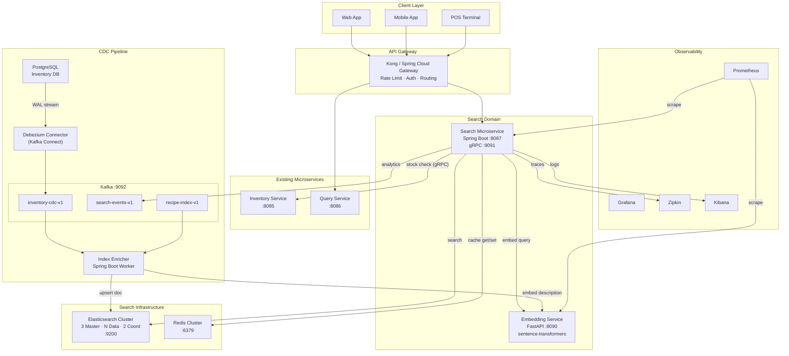
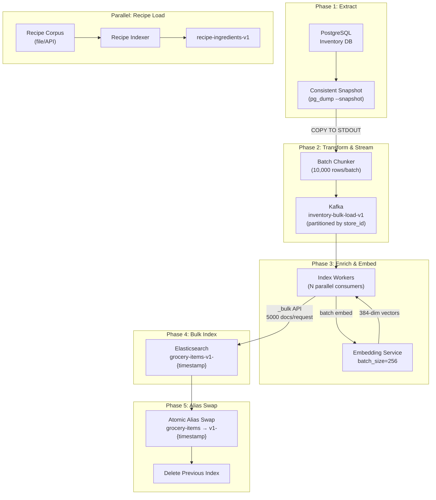
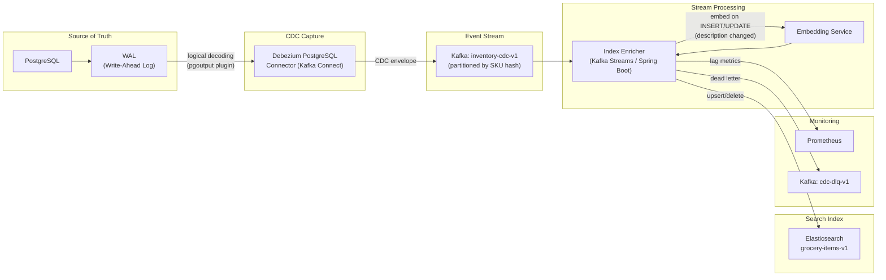
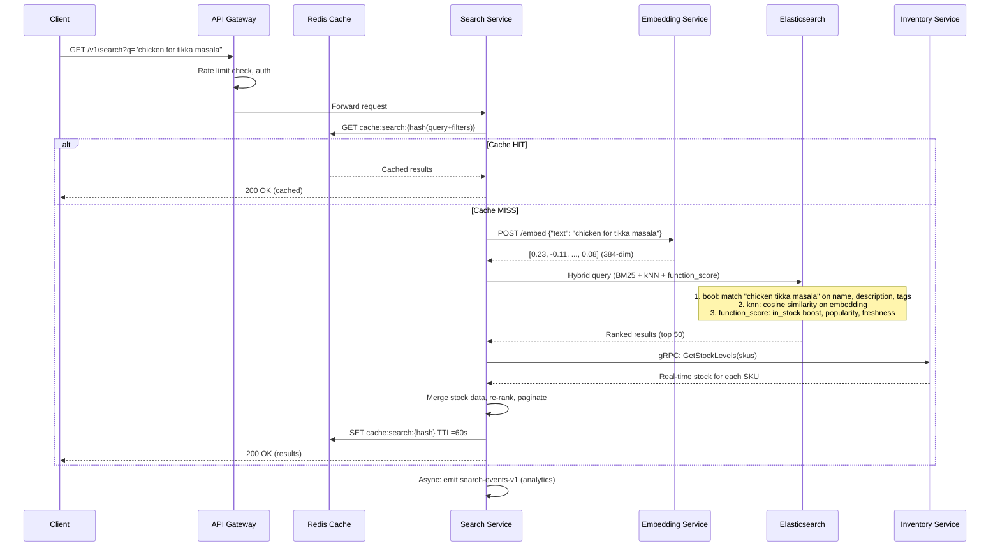
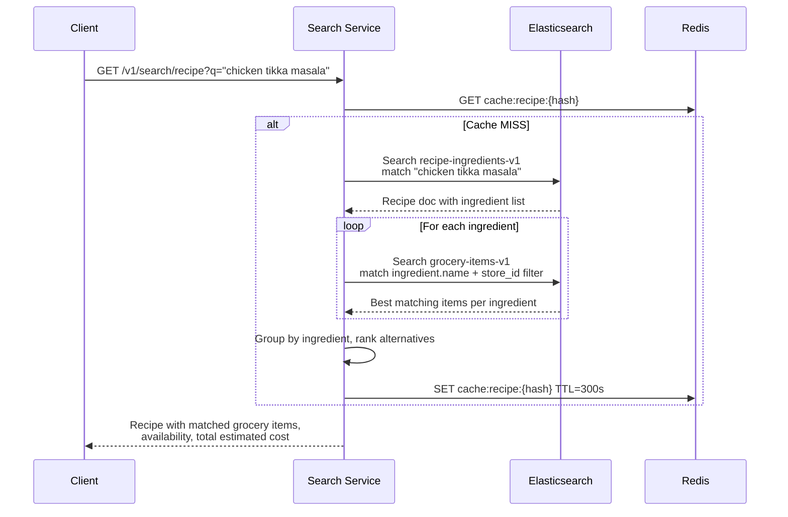
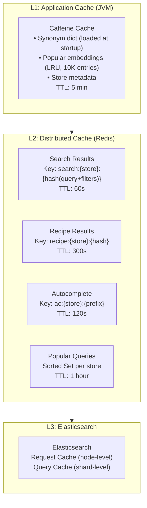
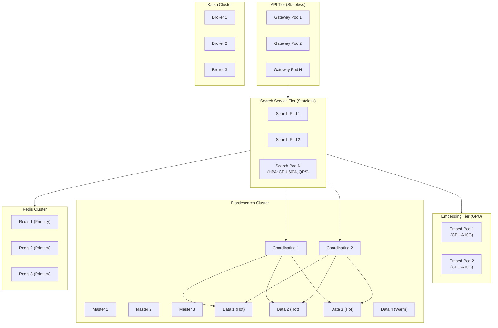
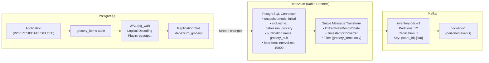
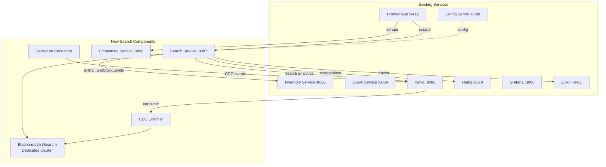

# Grocery Search System — Architecture & Design Proposal

> **Perspective**: Lead Software Architect + Lead Software Engineer
>
> **Scope**: Natural language search engine for grocery items in a retail inventory, with recipe-based discovery, tokenization-driven relevance, CDC-powered real-time indexing, and horizontal scalability for millions of concurrent users.

---

## Table of Contents

1. [Problem Statement](#problem-statement)
2. [Technology Stack](#technology-stack)
3. [High-Level Architecture](#high-level-architecture)
4. [Tokenization & NLP Strategy](#tokenization--nlp-strategy)
5. [Index Schema Design](#index-schema-design)
6. [Data Flow — Initialization (Full Load)](#data-flow--initialization-full-load)
7. [Data Flow — CDC (Real-Time Sync)](#data-flow--cdc-real-time-sync)
8. [Data Flow — Query Path](#data-flow--query-path)
9. [Recipe-Based Search](#recipe-based-search)
10. [Caching Strategy](#caching-strategy)
11. [Scaling for Millions of Users](#scaling-for-millions-of-users)
12. [CDC Model — Deep Dive](#cdc-model--deep-dive)
13. [Latency Budget & SLA Targets](#latency-budget--sla-targets)
14. [Pitfalls, Challenges & Mitigations](#pitfalls-challenges--mitigations)
15. [Observability Integration](#observability-integration)
16. [Deployment Topology](#deployment-topology)
17. [Migration & Rollout Plan](#migration--rollout-plan)

---

## Problem Statement

Retail grocery stores maintain inventory databases with millions of SKUs. Each item has structured fields (UPC, category, price, stock quantity) and unstructured fields (description, brand narrative, nutritional notes). Customers need to:

- **Search by natural language**: _"something for a quick pasta dinner"_, _"gluten free snacks for kids"_
- **Search by recipe**: _"chicken tikka masala"_ returns all required ingredients available in-store
- **Get recommendations**: _"I bought tomatoes"_ suggests basil, mozzarella, olive oil (complementary items)
- **Autocomplete**: Partial input yields ranked suggestions with sub-100ms latency

The system must index items from an inventory database, stay synchronized in near real-time via CDC, and serve search results at scale (millions of users, sub-200ms p99 latency).

---

## Technology Stack

| Layer | Technology | Rationale |
|-------|-----------|-----------|
| **Source of Truth** | PostgreSQL 16 | ACID inventory DB; logical replication support for CDC |
| **CDC Connector** | Debezium 2.x (PostgreSQL) | WAL-based, low-overhead CDC; mature Kafka Connect integration |
| **Event Backbone** | Apache Kafka 3.x | Already in the stack; durable log for CDC events, replay capability |
| **Search Engine** | Elasticsearch 8.x (or OpenSearch 2.x) | Inverted index, BM25, custom analyzers, dense vectors for semantic search |
| **Vector Embeddings** | sentence-transformers (`all-MiniLM-L6-v2`) | Lightweight model (80MB), 384-dim vectors, good grocery-domain accuracy |
| **Embedding Service** | Python sidecar (FastAPI) or Java ONNX Runtime | Generates embeddings at index time and query time |
| **Cache** | Redis 7.x Cluster | Already in the stack; search result caching, rate limiting, popular queries |
| **Search API** | Spring Boot 4.0.3 (search-microservice) | Consistent with existing stack; gRPC + REST |
| **API Gateway** | Kong / Spring Cloud Gateway | Rate limiting, auth, request routing, canary deployments |
| **Orchestration** | Kubernetes (EKS/GKE) | Horizontal pod autoscaling, node pools per workload type |
| **Observability** | Prometheus + Grafana + Zipkin + ELK | Already in the stack; extend with search-specific dashboards |

### Why Elasticsearch over alternatives

| Alternative | Rejection Rationale |
|------------|---------------------|
| **Solr** | Heavier operational overhead; Elasticsearch ecosystem (Kibana, APM) already present |
| **Typesense** | Limited custom analyzer support; weaker at complex multi-field queries |
| **Meilisearch** | No native dense vector support; single-node default architecture |
| **Algolia (SaaS)** | Vendor lock-in; per-query pricing prohibitive at millions-of-users scale |
| **pgvector + pg_trgm** | PostgreSQL full-text search lacks custom tokenizer pipelines; vector search performance degrades beyond ~5M rows without significant tuning |

---

## High-Level Architecture



---

## Tokenization & NLP Strategy

This is the core of the search relevance engine. The approach mirrors how major search engines (Google, Ticketmaster) tokenize and index content for natural language retrieval.

### Analysis Chain (Elasticsearch Custom Analyzer)

```mermaid
flowchart LR
    Raw["Raw Text<br/>'Organic Free-Range<br/>Chicken Breast, 2lb'"]
    --> CharFilter["Char Filters<br/>• HTML strip<br/>• Normalize hyphens<br/>• Remove special chars"]
    --> Tokenizer["Standard Tokenizer<br/>→ [organic, free, range,<br/>chicken, breast, 2lb]"]
    --> LowerCase["Lowercase Filter<br/>→ [organic, free, range,<br/>chicken, breast, 2lb]"]
    --> StopWords["Stop Words<br/>(custom grocery set)<br/>→ removes 'the', 'a', etc."]
    --> Synonyms["Synonym Filter<br/>• chicken breast → poultry<br/>• 2lb → 2 pound<br/>• organic → bio"]
    --> Stemmer["Stemmer (English)<br/>• breasts → breast<br/>• roasting → roast"]
    --> EdgeNgram["Edge N-Gram (autocomplete)<br/>• chick → chi, chic, chick<br/>• brea → bre, brea, breas"]
    --> Index["Inverted Index"]
```



### Analyzer Definitions

Four custom analyzers handle different use cases:

| Analyzer | Purpose | Pipeline |
|----------|---------|----------|
| `grocery_full` | Primary search (description, name) | char_filter → standard tokenizer → lowercase → grocery_synonyms → english_stemmer → asciifolding |
| `grocery_autocomplete` | Prefix matching for search-as-you-type | char_filter → standard tokenizer → lowercase → edge_ngram (min=2, max=15) |
| `grocery_exact` | Exact matches (UPC, brand) | keyword tokenizer → lowercase → trim |
| `grocery_recipe` | Recipe ingredient matching | char_filter → standard tokenizer → lowercase → recipe_synonyms → english_stemmer |

### Synonym Graph — Grocery Domain

Grocery search requires a rich synonym dictionary. This is a non-trivial, ongoing maintenance item.

```
# Measurement normalization
lb, lbs, pound, pounds => pound
oz, ounce, ounces => ounce
kg, kilogram, kilograms => kilogram
gal, gallon, gallons => gallon
pt, pint, pints => pint

# Grocery equivalences
chicken breast, poultry breast, boneless chicken => chicken_breast
ground beef, minced beef, hamburger meat => ground_beef
heavy cream, whipping cream, double cream => heavy_cream
all purpose flour, plain flour, ap flour => all_purpose_flour
bell pepper, capsicum, sweet pepper => bell_pepper
cilantro, coriander leaves, fresh coriander => cilantro
eggplant, aubergine => eggplant
zucchini, courgette => zucchini
arugula, rocket, rucola => arugula
scallion, green onion, spring onion => scallion

# Diet/attribute synonyms
organic, bio, certified organic => organic
gluten free, gf, coeliac safe => gluten_free
sugar free, no sugar, zero sugar => sugar_free
low fat, lite, light => low_fat
non gmo, gmo free => non_gmo
plant based, vegan => plant_based
```

### Multi-Field Strategy (BM25 + Vectors)

Each grocery item is indexed with multiple fields, each analyzed differently and weighted in the query:

```json
{
  "name":        { "analyzer": "grocery_full",         "boost": 3.0 },
  "name.autocomplete": { "analyzer": "grocery_autocomplete", "boost": 1.5 },
  "description": { "analyzer": "grocery_full",         "boost": 2.0 },
  "category":    { "analyzer": "grocery_full",         "boost": 1.5 },
  "brand":       { "analyzer": "grocery_exact",        "boost": 1.0 },
  "tags":        { "analyzer": "grocery_full",         "boost": 2.5 },
  "upc":         { "analyzer": "grocery_exact",        "boost": 5.0 },
  "embedding":   { "type": "dense_vector", "dims": 384, "similarity": "cosine" }
}
```

### Hybrid Scoring: BM25 + kNN + Business Signals

The final score for each search result is a weighted combination:

```
final_score = (0.5 × BM25_score) + (0.3 × kNN_cosine_similarity) + (0.2 × business_boost)
```

Where `business_boost` factors in:
- **In-stock status**: 1.0 if in stock, 0.1 if out of stock (still returned, demoted)
- **Freshness**: Higher for recently restocked perishables
- **Popularity**: Click-through rate from search analytics
- **Margin**: Configurable business-driven promotion weight
- **Proximity**: Aisle/location distance from user's current position (for in-store mobile)

This is implemented using Elasticsearch's `function_score` query wrapping a `bool` query with `knn` rescoring.

---

## Index Schema Design

### Primary Index: `grocery-items-v1`

```json
{
  "settings": {
    "number_of_shards": 5,
    "number_of_replicas": 2,
    "refresh_interval": "1s",
    "analysis": {
      "char_filter": {
        "grocery_char_filter": {
          "type": "pattern_replace",
          "pattern": "[^a-zA-Z0-9\\s]",
          "replacement": " "
        }
      },
      "filter": {
        "grocery_synonyms": {
          "type": "synonym_graph",
          "synonyms_path": "synonyms/grocery_synonyms.txt",
          "updateable": true
        },
        "grocery_stemmer": {
          "type": "stemmer",
          "language": "english"
        },
        "autocomplete_filter": {
          "type": "edge_ngram",
          "min_gram": 2,
          "max_gram": 15
        }
      },
      "analyzer": {
        "grocery_full": {
          "type": "custom",
          "char_filter": ["grocery_char_filter"],
          "tokenizer": "standard",
          "filter": ["lowercase", "grocery_synonyms", "grocery_stemmer", "asciifolding"]
        },
        "grocery_autocomplete": {
          "type": "custom",
          "char_filter": ["grocery_char_filter"],
          "tokenizer": "standard",
          "filter": ["lowercase", "autocomplete_filter"]
        }
      }
    }
  },
  "mappings": {
    "properties": {
      "sku":           { "type": "keyword" },
      "upc":           { "type": "keyword" },
      "name":          { "type": "text", "analyzer": "grocery_full",
                         "fields": { "autocomplete": { "type": "text", "analyzer": "grocery_autocomplete" },
                                     "keyword": { "type": "keyword" } } },
      "description":   { "type": "text", "analyzer": "grocery_full" },
      "brand":         { "type": "keyword" },
      "category":      { "type": "keyword",
                         "fields": { "text": { "type": "text", "analyzer": "grocery_full" } } },
      "subcategory":   { "type": "keyword" },
      "department":    { "type": "keyword" },
      "tags":          { "type": "text", "analyzer": "grocery_full" },
      "dietary_flags": { "type": "keyword" },
      "price":         { "type": "scaled_float", "scaling_factor": 100 },
      "unit_price":    { "type": "scaled_float", "scaling_factor": 100 },
      "unit_measure":  { "type": "keyword" },
      "weight_oz":     { "type": "float" },
      "in_stock":      { "type": "boolean" },
      "stock_qty":     { "type": "integer" },
      "aisle":         { "type": "keyword" },
      "store_id":      { "type": "keyword" },
      "embedding":     { "type": "dense_vector", "dims": 384,
                         "index": true, "similarity": "cosine" },
      "popularity":    { "type": "float" },
      "last_restocked":{ "type": "date" },
      "updated_at":    { "type": "date" },
      "indexed_at":    { "type": "date" }
    }
  }
}
```

### Secondary Index: `recipe-ingredients-v1`

Maps recipe names to normalized ingredient lists for recipe-based search:

```json
{
  "mappings": {
    "properties": {
      "recipe_id":    { "type": "keyword" },
      "recipe_name":  { "type": "text", "analyzer": "grocery_full",
                        "fields": { "autocomplete": { "type": "text", "analyzer": "grocery_autocomplete" } } },
      "cuisine":      { "type": "keyword" },
      "ingredients":  {
        "type": "nested",
        "properties": {
          "name":     { "type": "text", "analyzer": "grocery_full" },
          "quantity":  { "type": "keyword" },
          "category": { "type": "keyword" },
          "optional": { "type": "boolean" }
        }
      },
      "tags":         { "type": "text", "analyzer": "grocery_full" },
      "servings":     { "type": "integer" },
      "prep_time_min":{ "type": "integer" },
      "embedding":    { "type": "dense_vector", "dims": 384, "index": true, "similarity": "cosine" }
    }
  }
}
```

---

## Data Flow — Initialization (Full Load)

Full index build from scratch or complete reindex. This is needed on first deployment, after schema changes, or for disaster recovery.



### Initialization Performance Estimates

| Metric | Value | Notes |
|--------|-------|-------|
| Total SKUs | 500K–2M (typical large retailer) | Multi-store: items × stores for stock-level documents |
| Snapshot time | 30–60s | Consistent `pg_export_snapshot` read; no table locks |
| Batch size (Kafka) | 10,000 rows | Balances memory and throughput |
| Embedding throughput | ~5,000 items/sec | GPU: `all-MiniLM-L6-v2` on A10G; CPU: ~500/sec |
| Bulk index throughput | ~15,000 docs/sec | 5 shards, 3 index workers, `refresh_interval: -1` during bulk |
| **Total init time (1M items, GPU)** | **~8–12 minutes** | Includes snapshot + embed + bulk + alias swap |
| **Total init time (1M items, CPU)** | **~40–50 minutes** | CPU embedding is the bottleneck |

### Optimization: Disable refresh during bulk load

During initialization, set `refresh_interval: -1` and `number_of_replicas: 0` on the new index. After bulk load completes, restore settings and let Elasticsearch build replicas. This reduces init time by ~40%.

---

## Data Flow — CDC (Real-Time Sync)

Change Data Capture keeps Elasticsearch synchronized with the inventory database in near real-time.



### CDC Event Envelope (Debezium)

```json
{
  "schema": { "...": "..." },
  "payload": {
    "before": null,
    "after": {
      "sku": "GRC-001-42",
      "name": "Organic Free-Range Chicken Breast",
      "description": "Premium organic chicken breast, hormone-free, 2lb package",
      "category": "Meat & Poultry",
      "price": 12.99,
      "stock_qty": 47,
      "store_id": "STORE-0042",
      "updated_at": "2026-03-26T10:15:32.441Z"
    },
    "source": {
      "version": "2.5.0",
      "connector": "postgresql",
      "db": "inventory",
      "schema": "public",
      "table": "grocery_items",
      "lsn": 234881024,
      "txId": 559
    },
    "op": "u",
    "ts_ms": 1711444532441,
    "ts_us": 1711444532441000,
    "ts_ns": 1711444532441000000
  }
}
```

### Enricher Processing Logic

```
on CDC event:
  if op == 'c' (CREATE) or op == 'r' (READ/snapshot):
    doc = transform(event.after)
    doc.embedding = embed(doc.name + " " + doc.description + " " + doc.tags)
    elasticsearch.index(doc)

  else if op == 'u' (UPDATE):
    if description_changed(event.before, event.after):
      doc.embedding = embed(...)     # re-embed only when text changes
    else:
      doc.embedding = existing_embedding  # skip expensive re-embedding
    elasticsearch.update(doc)

  else if op == 'd' (DELETE):
    elasticsearch.delete(event.before.sku)
```

The conditional re-embedding is critical: stock quantity changes (frequent) should not trigger re-embedding (expensive). Only text field changes trigger it.

---

## Data Flow — Query Path



### Query DSL Example

```json
{
  "size": 20,
  "query": {
    "function_score": {
      "query": {
        "bool": {
          "should": [
            { "multi_match": {
                "query": "chicken for tikka masala",
                "fields": ["name^3", "description^2", "tags^2.5", "category.text^1.5"],
                "type": "best_fields",
                "fuzziness": "AUTO"
            }},
            { "multi_match": {
                "query": "chicken for tikka masala",
                "fields": ["name.autocomplete^1.5"],
                "type": "phrase_prefix"
            }}
          ],
          "filter": [
            { "term": { "store_id": "STORE-0042" } }
          ]
        }
      },
      "functions": [
        { "filter": { "term": { "in_stock": true } },  "weight": 5 },
        { "field_value_factor": { "field": "popularity", "modifier": "log1p", "missing": 1 } },
        { "gauss": { "last_restocked": { "origin": "now", "scale": "7d", "decay": 0.5 } } }
      ],
      "score_mode": "sum",
      "boost_mode": "multiply"
    }
  },
  "knn": {
    "field": "embedding",
    "query_vector": [0.23, -0.11, "...", 0.08],
    "k": 50,
    "num_candidates": 200,
    "boost": 0.3
  },
  "highlight": {
    "fields": {
      "name": {},
      "description": { "fragment_size": 150, "number_of_fragments": 2 }
    }
  }
}
```

---

## Recipe-Based Search

Recipe search is a two-phase process: resolve recipe → find matching grocery items.



### Recipe Response Shape

```json
{
  "recipe": {
    "name": "Chicken Tikka Masala",
    "servings": 4,
    "prep_time_min": 45
  },
  "ingredients": [
    {
      "name": "chicken breast",
      "required_qty": "2 lbs",
      "matches": [
        { "sku": "GRC-001-42", "name": "Organic Chicken Breast 2lb", "price": 12.99, "in_stock": true, "aisle": "A3" },
        { "sku": "GRC-001-43", "name": "Value Pack Chicken Breast 3lb", "price": 9.99, "in_stock": true, "aisle": "A3" }
      ]
    },
    {
      "name": "tikka masala sauce",
      "required_qty": "1 jar",
      "matches": [
        { "sku": "SAU-045-01", "name": "Patak's Tikka Masala Sauce 15oz", "price": 4.49, "in_stock": true, "aisle": "B7" }
      ]
    }
  ],
  "estimated_total": 28.47,
  "all_available": true
}
```

---

## Caching Strategy



### Cache Invalidation

CDC events trigger targeted cache invalidation:

1. **Stock change** (frequent): Invalidate search results containing that SKU. Use Redis key tagging: `search:*` keys store a reverse index of SKUs they contain.
2. **Price change**: Same as stock change — invalidate affected cached results.
3. **Description/name change**: Invalidate + re-embed + re-index. Broadest invalidation.
4. **Recipe cache**: Invalidated only when ingredient availability changes materially (all-out-of-stock for a key ingredient).

### Cache Stampede Prevention

Use Redis `SETNX`-based distributed locks with short TTL (500ms) when rebuilding a cache entry. Other requests for the same key wait on the lock or return stale data with a `stale-while-revalidate` header.

---

## Scaling for Millions of Users

### Traffic Model

| Metric | Value | Notes |
|--------|-------|-------|
| Peak concurrent users | 2M | Assumes 20M DAU, 10% concurrent at peak |
| Search QPS (peak) | 50,000 | 2M users × ~1.5 searches/min / 60 |
| Autocomplete QPS (peak) | 200,000 | ~4 keystroke events per search attempt |
| Writes (CDC events/sec) | 5,000 | Stock updates across all stores |

### Horizontal Scaling Plan



### Component Sizing (50K search QPS target)

| Component | Count | Spec | Rationale |
|-----------|-------|------|-----------|
| API Gateway | 6 pods | 2 vCPU, 4GB | ~8K req/s per pod |
| Search Service | 12 pods | 4 vCPU, 8GB | ~4K search/s per pod (includes enrichment) |
| Embedding Service | 3 pods | 4 vCPU, 16GB, 1× A10G GPU | ~2K embed/s per GPU; query embeddings only at search time |
| ES Coordinating | 4 nodes | 8 vCPU, 32GB | Fan-out to data nodes, aggregation |
| ES Data (Hot) | 6 nodes | 16 vCPU, 64GB, 1TB NVMe | 2M docs × 5 shards × 2 replicas; vector index in memory |
| ES Master | 3 nodes | 4 vCPU, 8GB | Cluster state management |
| Redis Cluster | 6 nodes (3 primary + 3 replica) | 4 vCPU, 32GB | ~500K ops/s total; search cache + rate limiting |
| Kafka | 3 brokers | 8 vCPU, 32GB, 500GB SSD | CDC throughput, 7-day retention |
| CDC Workers | 3 pods | 4 vCPU, 8GB | Partitioned by store_id; parallel enrichment |

### Autoscaling Triggers

| Component | Metric | Scale-up | Scale-down |
|-----------|--------|----------|------------|
| Search Service | CPU > 60% or QPS > 3500/pod | +2 pods (30s cooldown) | -1 pod (5m cooldown) |
| Embedding Service | Queue depth > 100 | +1 pod (GPU provisioning ~2min) | -1 pod (15m cooldown) |
| ES Data Nodes | Disk > 75% or search latency p99 > 150ms | Add node (manual review) | Shrink via ILM |

---

## CDC Model — Deep Dive

### Architecture: WAL-Based Capture via Debezium



### CDC Latency Breakdown

| Stage | Typical Latency | Worst Case | Notes |
|-------|----------------|------------|-------|
| **WAL write** | 0.1–1ms | 5ms | Synchronous; part of the transaction commit |
| **Logical decoding** | 1–5ms | 20ms | pgoutput plugin decodes WAL records |
| **Debezium read + transform** | 5–15ms | 50ms | Network read from PG replication slot + SMT |
| **Kafka produce** | 2–10ms | 30ms | acks=all, 3 replicas, linger.ms=5 |
| **Kafka broker replication** | 1–5ms | 15ms | ISR replication |
| **Consumer poll + process** | 5–20ms | 100ms | Includes embedding (if text changed: +50ms GPU, +200ms CPU) |
| **Elasticsearch index** | 10–50ms | 200ms | Single doc upsert; refresh_interval=1s adds up to 1s visibility delay |
| **Total (stock update, no re-embed)** | **25–100ms** | **~320ms** | Visible in search after next ES refresh (≤1s) |
| **Total (description update, re-embed GPU)** | **75–150ms** | **~520ms** | Embedding adds ~50ms on GPU |
| **Total (description update, re-embed CPU)** | **225–350ms** | **~720ms** | Embedding adds ~200ms on CPU |
| **Search visibility (end-to-end)** | **1–2s** | **~2.5s** | Dominated by ES refresh_interval (1s default) |

### CDC Ordering Guarantees

- **Per-SKU ordering**: Kafka key = `{store_id}.{sku}` ensures all changes for the same item go to the same partition → consumed in order.
- **Cross-SKU**: No ordering guarantee needed (items are independent documents).
- **Transactions**: Debezium captures transaction boundaries. Multi-row transactions are emitted as individual events but grouped by `txId` for consumers that need transactional consistency (our case does not).

### Failure Modes & Recovery

| Failure | Impact | Recovery |
|---------|--------|----------|
| **Debezium crash** | CDC events stop flowing; Elasticsearch stale | Connector auto-restart (Kafka Connect); resumes from last committed offset in replication slot. **No data loss** — WAL retains unacknowledged changes. |
| **Kafka broker failure** | Brief unavailability (ISR re-election) | Kafka replication factor 3; automatic leader election. Producer retries with idempotence. |
| **Consumer crash** | Processing paused for affected partitions | Consumer group rebalance; resumes from last committed offset. May re-process some events (idempotent upsert). |
| **Elasticsearch node failure** | Search degradation (replicas serve reads) | ES cluster self-heals; replica promotion. CDC events buffer in Kafka (7-day retention). |
| **Replication slot bloat** | WAL segments accumulate on PG if Debezium is down for extended period | Monitor `pg_replication_slots` → `wal_status`. Alert at 1GB retained WAL. Kill slot + re-snapshot if > 10GB. |
| **Schema change (PG)** | Debezium may fail to deserialize new columns | Use Debezium schema history topic. Non-breaking changes (add nullable column) are handled automatically. Breaking changes require connector restart + schema registry update. |

### Debezium Connector Configuration

```json
{
  "name": "grocery-inventory-connector",
  "config": {
    "connector.class": "io.debezium.connector.postgresql.PostgresConnector",
    "database.hostname": "postgres-primary",
    "database.port": "5432",
    "database.user": "debezium",
    "database.password": "${DEBEZIUM_PG_PASSWORD}",
    "database.dbname": "inventory",
    "topic.prefix": "inventory",
    "table.include.list": "public.grocery_items,public.grocery_stock",
    "plugin.name": "pgoutput",
    "publication.name": "grocery_cdc_pub",
    "slot.name": "debezium_grocery",
    "snapshot.mode": "initial",
    "snapshot.lock.timeout.ms": "10000",

    "key.converter": "org.apache.kafka.connect.json.JsonConverter",
    "value.converter": "org.apache.kafka.connect.json.JsonConverter",
    "key.converter.schemas.enable": false,
    "value.converter.schemas.enable": false,

    "transforms": "unwrap,route",
    "transforms.unwrap.type": "io.debezium.transforms.ExtractNewRecordState",
    "transforms.unwrap.drop.tombstones": false,
    "transforms.unwrap.delete.handling.mode": "rewrite",
    "transforms.route.type": "org.apache.kafka.connect.transforms.RegexRouter",
    "transforms.route.regex": "inventory\\.public\\.(.*)",
    "transforms.route.replacement": "inventory-cdc-v1",

    "heartbeat.interval.ms": "10000",
    "poll.interval.ms": "100",
    "max.batch.size": "2048",

    "errors.tolerance": "all",
    "errors.deadletterqueue.topic.name": "cdc-dlq-v1",
    "errors.deadletterqueue.context.headers.enable": true
  }
}
```

---

## Latency Budget & SLA Targets

### Search Query (p50 / p95 / p99)

```
Total budget: 200ms (p99)

┌─────────────────────────────────────────────────┐
│ API Gateway routing            5ms  │  10ms │  15ms │
│ Redis cache lookup             1ms  │   2ms │   5ms │
│ Embedding generation (GPU)    15ms  │  25ms │  40ms │
│ Elasticsearch query           30ms  │  60ms │ 100ms │
│ Stock enrichment (gRPC)        5ms  │  10ms │  20ms │
│ Serialization + response       2ms  │   5ms │  10ms │
├─────────────────────────────────────────────────┤
│ TOTAL (cache miss)            58ms  │ 112ms │ 190ms │
│ TOTAL (cache hit)              8ms  │  17ms │  30ms │
└─────────────────────────────────────────────────┘
```

### Autocomplete (p99 < 50ms)

```
┌──────────────────────────────────────┐
│ Gateway                    3ms │  5ms │
│ Redis prefix cache         1ms │  3ms │
│ ES completion suggester   10ms │ 25ms │
│ Response                   1ms │  2ms │
├──────────────────────────────────────┤
│ TOTAL (cache miss)        15ms │ 35ms │
│ TOTAL (cache hit)          5ms │ 10ms │
└──────────────────────────────────────┘
```

### SLA Targets

| Metric | Target | Measurement |
|--------|--------|-------------|
| Search p99 latency | < 200ms | Prometheus histogram |
| Autocomplete p99 latency | < 50ms | Prometheus histogram |
| Search availability | 99.95% | 4h 23m downtime/year |
| CDC lag (stock updates visible in search) | < 2s (p99) | Kafka consumer lag + ES refresh |
| Index freshness | < 5s (p99) | Timestamp diff: `updated_at` vs `indexed_at` |
| Cache hit rate (search) | > 60% | Redis hit/miss counters |
| Relevance (nDCG@10) | > 0.7 | Offline evaluation pipeline |

---

## Pitfalls, Challenges & Mitigations

### 1. Synonym Dictionary Maintenance

| Aspect | Challenge | Mitigation |
|--------|-----------|------------|
| **Completeness** | Grocery domain has thousands of equivalent terms across brands, regions, languages | Start with a curated base dictionary (~2000 entries). Use search analytics (zero-result queries) to identify gaps. Monthly review cycle. |
| **Conflicts** | Synonym expansion can cause false positives ("light" → "low fat", but "light beer" is different) | Use synonym_graph (preserves position) instead of flat synonyms. Context-aware filtering by category. |
| **Updates** | Synonym file changes require index close/reopen or reindex | Use `updateable: true` on synonym filter (ES 8.x); applies to search analyzers without reindex. Index-time synonyms still need reindex. Prefer search-time synonym expansion. |

### 2. Embedding Model Drift & Cold Start

| Aspect | Challenge | Mitigation |
|--------|-----------|------------|
| **Model updates** | New model version produces different vector space; old embeddings incompatible | Blue-green index strategy: build new index with new embeddings alongside old. Alias swap when validated. |
| **Cold start** | New items have no click-through data for popularity scoring | Default popularity = category average. Boost new items for first 7 days ("new arrivals" signal). |
| **Domain accuracy** | General-purpose embeddings may not capture grocery-specific semantics well | Fine-tune on grocery search logs (query-click pairs). Even 10K training pairs significantly improves domain relevance. |

### 3. CDC Replication Slot Bloat

| Aspect | Challenge | Mitigation |
|--------|-----------|------------|
| **WAL retention** | If Debezium is down, PostgreSQL retains WAL segments for the replication slot indefinitely | Monitor `pg_replication_slots` view. Alert at `wal_status = 'reserved'` > 1GB. Automated slot drop + re-snapshot if > 10GB. |
| **PG disk pressure** | Uncontrolled WAL growth can fill disk and crash PostgreSQL | Set `max_slot_wal_keep_size = 10GB` (PG 13+). If slot exceeds this, it becomes invalidated and Debezium must re-snapshot. |

### 4. Cache Consistency at Scale

| Aspect | Challenge | Mitigation |
|--------|-----------|------------|
| **Stale stock data** | Cached search results show "in stock" but item sold out since cache was written | Short TTL (60s) for search cache. Real-time stock overlay: client fetches stock badge via lightweight SSE/WebSocket endpoint. |
| **Thundering herd** | Popular query cache expires; 10K concurrent users all trigger cache rebuild | Probabilistic early expiration (jitter). Distributed lock on cache rebuild. Stale-while-revalidate pattern. |
| **Memory pressure** | Large result sets × many unique queries exceed Redis memory | Max memory policy `allkeys-lru`. Monitor eviction rate. Compress cached payloads (gzip). Store only IDs + scores in cache, hydrate from ES on hit. |

### 5. Multi-Store Complexity

| Aspect | Challenge | Mitigation |
|--------|-----------|------------|
| **Index size** | 500K SKUs × 2000 stores = 1B documents if indexed per-store | Split into two indices: `grocery-catalog-v1` (SKU metadata, shared) and `grocery-stock-v1` (per-store stock/price, routing by store_id). Catalog index stays small. |
| **Store-specific pricing** | Same item, different price per store | Stock index stores store-specific fields. Search joins catalog + stock at query time via parent-child or application-side join. |
| **Regional synonyms** | "Pop" vs "soda" vs "coke" by region | Store-level synonym dictionaries. Loaded per-request based on store_id → region mapping. |

### 6. Relevance Tuning is an Ongoing Process

| Aspect | Challenge | Mitigation |
|--------|-----------|------------|
| **No ground truth** | No labeled "correct" results for queries | Log click-through data. Build implicit relevance labels from (query, clicked_item, position) triples. |
| **A/B testing** | Need to compare relevance strategies in production | Elasticsearch index aliases + search templates. Route 10% of traffic to experimental ranking. Measure nDCG, CTR, conversion. |
| **Feedback loop** | Popular items get more clicks → more popular → shown higher (rich-get-richer) | Exploration/exploitation: inject 10% diversity items (less popular but relevant). Decay popularity score over time (half-life: 14 days). |

### 7. Elasticsearch Operational Complexity

| Aspect | Challenge | Mitigation |
|--------|-----------|------------|
| **Shard sizing** | Over-sharding kills performance; under-sharding limits scaling | Target 20–40GB per shard. For 2M docs with vectors: ~5 primary shards. Monitor with `_cat/shards`. |
| **Vector search memory** | Dense vectors stored in HNSW graph; requires heap + off-heap memory | Use `index: true` with `m: 16, ef_construction: 100` (defaults). Budget ~1KB per vector × num_docs for HNSW graph. For 2M docs: ~2GB. |
| **Zero-downtime reindex** | Schema changes, analyzer changes, model upgrades all require reindex | Always use index aliases. Build new index → bulk reindex → swap alias → delete old. Automate via index lifecycle management (ILM). |

---

## Observability Integration

Extend the existing Prometheus/Grafana/Zipkin/ELK stack with search-specific instrumentation.

### Metrics (Prometheus)

| Metric | Type | Labels | Purpose |
|--------|------|--------|---------|
| `search.query.duration` | Histogram | `store_id`, `query_type` (text/recipe/autocomplete) | Latency monitoring |
| `search.query.total` | Counter | `store_id`, `query_type`, `cache_hit` | QPS and cache effectiveness |
| `search.results.count` | Histogram | `store_id`, `query_type` | Zero-result rate detection |
| `search.zero_results.total` | Counter | `store_id` | Synonym/relevance gap indicator |
| `cdc.lag.seconds` | Gauge | `table`, `partition` | CDC pipeline health |
| `cdc.events.processed` | Counter | `table`, `operation` (c/u/d) | CDC throughput |
| `embedding.duration` | Histogram | `model`, `batch_size` | Embedding service performance |
| `cache.hit_rate` | Gauge | `cache_type` (search/recipe/autocomplete) | Cache effectiveness |
| `es.indexing.duration` | Histogram | `index`, `operation` | Indexing pipeline health |

### Grafana Dashboard: Grocery Search

Panels:
1. **Search QPS** (by type, by store)
2. **Search Latency** (p50/p95/p99, split by cache hit/miss)
3. **Zero-Result Rate** (% of queries returning 0 results — relevance health signal)
4. **CDC Lag** (seconds behind real-time, per table)
5. **Cache Hit Rate** (Redis hit/miss ratio)
6. **Elasticsearch Cluster Health** (shard state, indexing rate, search rate, JVM heap)
7. **Embedding Service** (requests/sec, latency, GPU utilization)
8. **Top Zero-Result Queries** (table, updated hourly — synonym dictionary improvement candidates)

### Distributed Tracing (Zipkin)

Search requests propagate trace context through:
`Gateway → Search Service → Embedding Service → Elasticsearch → Inventory (gRPC stock check)`

Each hop is a span with relevant metadata (query text hash, result count, cache hit/miss, ES took_ms).

---

## Deployment Topology

### Kubernetes Namespace Layout

```
grocery-search/
├── search-api        (Deployment, HPA, Service, Ingress)
├── embedding-svc     (Deployment, HPA with GPU nodeSelector)
├── cdc-enricher      (Deployment, 3 replicas, consumer group)
├── elasticsearch/    (StatefulSet, 3 master + 6 data + 4 coord)
├── redis-cluster/    (StatefulSet, 6 nodes)
├── kafka/            (StatefulSet or managed MSK/Confluent)
├── debezium/         (Kafka Connect cluster, 2 workers)
├── config/           (ConfigMaps: synonyms, analyzer settings)
└── monitoring/       (ServiceMonitor, PrometheusRule, GrafanaDashboard CRDs)
```

### Network Policies

- Search API: ingress from gateway only; egress to ES, Redis, Embedding, Inventory
- CDC Enricher: ingress from Kafka only; egress to ES, Embedding
- Elasticsearch: ingress from Search API, CDC Enricher, Coordinating nodes; no public ingress
- Embedding Service: ingress from Search API, CDC Enricher only

---

## Migration & Rollout Plan

### Phase 1: Foundation (search infrastructure)

- Deploy Elasticsearch cluster (dedicated, not shared with log analytics)
- Deploy Debezium connector on Kafka Connect
- Implement CDC enricher service
- Run initial full-load indexing
- Validate CDC lag and data consistency

### Phase 2: Core Search (text search)

- Deploy Search Microservice with BM25-based search
- Implement synonym dictionary (v1: 500 entries)
- Implement autocomplete endpoint
- Add Redis caching layer
- Shadow traffic testing: mirror production queries, compare results (no user-visible impact)

### Phase 3: Semantic Search (embeddings)

- Deploy Embedding Service (GPU nodes)
- Generate embeddings for full catalog (batch job)
- Enable hybrid BM25 + kNN scoring
- A/B test: BM25-only vs hybrid (measure CTR, conversion)

### Phase 4: Recipe Search

- Load recipe corpus into `recipe-ingredients-v1`
- Implement recipe-to-grocery resolution endpoint
- Build recipe autocomplete
- Partner with content team for recipe curation

### Phase 5: Personalization & Scale

- Implement click-through analytics pipeline
- Add user-level personalization signals (purchase history, dietary preferences)
- Fine-tune embedding model on grocery search logs
- Scale to multi-region with cross-cluster replication

---

## Integration with Existing System

The grocery search system integrates with the existing microservices-ops-demo stack:



The Search Microservice:
- **Registers** with Config Server (port 8888) and Admin Server (port 8089)
- **Communicates** with Inventory Service via gRPC for real-time stock checks
- **Publishes** search analytics events to Kafka (`search-events-v1`)
- **Reports** metrics to Prometheus (scraped at `/actuator/prometheus`)
- **Propagates** traces to Zipkin via Kafka
- **Uses** Redis for search result caching (separate key namespace from existing reservation keys)
- **Logs** to `application-logs` Kafka topic with traceId/spanId for Kibana correlation

---

## Summary of Key Design Decisions

| Decision | Rationale | Trade-off |
|----------|-----------|-----------|
| **Debezium CDC over polling** | Sub-second latency; no load on source DB for change detection | Operational complexity (replication slots, WAL monitoring) |
| **Hybrid BM25 + kNN** | BM25 handles exact matches well; kNN handles semantic similarity ("dinner ideas" → chicken, pasta, etc.) | Embedding generation cost; ~15ms per query on GPU |
| **Search-time synonym expansion** | No reindex needed for synonym changes; hot-reloadable | Slightly slower queries (synonym graph traversal); index-time expansion would be faster at query time |
| **Separate ES cluster for search** | Isolate search workload from log analytics; independent scaling and tuning | Additional infrastructure cost |
| **Redis cache with short TTL** | 60s TTL balances freshness (stock changes) with cache hit rate (~65%) | Users may see slightly stale stock for up to 60s |
| **Store-partitioned Kafka topics** | Enables parallel CDC processing per store; consumer scale-out by adding partitions | Max parallelism limited to partition count; rebalance lag on consumer group changes |
| **Alias-based zero-downtime reindex** | Schema changes, model upgrades, and full re-indexes cause zero user impact | Temporary 2× storage during reindex window |
| **GPU for embeddings** | 10× faster than CPU; critical for query-time embedding within 200ms budget | Higher infrastructure cost; GPU scheduling complexity in Kubernetes |

---

## Appendix A: Kafka Topic Registry (New)

| Topic | Partitions | Replication | Key | Producer | Consumer | Retention |
|-------|-----------|-------------|-----|----------|----------|-----------|
| `inventory-cdc-v1` | 12 | 3 | `{store_id}.{sku}` | Debezium | CDC Enricher | 7 days |
| `inventory-bulk-load-v1` | 12 | 3 | `{store_id}.{sku}` | Bulk Loader | CDC Enricher | 3 days |
| `search-events-v1` | 6 | 3 | `{session_id}` | Search Service | Analytics Pipeline | 30 days |
| `recipe-index-v1` | 3 | 3 | `{recipe_id}` | Recipe Ingester | CDC Enricher | 30 days |
| `cdc-dlq-v1` | 3 | 3 | (original key) | CDC Enricher | Ops/Manual review | 90 days |

## Appendix B: API Contract (Search Service)

```
GET  /v1/search?q={query}&store={store_id}&page={page}&size={size}&category={cat}&dietary={flags}
GET  /v1/search/autocomplete?q={prefix}&store={store_id}&limit={limit}
GET  /v1/search/recipe?q={recipe_query}&store={store_id}&servings={n}
GET  /v1/search/similar/{sku}?store={store_id}&limit={limit}
POST /v1/search/feedback  (body: {query, clicked_sku, position, session_id})
GET  /v1/admin/search/reindex  (trigger full reindex, admin-only)
GET  /v1/admin/search/synonyms  (list current synonyms)
PUT  /v1/admin/search/synonyms  (update synonym dictionary, hot-reload)
```

## Appendix C: PostgreSQL Setup for CDC

```sql
-- Enable logical replication (postgresql.conf)
-- wal_level = logical
-- max_replication_slots = 4
-- max_wal_senders = 4

-- Create publication for Debezium
CREATE PUBLICATION grocery_cdc_pub FOR TABLE public.grocery_items, public.grocery_stock;

-- Create replication user with minimal privileges
CREATE ROLE debezium WITH REPLICATION LOGIN PASSWORD '...';
GRANT USAGE ON SCHEMA public TO debezium;
GRANT SELECT ON public.grocery_items, public.grocery_stock TO debezium;

-- Monitor replication slot health
SELECT slot_name, active, restart_lsn, confirmed_flush_lsn,
       pg_wal_lsn_diff(pg_current_wal_lsn(), restart_lsn) AS lag_bytes
FROM pg_replication_slots
WHERE slot_name = 'debezium_grocery';
```
